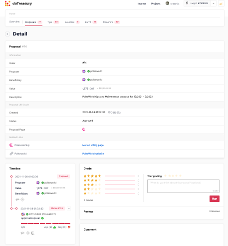
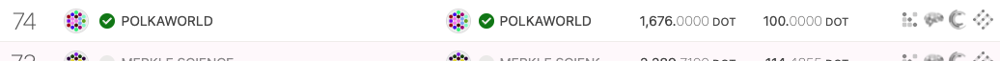

# Proposal 12 / Motion 14: Fund the creation of a community application to host the treasury, wiki, and more. (资助创建社区应用程序以托管财务、维基等。)

翻译后的帖子在底部。

The global DBC community needs a place to learn about DBC, find tutorials, and gain a better understanding of the Democracy side of the staking application. I have been building an application that can handle all of this and more. the application is open source and will be open to collaboration from community members. As workflows are put in place, more community members will be able to add to the content and development of this application.

The alpha version of the application has the start of a wiki I am writing and has ongoing development to integrate with the polkadot json wallet. These features will continue to be released as they are tested and ready. The alpha version of the application can be found at https://dbc.network/ and offers English and Simplified Chinese. More languages will be added to better serve the global community.

To support the initial development, web services expenses, and quality hosting, I am asking for 2 million DBC. I have covered the costs and development time. I am happy to contribute most of my expenses to the community to improve the available tools for everyone. However, help in covering these costs from the council and treasury will be greatly appreciated. This funding will be used and invested in the initial build and features. I will also be submitting another proposal for ongoing maintenance, hosting, and additional feature expenses.

This application will mimic many of the features found in the polkadot ecosystem. For example:

1. The Wiki: Provide multilingual instructions, information, guides, and more. The polkadot community has https://wiki.polkadot.network/ and I have learned a lot about how DBC works from their site. With our own wiki, everyone can learn directly about DBC. A strong focus will be encouraging global community involvement.

2. Treasury Integration: Links will exist in https://www.dbcwallet.io/ that will take users directly from proposals, motions, referenda, and more. For example, a user can view a proposal on the application and a link is available that goes directly to the treasury as in the image below. When clicked, a user is taken to the treasury application and presented with information about the proposal, motion, and so on. The person submitting the proposal can link their web3 address and write the proposal directly on the treasury site. This is the functionality we will have on https://dbc.network/.

3. Assembly: Polka Assembly is another application that allows users to link their addresses and write descriptions for the referenda and other submissions. These features will also be built out in https://dbc.network/.

4. Community-Contributed Content: With proper workflows, the community will be able to add information. The council and the core DBC team will lead the way but invite expertise from the global community.

5. Other features: The polkadot infrastructure is a decent model for what we can achieve, although there are numerous applications with overlapping features. We will achieve this community service and a single application that makes it fairly easy to maintain and collaborate.

全球 DBC 社区需要一个地方来了解 DBC、查找教程并更好地了解 staking 应用程序的民主方面。我一直在构建一个可以处理所有这些和更多的应用程序。该应用程序是开源的，将对社区成员的协作开放。随着工作流程的到位，更多的社区成员将能够添加到此应用程序的内容和开发中。

该应用程序的 alpha 版本开始于我正在编写的 wiki，并且正在进行与 polkadot json 钱包集成的开发。这些功能将在经过测试并准备就绪后继续发布。该应用程序的 alpha 版本可以在 https://dbc.network/ 找到，并提供英文和简体中文。将添加更多语言以更好地为全球社区服务。

为了支持初始开发、Web 服务费用和优质托管，我要求提供 200 万 DBC。我已经涵盖了成本和开发时间。我很高兴将我的大部分费用贡献给社区，以改进每个人可用的工具。但是，将不胜感激理事会和财政部对支付这些费用的帮助。这笔资金将用于并投资于初始构建和功能。我还将提交另一份关于持续维护、托管和额外功能费用的提案。

此应用程序将模仿 polkadot 生态系统中的许多功能。例如：

1. Wiki：提供多语言说明、信息、指南等。 polkadot 社区有 https://wiki.polkadot.network/，我从他们的网站上学到了很多关于 DBC 是如何工作的。有了我们自己的 wiki，每个人都可以直接了解 DBC。一个重点将是鼓励全球社区参与。

2. 资金整合：链接将存在于 https://www.dbcwallet.io/ 中，将直接从提案、议案、公投等中获取用户信息。例如，用户可以在应用程序上查看提案，并且有一个直接进入财务库的链接，如下图所示。单击后，用户将进入财务应用程序，并显示有关提案、议案等的信息。提交提案的人可以链接他们的 web3 地址并直接在财务网站上撰写提案。这是我们将在 https://dbc.network/ 上拥有的功能。

3. Assembly：Polka Assembly 是另一个应用程序，它允许用户链接他们的地址并为公投和其他提交写描述。这些功能也将在 https://dbc.network/ 中构建。

4. 社区贡献的内容：通过适当的工作流程，社区将能够添加信息。理事会和核心 DBC 团队将带头，但会邀请全球社区的专业知识。

5. 其他特性：Polkadot 基础设施是我们可以实现的一个不错的模型，尽管有许多具有重叠特性的应用程序。我们将实现这个社区服务和一个单一的应用程序，使维护和协作变得相当容易。
