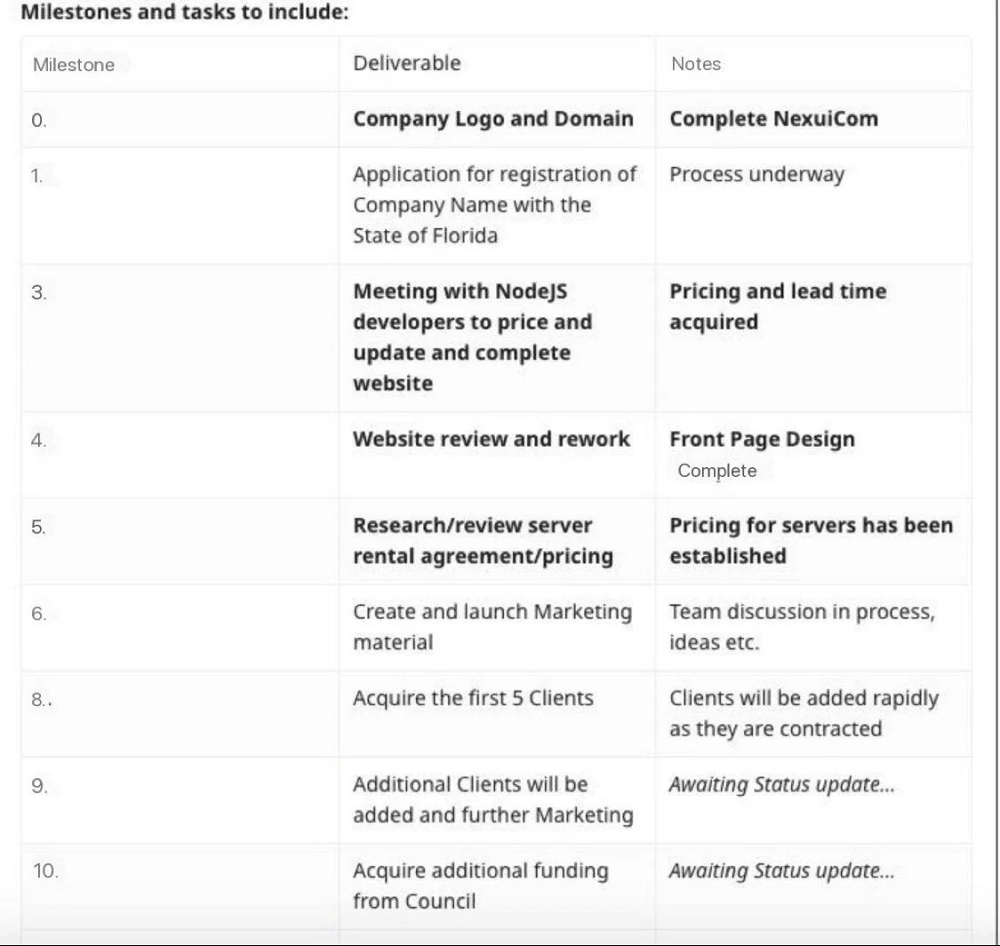

# Proposal 16,18,19: GPU Cloud Computing

::: tip
Reddit link: https://www.reddit.com/r/DBC_Council/comments/s9rg2k/proposal_gpu_cloud_computing/
:::

Additional Funding to Support and Help DBC Deploy NexuiCom GPU Cloud Computing Power in North America

额外资金支持和帮助 DBC 在北美部署 NexuiCom GPU 云计算能力

NexuiCom 在下面提供了一个中文翻译，将 DBC 社区聚集在一起。

**Proponent: Fastwalker - Nexui Communications 5FERzXKLRK3MDrgAKMq2WavcsckW4w3bXiWRQ6hEsyeJnc3L**

Date: 1/21/2022

Requested DOT: 3,000,000 DBC

NexuiCom is here to create the first and largest DBC GPU Cloud Service in North America, Supporting the DBC vision in bringing the future of Ai Deep Learning and GPU Cloud Computing to the people.

- Context of the proposal:

- I have been in discussions with various DBC Team members to get a clear understanding of what is required to succeed and to ensure the vision, created by Feng and the team, is accomplished successfully. We understand that GPU Cloud Computing is a fast growing industry, with Deep Learning, VR and the Metaverse being brought to us from tomorrows world, it is important to ensure everyone has access to a fast, high end reliable source at an affordable rate.

- I have started work on the front end of the Cloud Server website, representing NexuiCom and DBC whilst securing a Tier 3 Data Center to host the number of servers necessary for the implementation of the GPU Cloud Service provided by NexuiCom.

My team is as follows –

- Ken – Quality Assurance Specialist
- Edward – Software Engineer
- Joe – Network Engineer
- Data Center Staff to ensure the continuous running and maintenance of the servers provided
- Our motivation is the idea of successfully implementing the DBC GPU Cloud service and to provide the users a stable high end environment at a low cost.
- I have recently invested personal funds in order to create this startup, success is extremely important to myself and the team.

- **Problem statement**: The reason for requesting Council support with funding is to help our team provide Marketing, Website construction, New client communication and services within the North America Region, Located in Tampa, Florida.

- **Proposal Objective/solution/s to point 2:** I have chosen a Tier 3 Data Center and we are in the process of discussing pricing, server set up and installation. Once the servers are Client acquired and running, I will reinvest earned DBC from the rewards back into renting additional servers for the Cloud, thus providing further and much needed support for the North America Location. My goal is to have the required 8+ servers installed and rented by end of Q1 with a total of 48+ by the end of 2022, Numbers will be reviewed each quarter and with the support of the DBC Council we could double this number, my Team is ready.

**How does this proposal change the network? How do the milestones of the project achieve the ultimate goal? List the solution and milestones to reach your goal.**

If the proposal is to be awarded, it will offer an opportunity for NexuiCom/DBC to have a location in North America providing another ‘Stepping Stone’ across the Globe.

**Who does this solution help?** This solution will open up the opportunity for Gamers, Architects, Rendering Services and similar tech to have a much needed and affordable solution to their GPU Cloud needs, using Blockchain technology.

**Milestones and tasks to include:**

| Milestone | Deliverable                                                                 | Notes                                                |
| --------- | --------------------------------------------------------------------------- | ---------------------------------------------------- |
| **0.**    | **Company Logo and Domain**                                                 | **Complete NexuiCom**                                |
| 1.        | **Application for registration of Company Name with the State of Florida**  | **Completed March 12th**                             |
| 3         | **Meeting with NodeJS developers to price and update and complete website** | **Pricing and lead time acquired**                   |
| 4         | **Website review and rework**                                               | **Front Page Design Complete**                       |
| 5         | **Research/review server rental agreement/pricing**                         | **Pricing for servers has been established**         |
| 6         | Create and launch Marketing material                                        | Team discussion in process, ideas etc.               |
| 8         | Acquire the first 5 Clients                                                 | Clients will be added rapidly as they are contracted |
| 9         | Additional Clients will be added and further Marketing                      | _Awaiting Status update…_                            |
| 10        | Acquire additional funding from Council                                     | _Awaiting Status update…_                            |

**Please note that, upon delivery, each milestone needs a report for the Council to evaluate progress:** All updates will be shared in the original post generated and will clearly state the milestones delivered and any information on the progress (including developed tasks, links to the code, a comparison with the original proposal and any challenges encountered). We want our progress to stand out and be as transparent as possible.

- **Payment conditions:**

**_Funding_**

- **_What is the amount requested?_** 3,000,000 DBC
- **_Should this be divided on installments?_** 3 Installments would be welcomed over a 4-6 month period. Payments may be required sooner as goals are met. Additional funding may be required but will be discussed with the Council prior to submission

- **_How does this amount cover the work of the proposal?_** Funding will be used to help us reach three major targets –

- Server set up and Website Completion
- Marketing to gain Client interest/contracts
- Implementation and set up of Client contract, servers and initial maintenance

- **_Treasury timeline related to milestones: when are installments (if any) due?_** 3 Installments would be welcomed over a 4-6 month period or sooner.

**Proposal 19 - Treasury Installment I - 1,200,00**

**Proposal 18 - Treasury Installment II - 1,200,000**

**Proposal 16 - Treasury Installment III - 750,000**

- **_What is the address of the fund recipient? -_** 5FERzXKLRK3MDrgAKMq2WavcsckW4w3bXiWRQ6hEsyeJnc3L
- **_How can we contact the manager of the funds?_** Via WeChat, Telegram and Twitter
- **_What exchange rate are you considering and why?_** US Dollars

- **We'd love to hear about how you got to know about the Polkadot on-chain treasury: let us know, in a few sentences, how did you become familiar with the spending mechanism and the on-chain treasury?** After reviewing the DBC Wallet.io website and having further discussions with representatives within the community it became clear that the DBC Network is a community, if not a Hive, of intelligence intellect and drive that I have not seen in this kind of project. There is a want to succeed, and although we are at a new dawn of technology and an unknown, there is an excitement to want others to join and bring the future from tomorrow… too today.

**提案 - GPU 云计算**

**提案草案讨论**

**额外资金支持和帮助 DBC 在北美部署 NexuiCom GPU 云计算能力**

**支持者：Fastwalker - Nexui Communications 5FERzXKLRK3MDrgAKMq2WavcsckW4w3bXiWRQ6hEsyeJnc3L**

日期：2022 年 1 月 21 日

请求的 DOT：3,000,000 DBC

NexuiCom 在这里创建北美第一个也是最大的 DBC GPU 云服务，支持 DBC 将人工智能深度学习和 GPU 云计算的未来带给人们的愿景。

提案的背景：

我一直在与 DBC 团队的各个成员进行讨论，以清楚地了解成功所需的条件，并确保冯和团队创造的愿景能够成功实现。我们了解 GPU 云计算是一个快速发展的行业，随着深度学习、VR 和元宇宙从明天的世界带给我们，重要的是要确保每个人都能以可承受的价格访问快速、高端、可靠的资源。

我已经开始在 Cloud Server 网站的前端工作，代表 NexuiCom 和 DBC，同时保护第 3 层数据中心来托管实施 NexuiCom 提供的 GPU 云服务所需的服务器数量。

我的团队如下——

Maksim – 质量保证专家

爱德华 – 软件工程师

乔 - 网络工程师

数据中心人员确保所提供服务器的持续运行和维护

我们的动机是成功实施 DBC GPU Cloud 服务并以低成本为用户提供稳定的高端环境。

我最近投入了个人资金来创建这家初创公司，成功对我自己和团队来说都非常重要。

问题陈述：请求理事会提供资金支持的原因是帮助我们的团队在位于佛罗里达州坦帕市的北美地区提供营销、网站建设、新客户沟通和服务。

针对第 2 点的提案目标/解决方案/s：我选择了第 3 层数据中心，我们正在讨论定价、服务器设置和安装。一旦服务器被客户收购并运行，我将从奖励中获得的 DBC 再投资于为云租用额外的服务器，从而为北美地区提供进一步和急需的支持。我的目标是在第一季度末安装和租用所需的 8 台以上的服务器，到 2022 年底总共有 48 台以上的服务器，每个季度都会审查数字，在 DBC 委员会的支持下，我们可以将这个数字翻一番，我的团队准备就绪。

这个提议如何改变网络？项目的里程碑如何实现最终目标？列出实现目标的解决方案和里程碑。

如果该提案获得批准，它将为 NexuiCom/DBC 在北美设立一个地点提供机会，为全球提供另一个“垫脚石”。

这个解决方案对谁有帮助？该解决方案将为游戏玩家、建筑师、渲染服务和类似技术提供机会，使用区块链技术为他们的 GPU 云需求提供急需且负担得起的解决方案。

里程碑和任务包括:

里程碑交付说明

请注意，在交付时，每个里程碑都需要一份报告供理事会评估进度：所有更新将在生成的原始帖子中共享，并清楚说明交付的里程碑和任何有关进度的信息（包括开发的任务、指向代码，与原始提案的比较以及遇到的任何挑战）。我们希望我们的进展能够脱颖而出并尽可能透明。

- 付款条件：

资金

- 要求的金额是多少？ 3,000,000 DBC

- 这应该分期付款吗？ 3 分期付款将在 4-6 个月内受到欢迎。随着目标的实现，可能需要尽快付款。可能需要额外的资金，但将在提交之前与理事会讨论

- 该金额如何涵盖提案的工作？资金将用于帮助我们实现三个主要目标——

- 服务器设置和网站完成

- 营销以获得客户利益/合同

- 实施和建立客户合同、服务器和初始维护

- 与里程碑相关的财务时间表：分期付款（如果有）何时到期？ 3 分期付款将在 4-6 个月内受到欢迎。

- 受款人的地址是什么？ - 5FERzXKLRK3MDrgAKMq2WavcsckW4w3bXiWRQ6hEsyeJnc3L

- 我们如何联系基金经理？通过微信、电报和推特

- 你在考虑什么汇率，为什么？美元

- 我们很想听听您是如何了解 Polkadot 链上金库的：用几句话告诉我们，您是如何熟悉支出机制和链上金库的？在查看了 DBC [Wallet.io](https://Wallet.io) 网站并与社区内的代表进行了进一步讨论后，很明显 DBC 网络是一个我在此类项目中没有见过的智能和驱动社区，如果不是蜂巢的话。有一种成功的愿望，虽然我们正处于技术和未知的新曙光，但希望其他人加入并从明天开始带来未来......今天也是如此。
