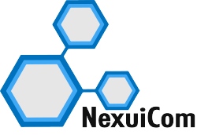

# Proposal 27 NexuiCom is applying for a Gold/Silver NFT

**提案 27** NexuiCom 正在申請金/銀 NFT

NexuiCom 在下面提供中文翻譯，將 DBC 社區聚集在一起。

## English

NexuiCom would like to put ourselves forward for the approval of a Gold NFT for the following reasons –

o Since NexuiCom has joined the DBC Ecosystem we have taken personal time to support DBC in a number of ways

o Through Social Media, Twitter is big here in the United States and I believe it is important for as many people to hear about our project, how it works, what we provide and what others can do to help grow the ecosystem, therefore we are reviewing posts daily and adding new information or progress as it happens. We also interact with as many people as possible to provide a positive outlook on the DBC Project

o We have been present at all Council meetings which have been made public, I listen and provide feedback where necessary

o I thoroughly enjoyed being part of the AMA sessions, not only answering questions provided but also listening to others and their ideas/opinions

o NexuiCom became the first GPU Server to be set up here in North America without any financial support, but of course with the support of the DBC Team. To be the first was more of a privilege than anything else, our goal is to help grow the ecosystem however we can o NexuiCom has also worked hard at setting up the first GPU Cloud Platform here in North America, there is still a lot more work to be completed and goals to be met but we are on track and we are determined to bring awareness to our project however we can

Here at NexuiCom we are determined to bring as much attention to the DBC project as possible, we are devoted to making sure not only we succeed but the Deep Brain Chain project, community and ecosystem also succeeds

If we are to be issued with the Gold/Silver NFT it will more than likely be reinvested back into the project to ensure success, we must first plant the seed, then water it, invest in it and only after a time can we pick the fruit and share with others what we have created.

NexuiCom Bringing the World of Tomorrow to the People of Today

## 中文

NexuiCom 出於以下原因提出批准金/銀 NFT：

o 自從 NexuiCom 加入 DBC 生態系統以來，我們花時間以多種方式支持 DBC

o 通過社交媒體，Twitter 在美國很重要，我相信讓盡可能多的人了解我們的項目、它是如何運作的、我們提供什麼以及其他人可以做些什麼來幫助發展生態系統是很重要的，因此我們是每天審查帖子並在發生時添加新信息或進展。我們還與盡可能多的人互動，為 DBC 項目提供積極的前景

o 我們出席了所有公開的理事會會議，我傾聽並在必要時提供反饋

o 我非常喜歡參加 AMA 會議，不僅回答提供的問題，還傾聽他人及其想法/意見

o NexuiCom 成為在北美設立的第一個 GPU 服務器，沒有任何財務支持，但當然得到了 DBC 團隊的支持。成為第一個比什麼都重要，我們的目標是幫助生態系統發展，但我們可以 o NexuiCom 也努力在北美建立第一個 GPU 雲平台，還有很多工作要做有待完成和要實現的目標，但我們正在走上正軌，我們決心盡我們所能為我們的項目帶來意識

在 NexuiCom，我們決心盡可能多地關注 DBC 項目，我們致力於確保不僅我們成功，而且深腦鏈項目、社區和生態系統也成功

如果我們要發行黃金/白銀 NFT，它很可能會被重新投資回項目以確保成功，我們必須先播種，然後澆水，投資它，只有在一段時間之後，我們才能挑選結出果實並與他人分享我們創造的東西。

NexuiCom 為今天的人們帶來明天的世界
