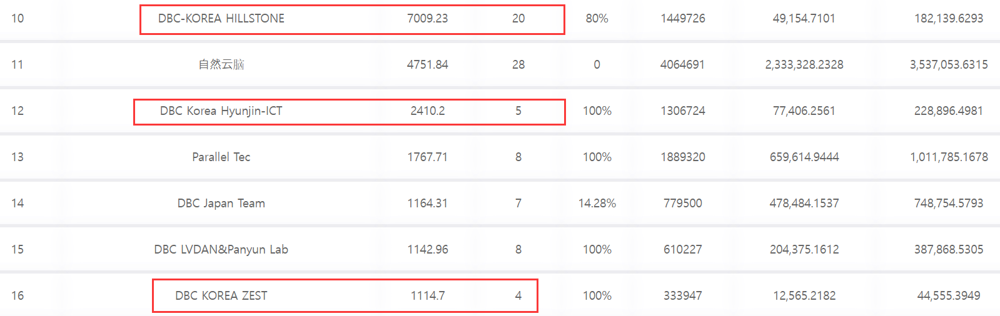

# Proposal id 35/Motions 65: 申请深脑链全方位落地韩国（DBC-KOREA）资金费用 /Funding fee for applying for DeepBrain Chain to fully land in South Korea (DBC-KOREA)

**提案人**：DBC 地址 5FHJYkMKxr87G3r914ME1DEE1mxpHeVzQ3j8pd1sy4zSFJSP

**日期**：2022-04-18

**预算**：2.0000 MDBC

**提案简述**：申请深脑链全方位落地韩国（DBC-KOREA）资金费用

**动议**: 65；

**提案 id**: 35

**摘要**

申请深脑链全方位落地韩国（DBC-KOREA）支援费用

**详情**

### 提案背景

大家好， 我是理事会成员之一 DBC-KOREA. 深脑链从今年年初开始深脑链落地韩国。我们的主要目的是拓展算池， 拓展云平台，交易所上所等事宜。

到如今不到一个季度内，我们韩国成功发展了三个算池，银河竞赛共上了 29 卡；

同时也拓展了韩国 2 个云平台正在进行开发当中；

除此以外我们还在努力进行深脑链的宣传，包括上新闻，建立深脑链韩国博客，翻译深脑链主网以及银河竞赛网页等，为了韩国算池韩国用户，我们对韩国本地化进行一些列的工作；

【韩国博客】[https://blog.naver.com/PostView.naver?blogId=dbc_korea&Redirect=View&logNo=222701744020&categoryNo=50&isAfterWrite=true&isMrblogPost=false&isHappyBeanLeverage=true&contentLength=49345](https://blog.naver.com/PostView.naver?blogId=dbc_korea&Redirect=View&logNo=222701744020&categoryNo=50&isAfterWrite=true&isMrblogPost=false&isHappyBeanLeverage=true&contentLength=49345)

【银河竞赛韩文版】
[https://galaxyrace.deepbrainchain.org/](https://galaxyrace.deepbrainchain.org/)

最后我们还主力推动韩国交易所上所事宜， 提交对应的资料，开会面谈等等。
到现在为止为了深脑链生态健康发展， 我们一直不断的努力工作，这些都是我们应该做的， 也是需要做的事情， 我们会一直努力做下去。 为了未来更好地发展韩国本地化的团队需要越来越大， 带来的固定支出也是越来越多， 在此希望可以得到各位理事的支持，对我们韩国落地接下来的更多工作拓展进行一些资金支援。

### 提案人介绍

我是 DBC-KOREA , 也是现任理事会成员之一，很荣幸成为这次的首要投票人。希望可以和各位理事各位社区成员一起建设健康生态。

我是韩国人， 曾在中国留学，精通中韩语， 有幸认识到深脑链的魅力和未来，希望对深脑链落地韩国付出我尽所能的努力。

DBC-KOREA 也属于一个团队，我们团队包含传统金融行业， 区块链开发者， 交易所开发者，以及元宇宙/NFT 平台运营者，也有 FIL 矿池运营经验。

所以我们对深脑链制作一个完善的韩文介绍报告来多次访问且开发算池

众多技术开发者进行部署云平台， 设计版面等

通过咨询公司， 来不断推动会见韩国交易所等。

### 问题陈述

深脑链是无限扩容的分布式高性能算力网络， 也是成为元宇宙+AI 等四次产业时代的重要基础设施。

为了达到如上目标， 我们不仅要继续拓展算池上卡的同时，最重要是需要主力拓展韩国的算力用户。 现在韩国正在部署 2 个云平台当中。 就是为了开发韩国的用户。

在我们拓展算池以及开发 2 个云平台的过程已经建立两家大团队进行开发， 无论是人力，时间 ，翻译，业务等，费用上都付出了很多， 但这些都是基础。

我们后续重点是做到最好的云平台进行客户的开发，包括个人用户和企业用户。

### 目标/解决方法

我们这次申请资金支援的目标， 是希望可以为我们韩国落地（固定支出，固定业务费用等）给一些资金补助。

我们在接下来的 2~3 个月内，一定会推动算池上更多的卡， 以及成功上线云平台

且分析韩国行业后， 在 5 月份会努力拓展韩国用户， 向大家共享实时状况。

同时我们也会不断的参加第四产业项目，宣传我们深脑链。

不断联络推动韩国交易所上所事宜。

全方位落地韩国，达到深脑链生态健康发展。 希望大家关注我们韩国的发展， 给予我们支持。
支付情况

please specify any special conditions regarding the payment of this proposal.

### 详细说明资金支付情况

- 资金总额 2.0000 MDBC

- 资金接收地址（注意：不能用交易所的地址申请，必须是自己掌握私钥地址，最好是 DBC 主网https://www.dbcwallet.io/生成的钱包地址，否则无法收到资金）: **5FHJYkMKxr87G3r914ME1DEE1mxpHeVzQ3j8pd1sy4zSFJSP**

- 资金管理者的联系方式 DBC-KOREA, Wechat ID：pzh0316

## English Version

**Proposer**: DBC address 5FHJYkMKxr87G3r914ME1DEE1mxpHeVzQ3j8pd1sy4zSFJSP

**Date**: 2022-04-18 Budget: 2.0000 MDBC

**Proposal Brief**: Funding Fees for Applying for DeepBrain Chain's All-round Landing in South Korea (DBC-KOREA)

**Proposal_id**:35

**Motions**:65

### Summary :

Apply for DeepBrain Chain's all-round landing in Korea (DBC-KOREA) support fee
Details Proposal Background:
Hello everyone, I am one of the board members DBC-KOREA. DeepBrain Chain has been launched in South Korea since the beginning of this year. Our main purpose is to expand the computing pool, expand the cloud platform, and exchange listings.
In less than a quarter till now, we have successfully developed three calculation pools in South Korea, and the Galaxy Competition has a total of 29 cards;

At the same time, two cloud platforms in South Korea have been expanded and are under development;
In addition, we are also working hard to promote DeepBrain Chain, including publishing news, establishing DeepBrain Chain Korean blog, translating DeepBrain Chain mainnet and Galaxy Competition webpage, etc. For the sake of Korean users in Korea, we localize in Korea. some series of jobs;

【Korean Blog】[https://blog.naver.com/PostView.naver?blogId=dbc_korea&Redirect=View&logNo=222701744020&categoryNo=50&isAfterWrite=true&isMrblogPost=false&isHappyBeanLeverage=true&contentLength=49345](https://blog.naver.com/PostView.naver?blogId=dbc_korea&Redirect=View&logNo=222701744020&categoryNo=50&isAfterWrite=true&isMrblogPost=false&isHappyBeanLeverage=true&contentLength=49345)

【Galaxy Race Korean Version】
[https://galaxyrace.deepbrainchain.org/](https://galaxyrace.deepbrainchain.org/)

Finally, we also mainly promoted the listing of the Korean stock exchange, submitted the corresponding materials, held meetings and interviews, and so on.

Up to now, we have been working hard for the healthy development of DeepBrain Chain ecology. These are what we should do and what we need to do. We will continue to work hard. In order to better develop the Korean localization team in the future, the team needs to be larger and larger, and the fixed expenditures will also be more and more. some financial support.

### Introduction of the proposer:

I'm DBC-KOREA, a current board member, and I'm honored to be the primary voter this time. I hope to build a healthy ecosystem together with all the directors and members of the community.
I am Korean, I have studied in China and am proficient in Chinese and Korean. I am fortunate to recognize the charm and future of DeepBrain Chain, and I hope to do my best to help DeepBrain Chain land in Korea.
DBC-KOREA also belongs to a team. Our team includes traditional financial industry, blockchain developers, exchange developers, and Metaverse/NFT platform operators, as well as FIL mining pool operation experience.
Therefore, we made a complete Korean introduction report on DeepBrain Chain to visit and develop the computing pool multiple times. Many technology developers deploy cloud platforms, design layouts, etc.
Through a consulting company, we continue to promote meetings with Korean exchanges, etc.

### Problem statement:

DeepBrain Chain is an infinitely scalable distributed high-performance computing power network, and it is also an important infrastructure for the fourth industrial era such as Metaverse + AI.
In order to achieve the above goals, we not only need to continue to expand the cards on the computing pool, but most importantly, we need to focus on expanding the computing power users in South Korea.
Now South Korea is deploying two cloud platforms. It is to develop Korean users.
In the process of expanding the computing pool and developing two cloud platforms, we have established two large teams for development. We have paid a lot in terms of manpower, time, translation, business, etc., but these are the foundation.
Our follow-up focus is to develop the best cloud platform for customers, including individual users and enterprise users.

### Goal/Solution:

The goal of our application for financial support this time is to provide some financial subsidies for our Korean landing (fixed expenses, fixed business expenses, etc.).

In the next 2~3 months, we will definitely promote more cards on the calculation pool and successfully launch the cloud platform After analyzing the Korean industry, we will try to expand Korean users in May and share the real-time situation with everyone.

At the same time, we will continue to participate in the fourth industry project to promote our DeepBrain Chain. Constantly contact and promote the listing of the Korean exchange.

Landing in South Korea in an all-round way to achieve the healthy development of the DeepBrain Chain ecosystem. I hope you will pay attention to our development in Korea and give us your support.

### Payment Details of the disbursement of funds:

- Total Funding 2.0000 MDBC

- Fund receiving address: **5FHJYkMKxr87G3r914ME1DEE1mxpHeVzQ3j8pd1sy4zSFJSP**

- **Money Manager contact details :** DBC-KOREA, Wechat ID: pzh0316
