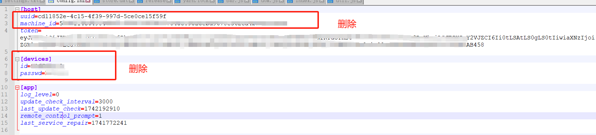

# Deeplink 长租操作流程

## 1. 在DBC链上上架符合Deeplink采矿要求的设备

### 1.1 设备要求

- 参考： https://orion.deeplink.cloud/longterm

### 1.2 安装Deeplink软件

- 软件下载地址： https://www.deeplink.cloud/software

- 如果您是本地盘的设备，直接下载安装deeplink，并登陆您的钱包即可

- 如果您是无盘系统带动GPU设备，请注意以下操作：

  - 在超级模式当中安装deeplink
  - 打开配置文件 (%appdata%\deeplink\config.ini)
  - 删除掉[host]选项中的 uuid \ machine_id 保留token，删除掉[device]选项的所有内容（token一定要保留，不然这个无盘服务器下的GPU设备无法与您的钱包关联）

  

  - 保存 并关机，然后将此镜像打包为启动镜像
  - GPU设备开机验证，确认您的GPU设备没有使用同样的ID 以及密码

### 1.3 将设备加入到DBC网络中

- 参考：https://deepbrainchain.github.io/DBC-Wiki/onchain-guide/bonding-machine.html

## 2. 在DBC链上租用您的设备并绑定EVM 钱包地址

### 2.1 租用设备（注意：参加DeepLink挖矿的用户，要使用上架设备的资金账户账户地址进行租用，否则会出现上线deeplink合约失败）

### 2.2 确认租用

> 提示： 确认租用要在租用后15分钟内进行确认

- 查询租用订单号

- 输入租用订单号确认租用

- 后续处理续租问题

- 绑定EVM地址，

## 3. 将设备加入到Deeplink长租模式采矿当中

### 3.1 GPU mining页面

- https://www.dbcscan.io/zh/mining/DeepLink (主网)

### 3.2 质押NFT 以及 DLC 开始采矿

- 质押NFT

- 质押DLC（可以不质押，但是质押的越多您的收益越高）

### 3.3质押完成后进入竞赛页面查询您的设备

- 竞赛页面： https://orion.deeplink.cloud/device
