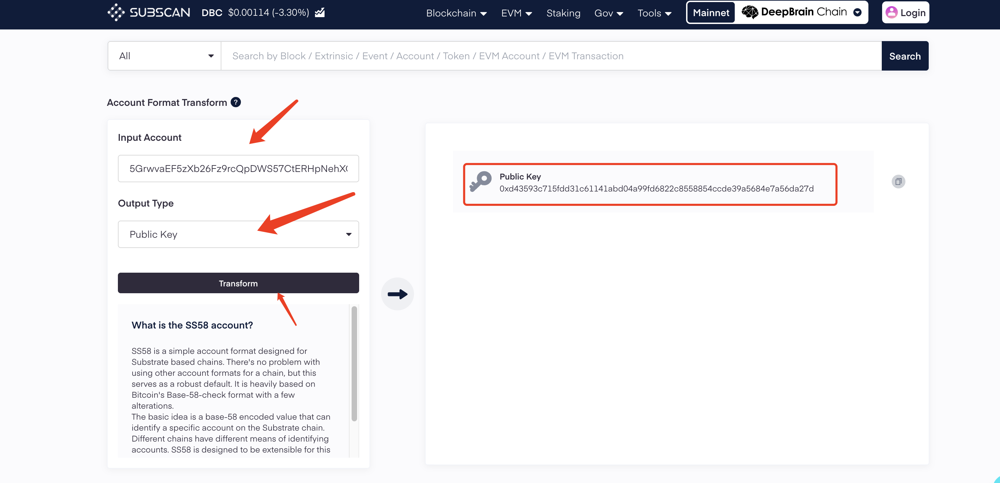

# EVM DBC转回Substrate

## 0x格式地址的DBC转回5开头格式地址:

### 通过官方bridge合约
1. 转换5开头地址的公钥，复制Public Key，填入第2步的to地址
   [https://dbc.subscan.io/tools/format_transform
   ](https://dbc.subscan.io/tools/format_transform)

2. 通过区块链浏览器调用官方bridge合约转账（建议先转1DBC测试）
   [https://www.dbcscan.io/address/0xD6D5252ab5cbDac9dd53468A12fC1f8050A4Ee22?tab=write_contract
   ](https://www.dbcscan.io/address/0xD6D5252ab5cbDac9dd53468A12fC1f8050A4Ee22?tab=write_contract)

### 我们不建议转到交易所地址，因此引起的代币丢失 损失由自己承担
