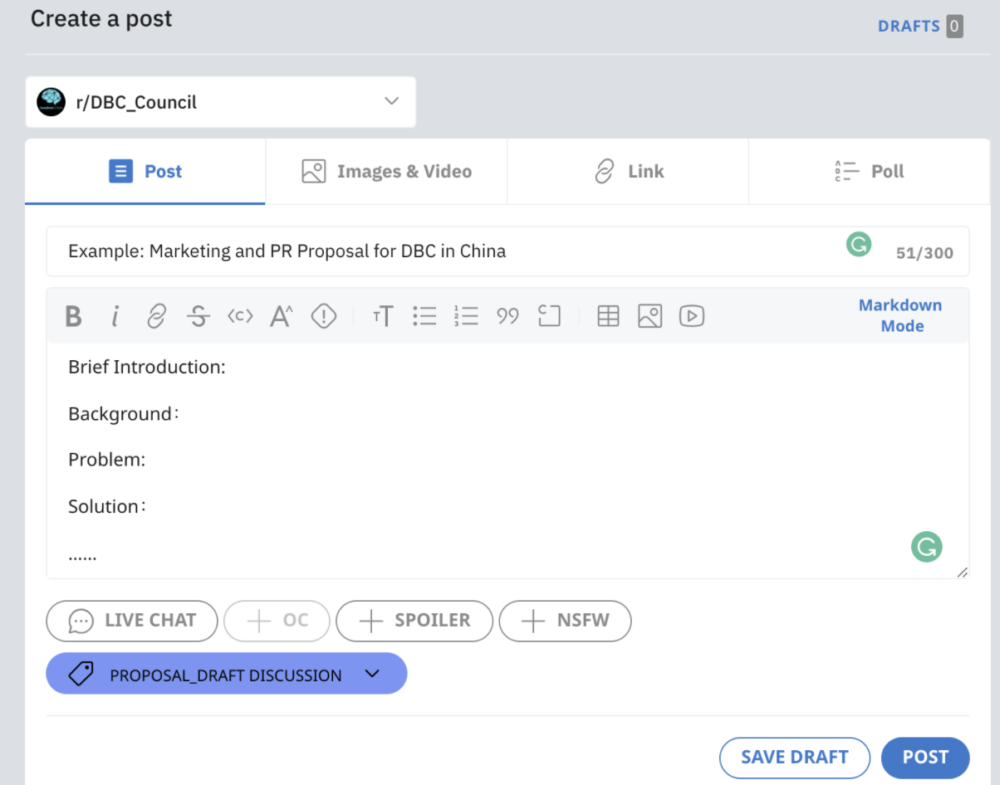
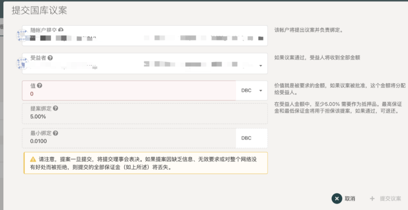
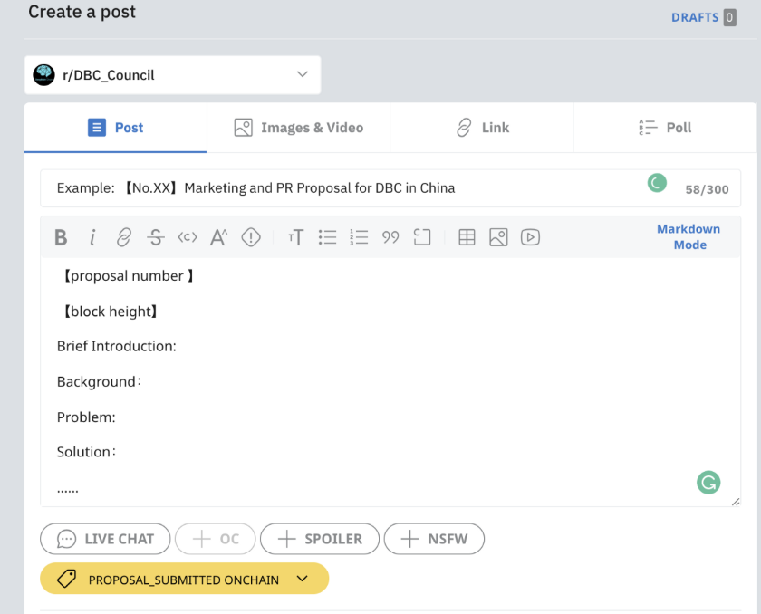

# 教程 | DBC Treasury 资金申请流程

> Treasury 资金申请流程：https://bit.ly/3FJ4gwo

## 1.准备草案

根据提案模板，准备草案

提案模板参考

英文：[https://shimo.im/docs/R6P99TpPWW8wC3yP](https://shimo.im/docs/R6P99TpPWW8wC3yP)

中文: [https://shimo.im/docs/lfwA369loYQhDprN/](https://shimo.im/docs/lfwA369loYQhDprN/)

## 2.提案链下讨论

在链上提交提案前，提案人可以在链下任何场合与理事会、社区成员进行提案讨论，如微信、telegram 社群等，并整合多方意见，不断完善提案。

目前 DBC 在 reddit 上建立了 subreddit 社区 DBC_Council（[https://www.reddit.com/r/DBC_Council/](https://www.reddit.com/r/DBC_Council/)），中国大陆使用需科学上网。该社区也建立了提案讨论的分区【proposal_draft discussion】。提案人亦可将草案发布至该社区，并添加 flair【proposal_draft discussion】，进行讨论。

## 3.链上提交

在 DBC 主网-governance-treasury 页面（[https://www.dbcwallet.io/#/treasury](https://www.reddit.com/r/DBC_Council/)）进行链上提交提案，并抵押部分 DBC（至少为申请金额的 5%）作为保证金。

::: warning
⚠️ 注意！如果提案通过，保证金将退还；如果提案被拒绝，保证金不退回！
:::

因此，请重视提案的准备工作，提交较为完整、可行的提案。

链上提交的同时，提案人必须将提案内容发布至 subreddit 社区 DBC_Council（https://www.reddit.com/r/DBC_Council/），并添加flair【proposal_submitted onchain】。链上提交后你将获得链上提案的编号和区块高度，将【编号】添加入你的提案帖中，方便链上-链下对应。

## 4.理事会在链上进行投票

## 5.投票完成

投票出结果后，DBC subreddit 的社区管理员会降通过的提案归档至 flair【proposal_approved】，未通过的提案归入 flair【proposal_rejected】。

## 6.资金发放

资金分批发放，请申请成功的提案人持续更新自己的成果。请在提案中写明每阶段需要的资金。提案完成情况由社区成员（非理事会成员）进行监督投票。

**_特别注意：接收资金的地址不能是交易所地址，需要是自己能掌握私钥的地址，最好是 DBC 主网生成的地址，否则通过后无法收到下发的资金。_**
