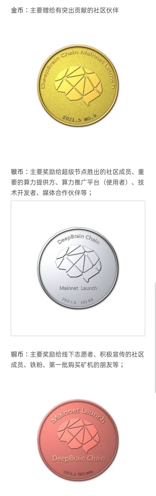

# 为迎接主网上线，深脑链（DBC）NFT 免费赠予社区

> 如何向议会申请 DBC NFT: [https://deepbrainchainglobal.medium.com/how-to-apply-for-dbc-nft-from-dbc-council-46492cb3f2ea](https://deepbrainchainglobal.medium.com/how-to-apply-for-dbc-nft-from-dbc-council-46492cb3f2ea)

最新消息，深脑链基金会为迎接主网上线，特意铸造一批 NFT 纪念币用于奖励对深脑链社区做出突出贡献的社区成员，并且承诺免费赠送，永不增发，保底回购，送完为止。

据了解，此次 DBC 主网 NFT 纪念币共分为金币、银币、铜币三种，发行量分别为 10 枚，100 枚，1000 枚，每一枚均有唯一编号，永不增发，计划自 2021 年-2026 内发放完毕。

纪念币持有者享受的权益包括：

1、基金会每年 1 月份开放一次回购：

金币可以兑换 100 万 DBC，银币兑换 10 万 DBC，铜币兑换 1 万 DBC；回购截止日期 2026 年 12 月 31 日。

2、纪念币持有者可以优先参与社区治理工作。

纪念币具体信息详见下图：

