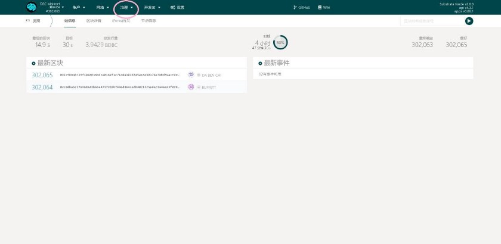
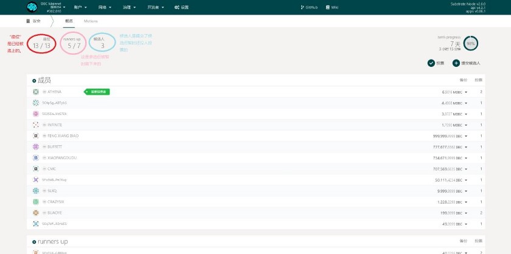

# DBC 理事会参选流程

> 中文版深脑链 DBC 理事会参选教程（图文+视频增强版）
> https://bit.ly/3HmrPLV

https://t.youku.com/yep/page/m/957gtxr1a1?wh_weex=true&isNeedBaseImage=1&objectType=1&objectCode=1450996867&sharekey=50ac9db00159ca59a635d9ef76a7041a5

图文版：

首先，大家得有一个基于波卡的 DBC 主网钱包。建好钱包后打开 DBC 主网地址www.dbcwallet.io，点选“治理”一栏。

弹出栏会有“议会”这一选项

点进去，就是当前议会竞选状态概览

“座位” — — 当前被选上的理事会成员

“runners up” — — 暂时被刷下来的参选者（亚军）

“候选人” — — 提交了候选人后暂时没进入前 20 的参选者

页面右上角分别是“投票”和“提交候选人”

如果你想竞选理事会则进入“提交候选人”；如果只想投票就进入“投票”

一、接下来我们先看“投票”

点进去可以看到自己账户余额

选好心仪的候选人后，在“投票值”处输入自己想投票的数量

1 个 DBC 算 1 票，注意，少于 1 个 DBC 的投票是不会成功的

确定好后签名提交、输密码确认就可以了

二、接下来看“提交候选人”

进入后选择自己想要参与竞选的账户

“候选资格绑定”处默认绑定 0.1DBC 就可以获得竞选资格

点选提交等链上确认后，我们就可以回到“投票”步骤给自己投票了

投票的方式是给特定账户打入保证金，

保证金越多，胜率越大

当然如果你社区威望高、拉票能力强，发动大家投你也是可以的

— — 以上就是参与竞选理事会的全部攻略了，值得一提的是：

无论是投票和竞选，质押的保证金都无需从节点质押中解押，

收益、竞选两不误！

— — — — — — — — — — — — — — — — — — — — — — — — — —

DBC 主网完全切换成波卡后，推进社区民主治理就成了当前的大事

DBC 基金会每月注入 425 万链上资金池，全部作为治理基金供社区运用。

每位 DBC 社区成员，都可以申请治理基金来做一些对社区生态发展有利的事，经理事会投票同意后即可获得资金。
