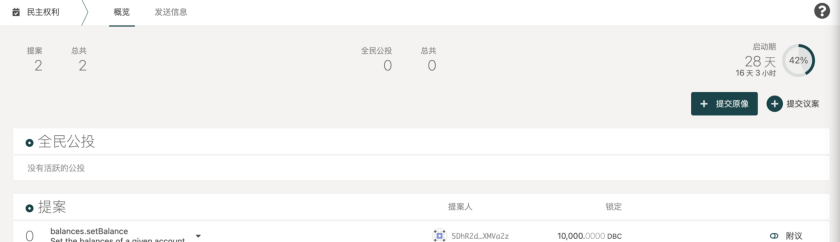
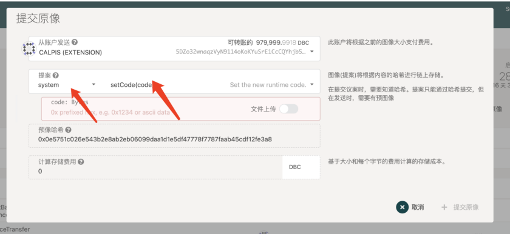
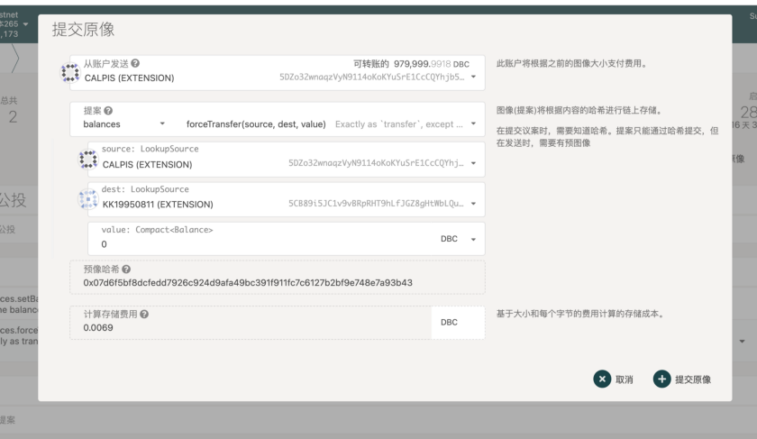
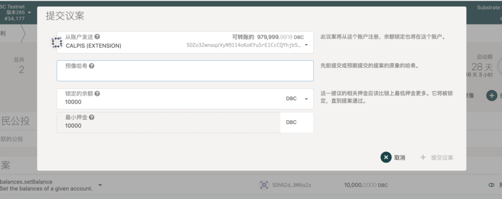
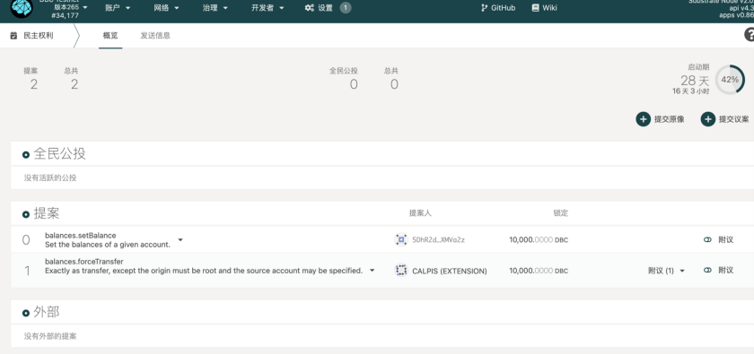
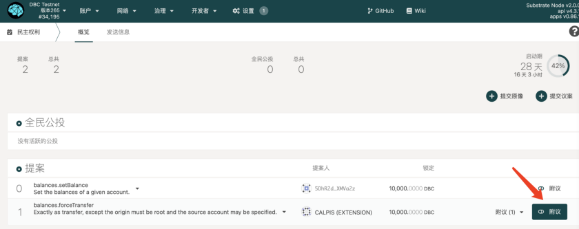
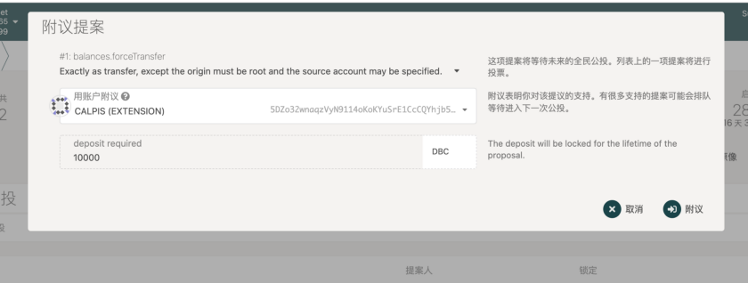
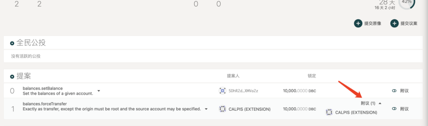

# 教程 | 如何在 DBC 主网发起公投

公投是大众对议案进行公开投票。治理决策由一个议案开始，经过大众公投后成立。这里的议案可以是用户无法直接触及的一组特权函数的任意一个，比如设置账户余额、强制转账等等。公投的议案可以来自公众公开提交、理事会提交等，这里我们主要介绍公众如何发起一项公投。

任何人都可以通过在一定时期内存入最低金额的 DBC 来发起一项公投，整个流程主要涉及【提交原像】-【提交议案】-【议案获得最多附议】-【进入公投】。

## 1. 提交原像

在提交议案前，发起人需要先提交原像。

点击【提交原像】

根据你的提案内容选择 system，填入相关参数，然后复制预像哈希

例如，如果有个人想发起一笔强制转账，那么他需要在 system 处选择“balances”，并填入随之出现的参数，然后复制预像哈希。

## 2. 提交议案

在提交原像后，选择【提交议案】，并将上一部复制的预像哈希粘贴在此处。

提交议案后，你就可以在【提案】部分看到你的议案了

同时你也可以把更详细的议案内容发布至我们的 reddit 社区 [https://www.reddit.com/r/DBC_Council/](https://www.reddit.com/r/DBC_Council/)

## 3. 附议议案

每 28 天，只有一个来自公众的议案可以进入公投环节，即获得【附议】最多的议案。如果你支持某个议案并愿意通过锁定一定数量的 dbc 帮助其更快进入公投环节，即可使用【附议】功能。锁定的 dbc 会在议案进入公投时解锁。

操作成功后，这里就会出现你的附议

## 4.关于治理机制的扩展阅读

DBC 主网是基于波卡 substrate 开发的，治理机制与波卡类似。想了解更多关于治理机制的内容可以阅读：

[https://mp.weixin.qq.com/s/K3_ISFO2Zhi5Uh3s07rWUQ](https://mp.weixin.qq.com/s/K3_ISFO2Zhi5Uh3s07rWUQ) （中文）

[https://wiki.polkadot.network/docs/learn-governance#referenda](https://wiki.polkadot.network/docs/learn-governance#referenda) （英文）

[https://wiki.polkadot.network/docs/maintain-guides-democracy](https://wiki.polkadot.network/docs/maintain-guides-democracy) （英文）
