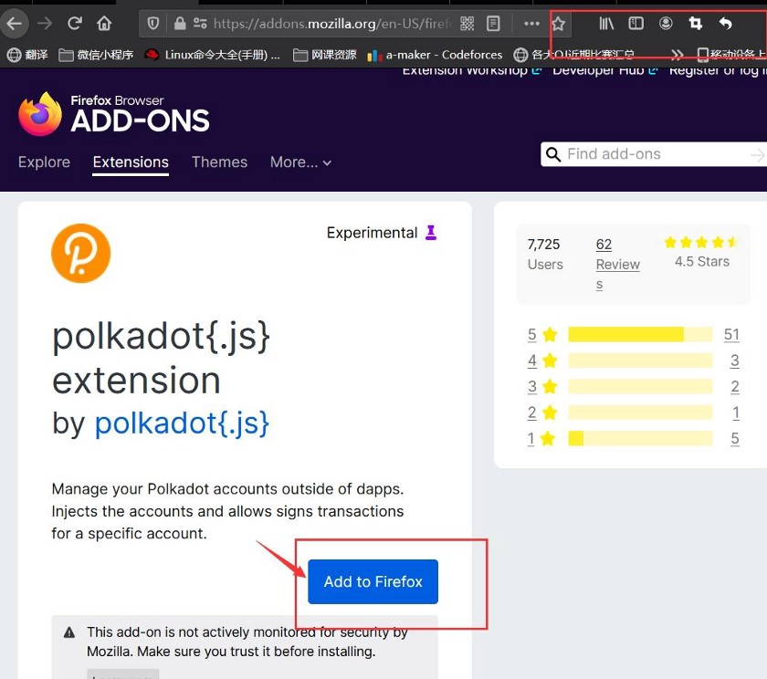
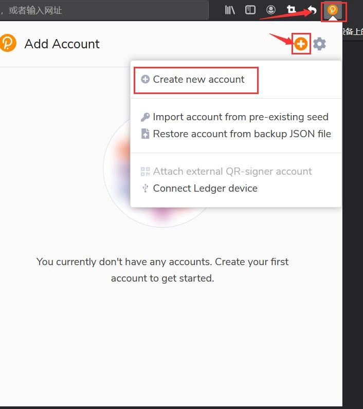
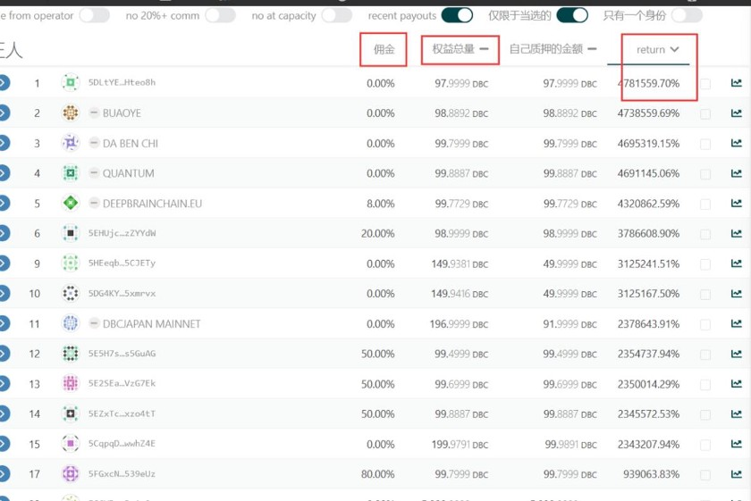
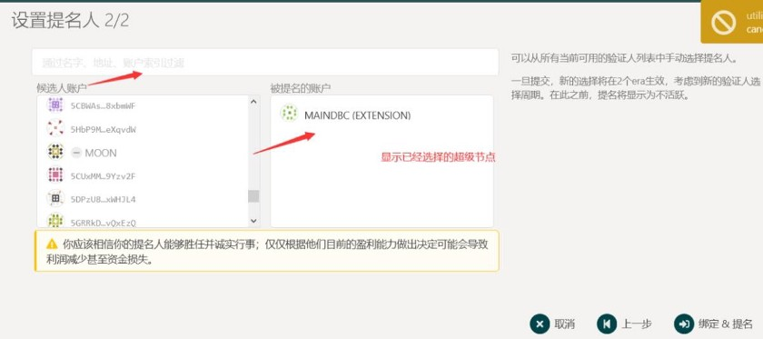
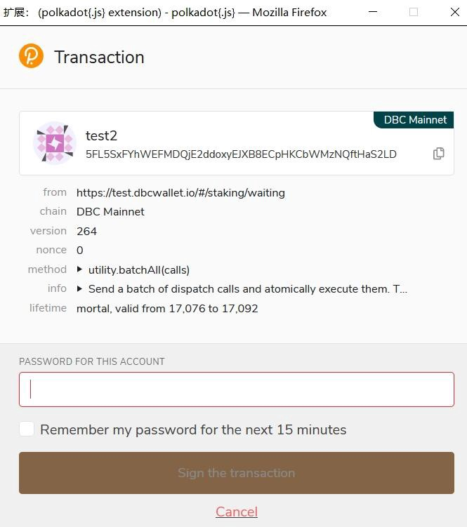

# 教程 | DBC 创建账号、质押、节点选举投票

> DBC 创建账号、质押、超级节点选举投票教程： https://bit.ly/3eAVQeU
>
> DBC 超级节点选举质押、投票链接：[https://www.dbcwallet.io/#/staking/actions](https://www.dbcwallet.io/#/staking/actions)

持有深脑链 DBC，如何在钱包里获取节点质押收益呢?

（如果不喜欢看文章的可以看下面的这个视频也介绍的很详细。）

https://v.qq.com/x/page/d3247jd4vjb.html?url_from=share&second_share=0&share_from=copy

## 一. 前期准备

1. 有一台可以使用的电脑

2. dbc 钱包备份的助记词;没有的话不要紧，下面会有教程讲述如何在主网创建新钱包;

3. 安装火狐浏览器（注意这里只要火狐浏览器，其他的浏览器无法使用后面的插件，谷歌浏览器需要特殊手段才能使用，所以必须安装火狐浏览器）

   [火狐浏览器官方下载地址](https://www.mozilla.org/zh-CN/firefox/new/)

   点击进去后点击下载然后安装即可

4. 安装波卡 JS 钱包插件

   插件下载地址：[波卡官方插件下载地址](https://addons.mozilla.org/en-US/firefox/addon/polkadot-js-extension/)

   进入官方下载地址后可以看到这个页面

点击蓝色的方框下载添加即可。添加完成后页面是这样的。

蓝色方框变成了白色，右上角红色箭头处出现了这个插件的图标。此时插件已经添加完毕。

## 二、导入（或创建）深脑链主网钱包

在上一步完成后，可以点击该插件图标创建主网钱包。

**_注意上面的助记词很重要，一定要保存到安全的地方并且做备份，记录好之后可以点击 Next Step 进入设置密码_**

设置完成后进入下一步。点击插件图标就可以看到自己的深脑链钱包地址了。

## 三、正式进入深脑链主网质押环节，提名验证人节点(质押超级节点）

> 注：
>
> 1.这里质押超级节点是一种人人都可以参与的获取投票收益方式，没有任何门槛，不需要服务器等硬件资源，只需要大家手里持仓一定数量的 dbc 即可。
>
> 2.在这里会介绍一些质押挖矿可能遇到的坑以及如何介绍一些质押技巧，尽可能的让大家质押等量的 dbc 得到的回报最高。

1. 打开深脑链主网地址

[主网地址](https://www.dbcwallet.io/#/explorer)

点进来以后，大家可以看到自己的钱包地址以及钱包里的余额。

接下来点击网络的质押选项就可以看到超级节点列表信息了

超级节点在最开始第一个季度有 21 个，官方会占有 3 个节点，但是超级节点数量大于 18 个时候，官方节点会下线，每个季度会增加 10 个节点，当前共 41 个节点。（https://dbc.subscan.io/validator）

**接下来给大家分析一下这 41 个超级节点的的情况。**

> 注：
>
> 超级节点每 24 小时选举一次，所有没有永久的超级节点，能否选上超级节点是根据这个超级节点的总的质押量排名后，前 41 名将会被自动选为超级节点，无需任何操作）

在超级节点页面我们可以看到自己质押的金额与其他人质押的金额加起来的总量最大的 41 个节点将被选为超级节点，但是也有其他的节点想要参与选举，但是由于这轮选举已经结束或者质押量排在了 41 名之后，这些节点将会出现在这个页面中

点击目标，我们可以看到所有参与选举的超级节点，接下来我们会通过分析这些超级节点的数据来决定我们投票那些超级节点让我们的利益尽可能的最大化的同时，又可以保证我们我们每天都获得利益。

看到所有的超级节点后，我们需要分析以下数据

> 注：
>
> return：指的是根据你账户的 dbc，如果你质押该节点，所能得到的利润，如果点进来发现 return 没有显示，可以单击 return，会自动从大到小排序。
>
> 权益总量：指的是该节点自己加上质押他的提名人的 dbc 总的数量，排名前 41 位的当选，而且能否当选超级节点只看这个数据。
>
> 佣金：指的是 dbc 网络会每天把等额的 dbc 发到这些超级节点上，但是超级节点需要服务器用来帮助网络出块验证，所有超级节点可以自己设定佣金比例给自己，这个佣金比例越高，超级节点所能得到也就越多，那么质押该超级节点的用户得到的也就越少，因为总的数量是确定的。
>
> 为了大家能够更加通俗的理解质押模型，这里给大家举一个通俗易懂的例子：
>
> dbc 主网每天都会准备 41 块蛋糕给用户，然后有三块是留给团队自己的，剩下的 41 块让主网上面的质押用户去分这 41 块蛋糕。但是怎么分才能保证公平而且有说服力呢？dbc 会设置无数个小组长名额，也就是超级节点，但是蛋糕只有 41 块，所有这些小组长要去竞选，怎么能保证你能选上呢，只看你手里的选票总量，也就是这个超级节点所能获取到的自己手里的 dbc 加上其他用户质押给这个节点的 dbc 总量，只要总量排在前 41 位。就一定能选上超级节点，在整个选举过程不需要任何操作，需要操作的是这些超级节点去各大社区去拉选票或者自己持有大量的 dbc 来保证选票的数量，以保障下一轮能排在前 21 位获得这块蛋糕。
>
> 还有一个问题，蛋糕是有了，那怎么分这个蛋糕，我给这个超级节点投票我该怎么计算我能得到的具体的收益呢？
>
> 首先，dbc 主网会把这个蛋糕给了超级节点，也就是每天超级节点会得到 6772 个（按照 41 个节点计算）左右的 dbc，这个时候这个
>
> 目标页面的数据就可以帮助我们更好的筛选超级节点了。
>
> 
>
> 
>
> 所得蛋糕（dbc）的计算公式 = （蛋糕总量 _ （1 — 佣金）_ （你自己的 dbc 所占该节点权益总量的比例））
>
> tips：超级节点的收入来源于两个地方，第一个地方就是自己设置的佣金比例 \* 所得的蛋糕（dbc）重量 +
>
> 蛋糕总量 _ （1 — 佣金）_ （超级节点的 dbc 所占该节点权益总量的比例））
>
> 给大家解释一下这个公式，第一要看的就是佣金下面的数字，这个百分比是由超级节点自己设立的，比如设立 0%就是超级节点拿到这块蛋糕后，我不额外去先去拿一些 dbc 奖励，我会和我的质押者们一起分享，然后根据自己的持仓 dbc，持仓的多分的也就越多。但是基本所有的节点都不会把这个比例设置成 0%，这个比例设置的越大，那么超级节点额外拿到的也就越多，拿完剩下的才和他的质押者们一起分享，如果这个比例设置成 100%，说明超级节点一口蛋糕都不会给质押者，这种节点直接无视就好了，因为质押这种节点拿不到任何收益。

但是也不是这个比例越低越好，否则也不会有这么多的筛选条件出现了。

所以因果关系就是这个佣金和你的持仓量所占这个节点的权益总量决定了你的收益，也就是 return 的大小。

> 注：大家在质押时候在按照 return 排序后选择前 21 名中 return 比例相对较高的，然后一些可靠的节点，为什么要选择可靠的节点呢？因为有的节点你看到的时候，可能由于佣金比例设置的很低，甚至设置为 0，然后 return 自然而然就会高一些，去吸引一些质押者去投票，但是当他选举为超级节点的时候，他是可以改变佣金比例，也就是提高自己所拿到的 dbc，所以其他人拿到的自然而然就会少很多。所以要找一些可靠的节点，这样我们虽然拿到收入相对于前面的收益小一些但是可能保证我们的收益非常稳定。这就需要我们加入一些官方投票社区了去真的接触这样的超级节点，以保证我们投的超级节点比较可靠。

还有一个需要考虑的条件就是就是超级节点的机器情况。

点这些曲线图标后我们可以看到一些惩罚和奖励情况，如果图像经常有一些点突然掉下去了，说明这个超级节点经常被惩罚这个，一旦被惩罚也就意味着你今天的收益就会少很多。

对这些提名人分析完毕后我们接下里就要进行具体操作了。

在设立绑定金额的时候不要全部质押，要留一个 dbc 出来，用于网络转账。

一直点击下一步进入到该页面输入密码即可完成

提名完成后可以在该列表看到自己所以提名的超级节点的等待信息，如果质押的超级节点在下一轮的选举中能够当选的话，你就可以拿到相对应的奖励了。
