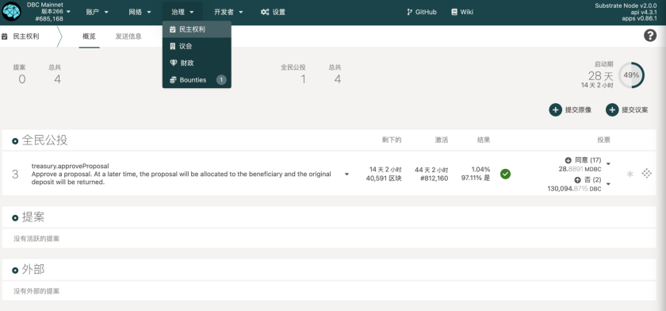
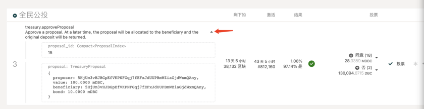
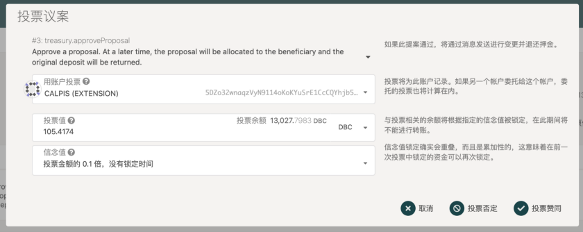
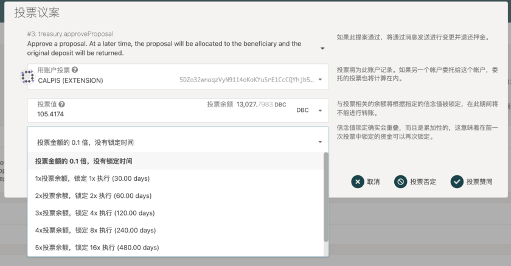
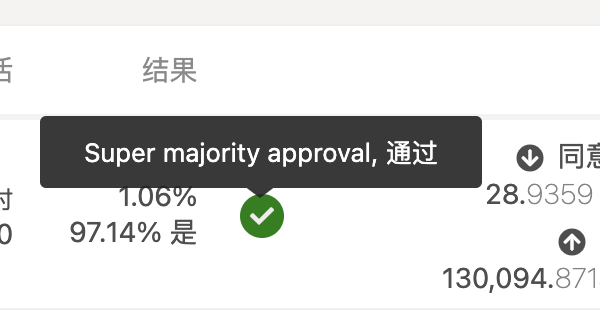
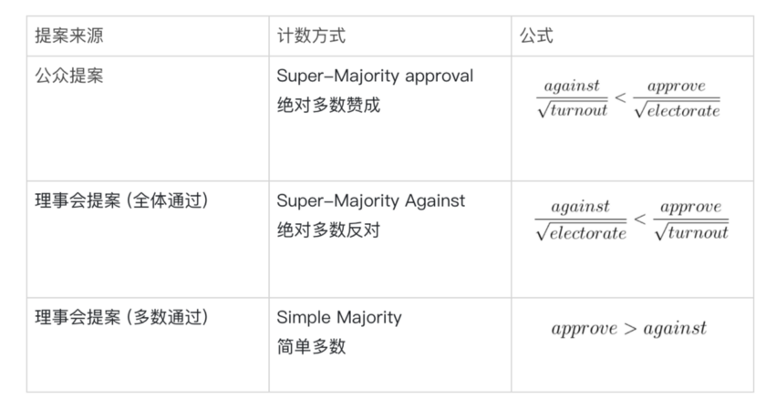

# 教程 | 如何参与 DBC 主网公投投票

## 1.【治理】-【民主权利】界面功能介绍

[https://www.dbcwallet.io/#/democracy](https://www.dbcwallet.io/#/democracy)

- **提案** — 公众发起的提案。每个启动期结束时（目前为每 28 天），收到附议数最多（指附议的 dbc 总额最多）的提案，会进入全民公投。

- **外部** — 来自理事会的提案。

- **启动期** — 新公投开启的周期，目前为 28 天。

- 点击小三角可以看到提案内容。更多细节可以去 reddit 社区 https://www.reddit.com/r/DBC_Council/

- **剩下的** — 剩余投票时间。

- **激活** — 距离提案生效的时间。

- **结果** — 第一行为投票率；第二行为暂时的结果，非最终结果。

## 2. 投票

在每个启动期结束时，收到附议数额最多的提案可以进入全民公投。在公投期间，你可以使用持有的 dbc 进行投票。你投出的 dbc 最终值多少票，取决于 dbc 的数量和锁定的时长。锁定的时间越长，你的投票效力越高。被锁定的 dbc 无法转账。如果不想锁定 dbc，你仍然可以参与投票。

点击【投票】进入投票界面

赞成就选择【投票赞同】，反对就选择【投票否定】

值得一提的是【信念值】选项。通过这个选项，你可以在一定范围内自己决定锁定 dbc 的时长。锁定时间越长，你的投票效力越高。信念值的锁定期从投票期结束时开始计时。

## 3. 结果判定方式

不同来源的提案，采用不同的结果判定方式，见下表：

（against=反对票，考虑信念值； approve=赞成票，考虑信念值； turnout=参与投票的代币数，不考虑信念值； electorate=发行的代币总数）

## 4.关于治理机制的扩展阅读

DBC 主网是基于波卡 substrate 开发的，治理机制与波卡类似。想了解更多关于治理机制的内容可以阅读：

[https://mp.weixin.qq.com/s/K3_ISFO2Zhi5Uh3s07rWUQ](https://mp.weixin.qq.com/s/K3_ISFO2Zhi5Uh3s07rWUQ) （中文）

[https://wiki.polkadot.network/docs/learn-governance#referenda](https://wiki.polkadot.network/docs/learn-governance#referenda) （英文）

[https://wiki.polkadot.network/docs/maintain-guides-democracy](https://wiki.polkadot.network/docs/maintain-guides-democracy) （英文）
