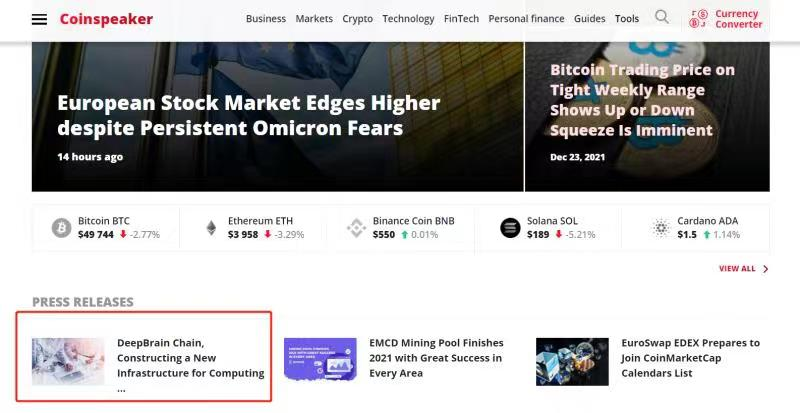
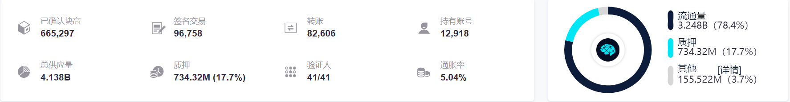
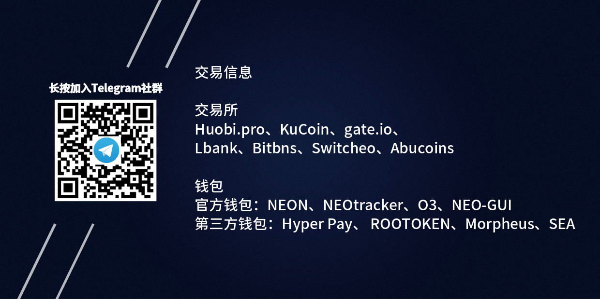

# 深脑链2021年末週报

**尊敬的深脑链全球社区成员，**

**2021年团队的马不停蹄带来了项目的大跃进，在年末时稍作休息，感谢社区成员的耐心与支持。**

**深脑链在2022年迎来了项目的第5个年头，能走到此实属不易，靠的是团队与社区的信仰与坚持。感谢每一个没有放弃的你和我，并期许在2022年能继续与大家一同乘风破浪。**

> 2017-2021，DBC已走过四个年头，一路曲折但坚定，尤其是过去的2021年，取得了很大的成绩：超级节点顺利上线并稳定运行，从最开始的21个节点增加到41个节点；主链顺利上线并稳定运行；理事会顺利启动，标志着社区自治迈向新的阶段；GPU算力主网上线，目前网络已有近1,000块GPU，且保持96%以上的租用率，待网络超过5,000块GPU后将自动启动销毁机制；DBC 生态已有十四个算池、数十家AI云平台，服务近2万AI开发者、上百家企业，包括AI、元宇宙、视觉渲染、区块链等众多行业。DBC初心不改，将朝着构建全球最大的分布式高性能算力网络，成为AI+元宇宙时代的算力基础设施这一愿景奋力前进。--深脑链联合创始人lee

## **一、产品开发进展**

> 2021年深脑链产品和技术经历了两个重要的里程碑，分别是5月20号区块链主网上线，11月24号GPU算力主网上线。

**GPU算力主网上线的功能有：**

1. 在线奖励模块

2. 在线奖励模块

3. 机器审核模块

4. 链上租用模块

5. 链上治理模块等等模块

**GPU分布式算力网络上线的功能有：**

1. 节点间实现非对称加密通信

2. 支持使用多签账户租用机器

3. 支持一台物理机创建多个虚拟机

4. 非租用者可以通过租用者分发的session_id操作功能节点

5. 支持虚拟机快照管理

6. 支持虚拟机镜像管理

7. 支持用户创建和加入分组，分组之间网络上隔离，分组内互通等等功能

另外，

1. [https://github.com/DeepBrainChain/DeepBrainChain-MainChain](https://github.com/DeepBrainChain/DeepBrainChain-MainChain) DBC算力主网代码库

570次commits提交, 2,425 个文件被修改, 74788 行代码被插入

2. [https://github.com/DeepBrainChain/DBC-Wiki](https://github.com/DeepBrainChain/DBC-Wiki): DBC文档库

88次commits提交, 1053 个文件被修改, 20705 行代码被插入

3. [https://github.com/DeepBrainChain/Rosetta-DBC](https://github.com/DeepBrainChain/Rosetta-DBC)：支持了coinbase 上币接口库

20次commits提交, 70 个文件被修改, 3189 行代码被插入

4. https://github.com/DeepBrainChain/substrate-api-sidecar：DBC substrate API接口库

8次commits提交, 17 个文件被修改, 535 行代码被插入

5. https://github.com/DeepBrainChain/PolkaWallet_Plugin_DBC：DBC手机钱包

5次commits提交, 23 个文件被修改, 77 行代码被插入

6. [https://github.com/DeepBrainChain/DBC-AIComputingNet](https://github.com/DeepBrainChain/DBC-AIComputingNet)：GPU分布式算力网络代码库

242次 commits 提交  290,213 行代码被插入

7. [https://github.com/DeepBrainChain/DBChainWebsite](https://github.com/DeepBrainChain/DBChainWebsite)：dbchain云平台

38 commits 提交 72998 行代码被插入

目前深脑链所有底层技术全部成熟可用，开发者将可以基于深脑链的IaaS服务开发丰富多彩的PaaS或者SaaS高性能计算应用。

> 深脑链创始人feng预测深脑链网络未来可能诞生的以下十大应用，这些应用每个方向都是一个巨大的创业机会，期待深脑链平台开发者可以创造GPU云服务应用的奇迹。

1. jupyter cloud：jupyter部署在深脑链之上以云服务的形式提供给AI开发者

2. omniverse cloud：omniverse部署在深脑链之上以云服务的形式提供给设计师和艺术家

3. 云游戏paas服务：传统游戏通过调用API接口实现游戏的云化元宇宙

4. paas服务:

  + 元宇宙世界逼真的场景需要边缘云端GPU服务器进行渲染计算，计算出来画面实时传输到VR头盔端进行显示，从而避免头盔进行大量计算，降低头盔成本和体积。

  + VR直播也将会作为元宇宙的一个重要应用开始崛起，VR的技术架构将会和手机直播完全不一样。主播端需要多台相机360度无死角拍摄，拍摄出来的画面传输到边缘云端GPU服务器进行渲染计算，形成一个三维世界效果，然后把这个计算结果传输到VR头盔端。

> 元宇宙的真正实现将会需要海量的边缘端GPU云服务器，支撑这一需求的服务器 将会遍布在全球数十万的边缘机房，服务器数量以千万计。-- 深脑链创始人feng

5. 云渲染Paas服务：通过API接口实时渲染电影

6. 分布式AI训练Paas服务：通过对参数的压缩和小数据学习等等技术实现分布地理位置节点的分布式训练

7. 网格计算服务：适合一个大任务拆分成多个小任务进行并行计算的场景

8. AI推理容器调度服务：通过在深脑链虚拟机中部署容器，对容器进行分布式调度

9. 生物大分子分析SaaS服务：以GPU计算为核心的DNA、蛋白质、RNA分析平台

10. 物理模拟仿真服务：在传统CPU超算上实现的仿真服务，可以迁移到GPU上面

## **二、市场进展、媒体关注**

过去一年海内外众多知名媒体对于深脑链在产品、技术及生态拓展方面的进展予以积极报道：

1. 知名科技媒体36氪报道深脑链：一文读懂深脑链DBC：无限扩容的分布式高性能算力网络，原文链接： [https://36kr.com/p/1253772390861320](https://36kr.com/p/1253772390861320)

2. 知名区块链媒体区块律动报道深脑链：高性能计算赛道的深脑链，是Web3.0时代的刚需吗？原文链接：[https://www.theblockbeats.info/news/24626](https://www.theblockbeats.info/news/24626)

3. yahoo Finance报道: 深脑链主网即将上线，波卡生态唯一大规模落地的云计算项目,原文链接地址：[https://finance.yahoo.com/news/deepbrain-chain-dbc-mainnet-launching-052000902.html](https://finance.yahoo.com/news/deepbrain-chain-dbc-mainnet-launching-052000902.html)

4. 多家知名媒体报道DBC: Metaverse Supported by DeepBrain Chain, a Distributed High-performance Computing Network，原文链接地址：

[https://coindeals.info/metaverse-supported-by-deepbrain-chain-a-distributed-high-performance-computing-network/](https://coindeals.info/metaverse-supported-by-deepbrain-chain-a-distributed-high-performance-computing-network/)；

[http://finance.dailyherald.com/dailyherald/news/read/42013419](http://finance.dailyherald.com/dailyherald/news/read/42013419)；

[http://business.theeveningleader.com/theeveningleader/markets/news/read/42013419](http://business.theeveningleader.com/theeveningleader/markets/news/read/42013419)；

[https://coins.group/metaverse-supported-by-deepbrain-chain-a-distributed-high-performance-computing-network/](https://coins.group/metaverse-supported-by-deepbrain-chain-a-distributed-high-performance-computing-network/)

5. 知名媒体coinspeaker 首页报道DBC : "DeepBrain Chain, constructing a new infrastructure for computing power in the metaverse era?"

原文链接： [https://www.coinspeaker.com/deepbrain-chain-new-infrastructure-computing-power-metaverse-era/](https://www.coinspeaker.com/deepbrain-chain-new-infrastructure-computing-power-metaverse-era/)

6. AP News 报道DBC GPU算力主网上线: ''DeepBrain Chain computing power mainnet launches online, meaning all GPU servers can now freely connect to the DBC network'' -- 原文链接： [https://apnews.com/press-release/marketersmedia/technology-blockchain-artificial-intelligence-5baa7937549a0f02b1cb0612f9afefa5](https://apnews.com/press-release/marketersmedia/technology-blockchain-artificial-intelligence-5baa7937549a0f02b1cb0612f9afefa5)

7. Korea Economic Daily报道：딥브레인체인(DBC), 블록체인 기반 GPU 컴퓨팅 클라우드·메타버스 타고 성장，原文链接：[http://kpenews.com/View.aspx?No=2173120](http://kpenews.com/View.aspx?No=2173120)

8. DBC  联合多家知名社区共举办超15场AMA，获得热烈反响，以下是部分社区AMA Recap

[https://cryptotalkz.in/ama-recap-crypto-talkz-x-deepbrain-chain/](https://cryptotalkz.in/ama-recap-crypto-talkz-x-deepbrain-chain/)

[https://cryptoscreen.org/ama-recap-cryptoscreen-with-deepbrainchain/](https://cryptoscreen.org/ama-recap-cryptoscreen-with-deepbrainchain/)

[https://medium.com/@mdsakibhasan19711626/eliena-hi-jack-lee0-d2d97a9c7c5c](https://medium.com/@mdsakibhasan19711626/eliena-hi-jack-lee0-d2d97a9c7c5c)

[https://medium.com/@cryptoroyals09/deepbrain-chain-ama-recap-495a364c62a3](https://medium.com/@cryptoroyals09/deepbrain-chain-ama-recap-495a364c62a3)

[https://medium.com/p/deepbrainchain-ama-recap-cryptotech-community-4d5dc696a624](https://medium.com/p/deepbrainchain-ama-recap-cryptotech-community-4d5dc696a624)

[https://medium.com/p/ama-recap-crypto-squadx-x-deep-brain-chain-venue-crypto-squadx-date-22-nov-2021-time-02-00-35b03cf3eba](https://medium.com/p/ama-recap-crypto-squadx-x-deep-brain-chain-venue-crypto-squadx-date-22-nov-2021-time-02-00-35b03cf3eba)

[https://medium.com/p/ama-recap-id-crypto-x-deepbrain-chain-aced37ccf8d5](https://medium.com/p/ama-recap-id-crypto-x-deepbrain-chain-aced37ccf8d5)

[https://medium.com/p/deepbrainchain-x-im-community-ama-recap-67abc44c40e1](https://medium.com/p/deepbrainchain-x-im-community-ama-recap-67abc44c40e1)

[https://medium.com/p/ama-recap-of-crypto-eagles-with-deepbrain-chain-be5c9db9ddf5](https://medium.com/p/ama-recap-of-crypto-eagles-with-deepbrain-chain-be5c9db9ddf5)

9. 参加2021韩国科学技术大展、拜访韩国当地一些知名企业以及数据中心等，加速DBC生态在韩国落地；

10. 过去一年，官方社媒粉丝数增长迅速，twitter 达到5.3万，telegram 超过2万人；DBC tele群：[https://t.me/deepbrainchainglobal](https://t.me/deepbrainchainglobal)；twitter: [https://twitter.com/DeepBrainChain](https://twitter.com/DeepBrainChain)

11. 社区参与链上治理的积极性进一步提高，根据区块链链上数据，主网质押DBC数量达到734.32百万，质押率达到17.7%，创历史新高，详见：https://dbc.subscan.io/；

12. 社区自治取得积极进展：全民公投1条，理事会提案共19条，社区自治热情高涨，2022年深脑链社区自治的广度和深度将进一步提高，欢迎广大社区成员积极参与。详见：[https://www.dbcwallet.io/#/democracy](https://www.dbcwallet.io/#/democracy)；[https://www.dbcwallet.io/#/treasury](https://www.dbcwallet.io/#/treasury)

> 「2022年，将在几个方面发展：推动以理事会为核心的社区自治；全球范围内大力发展AI开发者生态以及元宇宙开发者生态，支持开发者基于英伟达元宇宙Omniverse平台和DeepBrain Chain生态进行创业；发动社区成员在全球范围内为DeepBrain Chain 网络部署更多GPU计算节点。」-- 深脑链联合创始人Lee

## **三、算力生态建设**

> 2021年算力主网经过两轮测试网和一轮预主网后正式上线，网络算力日益增加，根据不同国家和地区的运维成本和市场情况，算力值模型经过多次调整逐步完善，多个国家和地区的算力节点正在筹划中。

**发展过程：**

1. 7月18日-8月18日测试网一阶段

2. 8月18日-9月18日测试网二阶段

3. 9月18日-11月24日预主网阶段

4. 11月24日算力主网正式上线，截至年底算力主网共入网10种不同型号GPU 共991个，算力值219,203，算力节点14个综合租用率超过96%，GPU品种不断丰富，以中高端GPU为主

5. 测试网算力值模型经过两次大的调整，之后将结合市场情况继续升级

6. 算力应用领域得到拓展，目前以云游戏，人工智能，渲染以及密码学计算为主要应用方向，更多的应用场景将持续得到拓展

**关于2022年算力板块的发展可以期待的部分：**

1. 算力节点全球化建设，全球化是2022年算力发展的主基调，重点发展目标为日韩、东南亚、北美、中东以及欧洲地区

2. 算力值模型的升级，加入地域影响系数，平衡不同国家和区域的算力入网收益平衡

3. 面向更多国家算力节点的孵化计划，包括技术对接以及市场指导

4. 全球云算力平台拓展，在2022年将发展更多的不同国家的云计算平台使用深脑链网络提供的算力

5. 2022年目标全网GPU数量突破5,000卡，综合租用率保持90%以上，基于深脑链的云计算平台新增20家以上

联系方式：

邮箱：zhouyu@deepbrainchain.org；leo@deepbrainchain.org

微信：DeepBrainChain；DBC-Leo

Telegram：18221230521；13681709317

---

欢迎您在以下平台关注我们，一起见证深脑链成长：

DBC GPU网络产品使用网站： [www.dbchain.ai](www.dbchain.ai)

DBC 产品展示网站：[www.deepbrainchain.org](www.deepbrainchain.org)

币乎专栏：[https://m.bihu.com/people/1683993092](https://m.bihu.com/people/1683993092)

Telegram 英文电报群：[https://t.me/deepbrainchainglobal](https://t.me/deepbrainchainglobal)

Twitter 粉丝：[http://twitter.com/DeepBrainChain](http://twitter.com/DeepBrainChain)

Facebook Page 粉丝：[https://www.facebook.com/OfficialDeepBrainChain/](https://www.facebook.com/OfficialDeepBrainChain/)

微信社区，请加小助手微信号 j17721137520 或 DeepBrainChain，由小助手加您入群。

关于深脑链

深脑链是无限扩容的分布式高性能计算网络

使命：连接全球算力，打造分布式高性能算力网络，构建人工智能元宇宙时代的算力基础设施

愿景：成为全球最大的算力网络

深脑链算力网络，可以帮助AI从业者/企业/大学/科研机构、云游戏、渲染、区块链等用户，节省算力成本、提高计算效率、提升产品体验。

目前，深脑链已经上线AI计算网络正式网，搭建起AI算力资源撮合的交易平台，在该平台上：算力需求方：可以根据自己的算力需求，在深脑链算力网络中找到合适的GPU算力提供方，通过支付DBC来获取GPU算力的使用权。

算力提供方：可以在官网下载软件安装包，部署深脑链算力网络节点，把自己闲置的GPU算力资源共享到全网中，并获得DBC收益。

——你们的，深脑链团队
