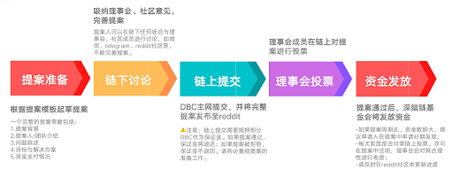

# 基金会关于 GPU 云平台扶持方案

为了帮助云平台运营人快速上手，解决资金、获客等核心运营难题，DBC 团队根据以往云平台的运营经验，总结本方案。

## 如何获取资金支持？

### 资金来源：Treasury——DBC 资金池

作为一个去中心化项目，DBC 实行链上治理与社区自治，设有专门用于生态发展的资金池——Treasury。2022 年起，DBC 基金会每月解锁 425 万 DBC 进入 Treasury 资金池，由理事会（由社区投票选出)来进行管理。这些资金主要用于基础设施部署和持续运营；网络安全运营（监查服务、持续审计）、生态支持（和友好链的合作）、市场活动（广告、支付、合作）、社区活动和外展活动（meetup，pizza parties, hackerspaces)、软件开发等等。因此， 云平台如果需要资金支持，就可以通过提案的方式向理事会申请 Treasury 资金。

### 申请流程

资金申请图文版教程：https://deepbrainchain.github.io/DBC-Wiki/dbc-democracy/apply-treasury.html
提案模板：https://shimo.im/docs/lfwA369loYQhDprN
DBC Council reddit 社区：https://www.reddit.com/r/DBC_Council/

## 获取用户：找到用户，激励用户

（此处获取用户以 AI 开发者等个人用户为主；如有企业用户的承接需求，DBC 团队会有专人对接支持）

### 如何找到潜在用户

DBC 算力网络的优势就是【高性价比 GPU 算力资源】，而目前 GPU 算力资源主要被应用于区块链、人工智能、云游戏、视觉渲染、生物制药、半导体仿真模拟等各个场景。因此，这些领域的从业人员和相关专业学生聚集的平台就是我们的目标用户聚集地，如 AI 开发者社区、建模设计师社区、设计软件的用户社区等。

这里我们也为大家列举了一些目标用户聚集地

| GPU 用户讨论群             | 3D Rendering and Architectural Visualization                                | https://www.facebook.com/groups/891302667703732  | 3D 渲染和建筑可视化        |
| -------------------------- | --------------------------------------------------------------------------- | ------------------------------------------------ | -------------------------- |
|                            | 3D Modeling,Texturing, Rendering, Rigging, Animation                        | https://www.facebook.com/groups/290530545401744  | 3D 建模渲染动画等          |
|                            | 3D Modeling, 2D Art, Drawing, Design, Animation,VFX, Rendering, illustrator | https://www.facebook.com/groups/488801081988816  | 3D 建模渲染动画等          |
| KOL（可以关注 KOL 评论区） | Benji-Sales                                                                 | https://www.youtube.com/benjisales               | 视频游戏行业博主           |
|                            | RedGaming Tech                                                              | https://www.youtube.com/c/RedGamingTech/featured | GPU 显卡和各类硬件技术分析 |

## 用户激励方案

（此部分扶持期一般为云平台建立初的 3 个月）

### 推特激励计划

#### 任务

使用注册时间大于三个月的推特账号完成以下两项
关注 DBC 和云平台的推特主页
发布一条关于 DBC 和云平台的推特，（或转发指定的某条推特），并添加 tag#DBC #GPU，或云平台要求的 tag，保 24 小时以上

#### 奖励

原创推特 2000DBC
转发指定推特 1000DBC
（以上两项二选一，且每人限领一次）

#### 领奖方式

将（1）推特主页链接 （2）上述第二条的链接或截图 （3）dbc 接收地址 提供给 GPU 云平台运营人员

### 裂变激励

#### 任务

推荐新用户完成推特任务，每人最多享受 10 次有奖邀请

#### 奖励

邀请一人完成推特任务，获得 1000dbc

#### 领奖方式

被邀请人将（1）邀请人及其 dbc 地址 （2）上述推特激励领奖所需材料 提交给 GPU 云平台运营人员

### 内容产出激励

#### 任务

用户在 YouTube、tiktok 发布关于使用云平台的原创视频，或在其他 ai 开发者论坛、GPU 用户聚集的社区发布关于 dbc 及云平台的原创介绍贴、使用分享贴。

#### 奖励

由运营人员根据内容篇幅、质量、效果等提供 5000-30000 的 dbc 奖励，特别优秀的爆款内容还可以获得 NFT 奖章

#### 领奖方式

将个人主页截图、作品链接提供给云平台运营人员，每个作品限领一次

## PR

DBC 将利用自身社媒资源，协助云平台进行宣发推广；
DBC 可以对接全球范围内媒体资源，帮助云平台联系外部媒体渠道，提升知名度；
DBC 可以联合 GPU 云平台一起做品宣、市场活动；
