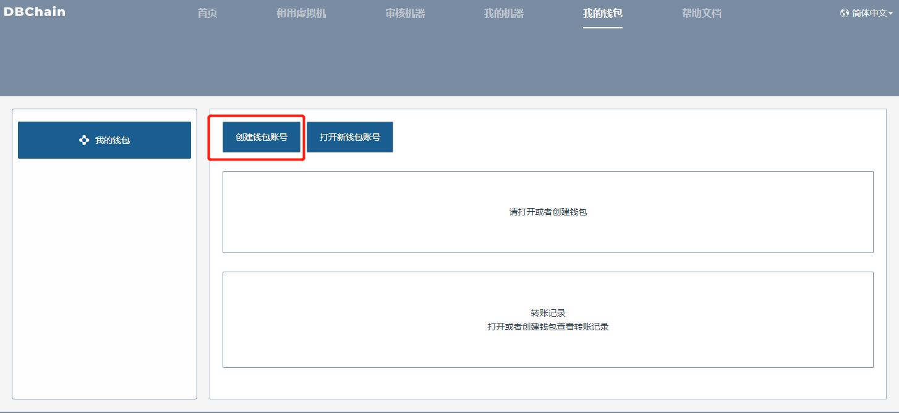
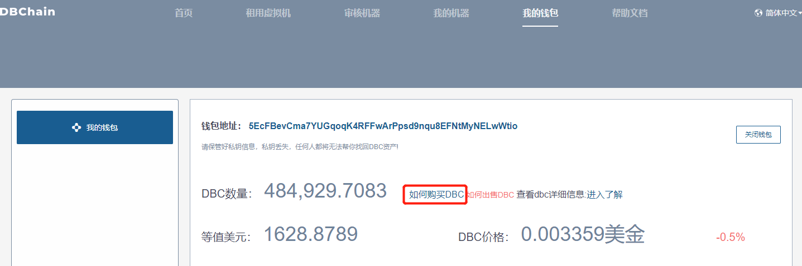
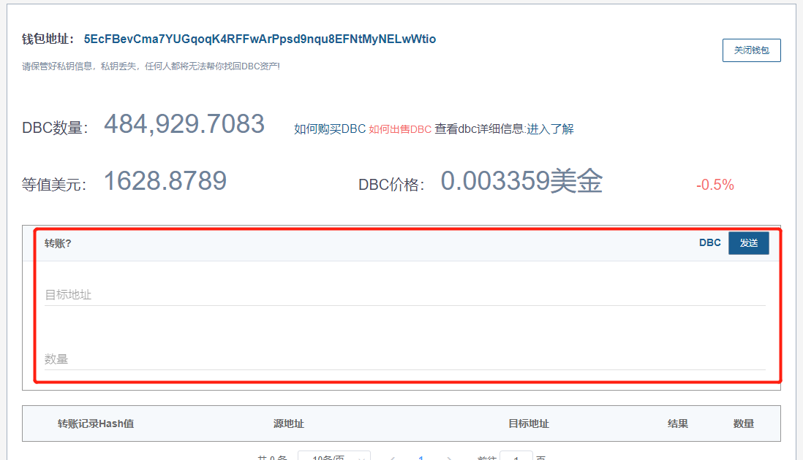
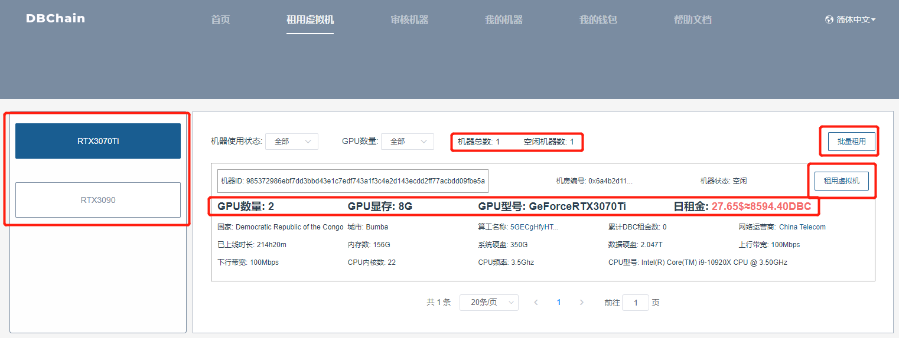
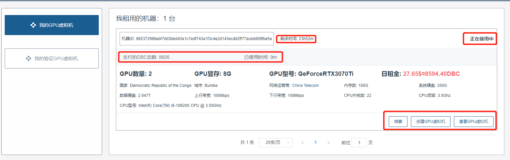
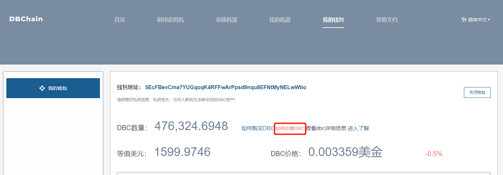

# 虚拟机租用教程

## 一. 注册钱包

进入我的钱包页面 --> 点击 创建钱包账号 按钮，按提示完成操作即可

## 二. 购买 DBC

租用虚拟机时，需要钱包里面有一定数量的 DBC，1 个 DBC 目前不到 3 分钱，点击 如何购买 DBC，进入购买

::: warning
DBC 不是积分，他是一种数字货币，他的价格是时刻都在波动的，购买 DBC 后，不仅仅在当前网站可以使用，也可以转账到其他支持 DBC 钱包或者数字货币交易所买卖，比如下图，你可以转账到任何其他的 DBC 钱包地址，当转出去过后，DBC 将不再属于你，而是属于这个钱包地址的所有者。
:::

## 三. 租用虚拟机

进入 租用虚拟机页面，左侧为目前已有机器的 GPU 型号分类信息，右侧展示具体 GPU 型号下的机器详细信息，如 GPU 型号、GPU 数量、显存，日租金等内容。其中，租用虚拟机方式分别为 单个租用虚拟机 以及 批量租用虚拟机 ，用户可以根据自己的需求灵活使用。

##### 1. 单个租用虚拟机

点击机器列表中 租用虚拟机 按钮，弹出弹框，自己填写租用时长，此时会显示总计所需金额以及对应的 DBC 数量，以及相关提醒，确认信息无误后，点击 确认支付 按钮，开始租用改机器，等待 30S 左右，租用成功时，跳转至我的机器-->我的 GPU 虚拟机页面，查看相关租用信息

##### 2. 批量租用虚拟机

点击批量租用接口，出现多选框，选择自己想租用的机器，点击 确认提交，填写租用时长，此时会显示总计所需金额以及对应的 DBC 数量，以及相关提醒，确认信息无误后，点击 确认支付 按钮，开始租用改机器，当租用完成后，会跳转至我的机器-->我的 GPU 虚拟机页面，查看相关租用信息

## 四. 我的机器

进入 我的机器 --> 我的 GPU 虚拟机 页面，显示当前钱包下的虚拟机订单信息，虚拟机订单一共展示四种状态：待确认租用、正在使用中 、订单结束、订单取消、正在退币中，请稍后(只针对订单取消状态之前)

##### 1. 待确认租用

从租用虚拟机页面进行机器租用后，生成待确认租用订单，此时，会有 30 分钟的确认租用时间，可用于创建虚拟机，验证机器是否可用，如创建成功，可点击确认租用，此时订单变为 正在使用中 状态，若创建失败，无需操作，30 分钟后，订单变为 订单取消 状态，此时会将剩余 DBC 打入支付账户中

##### 2. 正在使用中

点击 确认租用 按钮后，订单变为 正在使用中 状态，此时可进行创建虚拟机，续费等操作，页面展示支付 DBC 数量，已经使用时间，及剩余时间，等机器到期后，订单变为 订单结束 状态，同时在使用中用户创建的虚拟机信息则会保留 10 天，10 天后自动删除虚拟机信息

## 五. 卖出 DBC

购买了比较多的 DBC，但是没有用完，可以选择卖出 DBC，当然也可以选择放在钱包，但是一直放在钱包，DBC 的价格是一直波动的，可能涨价也可能下跌，需要自己做好判断，可以承担下跌损失。如果想要卖出 DBC，进入 我的钱包 页面，点击 如何出售 DBC ,即可了解卖出规则

