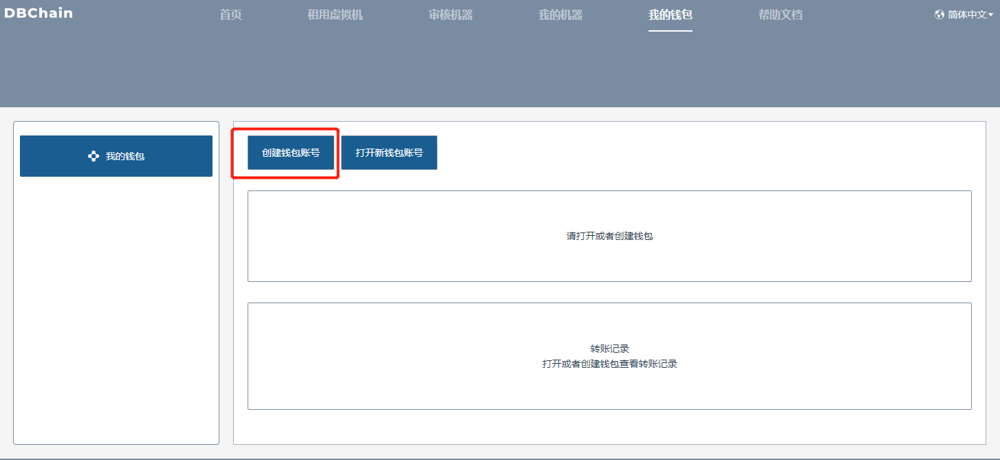
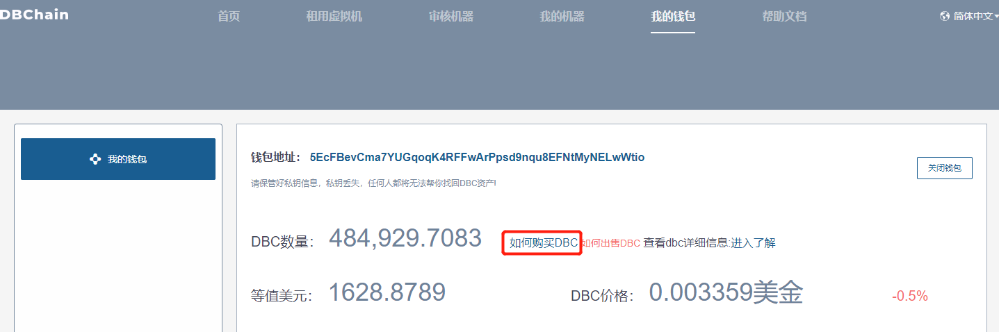
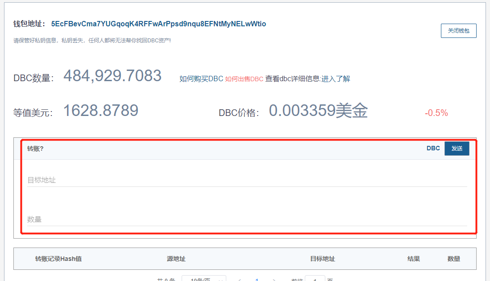
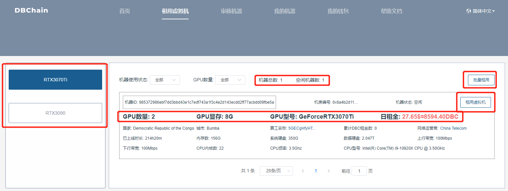
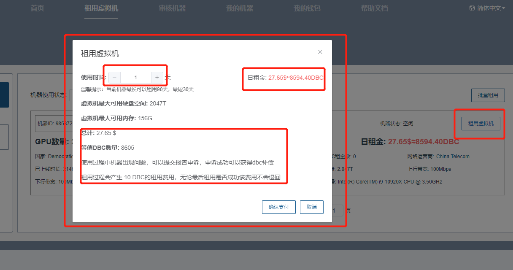
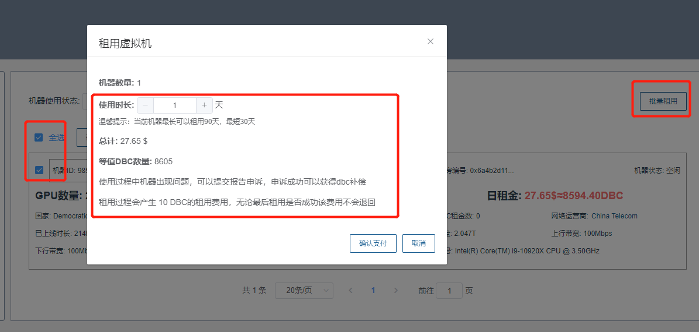
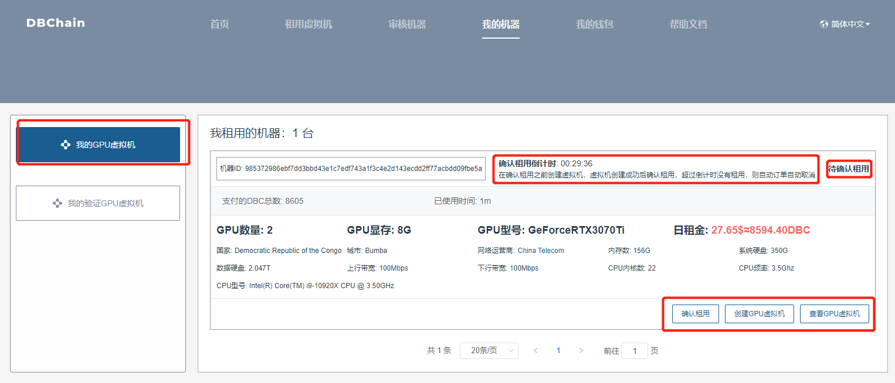
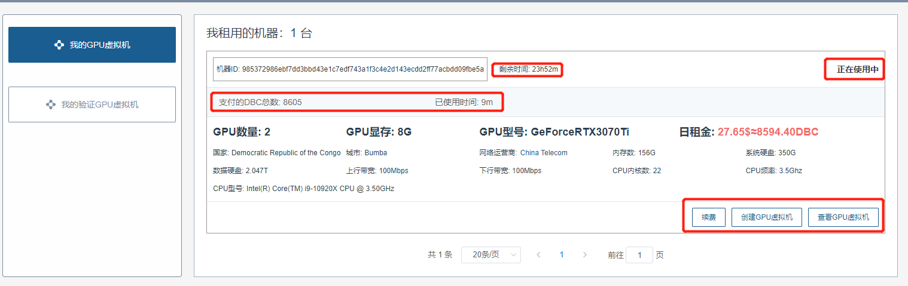
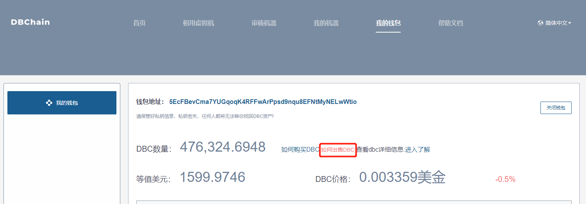
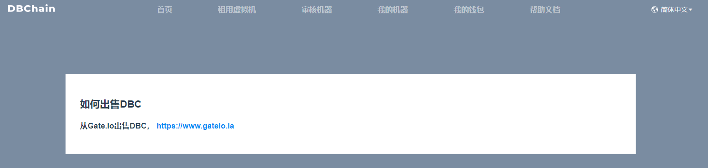

# 操作文档
## 一. 注册钱包
进入我的钱包页面 --> 点击 创建钱包账号 按钮，按提示完成操作即可

## 二. 购买DBC
租用虚拟机时，需要钱包里面有一定数量的DBC，1个DBC目前不到3分钱，点击 如何购买DBC，进入购买

::: warning
DBC不是积分，他是一种数字货币，他的价格是时刻都在波动的，购买DBC后，不仅仅在当前网站可以使用，也可以转账到其他支持DBC钱包或者数字货币交易所买卖，比如下图，你可以转账到任何其他的DBC钱包地址，当转出去过后，DBC将不再属于你，而是属于这个钱包地址的所有者。
:::

## 三. 租用虚拟机
进入 租用虚拟机页面，左侧为目前已有机器的GPU型号分类信息，右侧展示具体GPU型号下的机器详细信息，如 GPU型号、GPU数量、显存，日租金等内容。其中，租用虚拟机方式分别为 单个租用虚拟机 以及 批量租用虚拟机 ，用户可以根据自己的需求灵活使用。

##### 1. 单个租用虚拟机
点击机器列表中 租用虚拟机 按钮，弹出弹框，自己填写租用时长，此时会显示总计所需金额以及对应的DBC数量，以及相关提醒，确认信息无误后，点击 确认支付 按钮，开始租用改机器，等待30S左右，租用成功时，跳转至我的机器-->我的GPU虚拟机页面，查看相关租用信息

##### 2. 批量租用虚拟机
点击批量租用接口，出现多选框，选择自己想租用的机器，点击 确认提交，填写租用时长，此时会显示总计所需金额以及对应的DBC数量，以及相关提醒，确认信息无误后，点击 确认支付 按钮，开始租用改机器，当租用完成后，会跳转至我的机器-->我的GPU虚拟机页面，查看相关租用信息

## 四. 我的机器
进入 我的机器 --> 我的GPU虚拟机 页面，显示当前钱包下的虚拟机订单信息，虚拟机订单一共展示四种状态：待确认租用、正在使用中 、订单结束、订单取消、正在退币中，请稍后(只针对订单取消状态之前)

##### 1. 待确认租用
从租用虚拟机页面进行机器租用后，生成待确认租用订单，此时，会有30分钟的确认租用时间，可用于创建虚拟机，验证机器是否可用，如创建成功，可点击确认租用，此时订单变为 正在使用中 状态，若创建失败，无需操作，30分钟后，订单变为 订单取消 状态，此时会将剩余DBC打入支付账户中

##### 2. 正在使用中
点击 确认租用 按钮后，订单变为 正在使用中 状态，此时可进行创建虚拟机，续费等操作，页面展示支付DBC数量，已经使用时间，及剩余时间，等机器到期后，订单变为 订单结束 状态，同时在使用中用户创建的虚拟机信息则会保留10天，10天后自动删除虚拟机信息

## 五. 卖出DBC
购买了比较多的DBC，但是没有用完，可以选择卖出DBC，当然也可以选择放在钱包，但是一直放在钱包，DBC的价格是一直波动的，可能涨价也可能下跌，需要自己做好判断，可以承担下跌损失。如果想要卖出DBC，进入 我的钱包 页面，点击 如何出售DBC ,即可了解卖出规则

