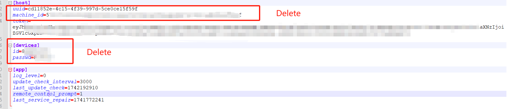

# Internet cafes participate in Deeplink short-term mining

## 1. Equipment requirements

+ Reference： https://orion.deeplink.cloud/shortterm

## 2. Install and set up Deeplink software

### 2.1 Solution 1

+ Software download address: https://www.deeplink.cloud/software

+ If you are using a diskless system to drive a GPU device, please pay attention to the following operations:

  +  Install deeplink in super mode and log in to your wallet
  + Open the configuration file (%appdata%\deeplink\config.ini)
  + Delete the uuid \ machine_id in the [host] option, keep the token, and delete all the contents of the [device] option (the token must be kept, otherwise the GPU device under this diskless server cannot be associated with your wallet)

  

  + Save and shut down, then package this image as a boot image
  + GPU device startup verification, confirm that your GPU device does not use the same ID and password

### 2.2 Solution 2

+ Open the configuration file (%appdata%\deeplink\config.ini) and add the following configuration in the [devices] module and restart the deeplink service

```
[devices]
# Ignore the device code option above and always get the device code from the server. It is recommended to set this to 1 to enable this function in a diskless environment in an Internet cafe.
always_refresh_id=1
```

## 3. Rent your device

+ Click to enter the cloud GPU machine
+ Select Rent my computer
+ Pledge DBC NFT and DLC for rent
