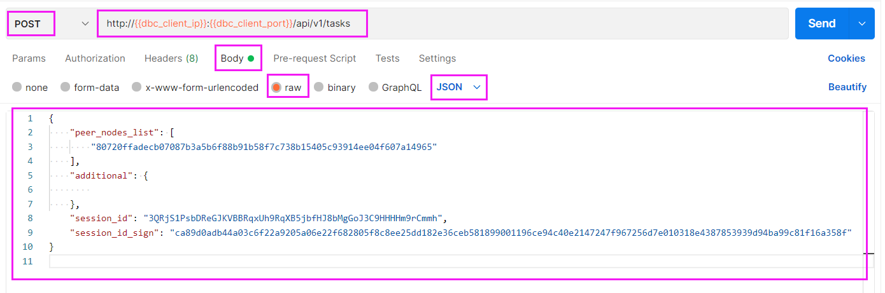
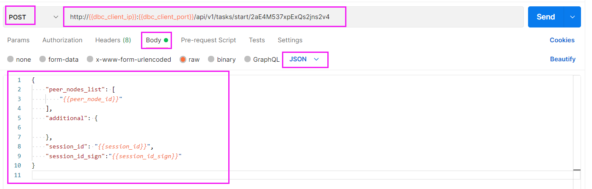
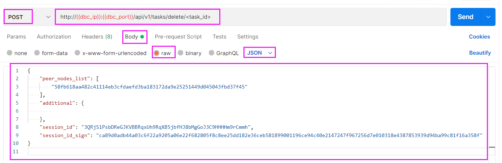
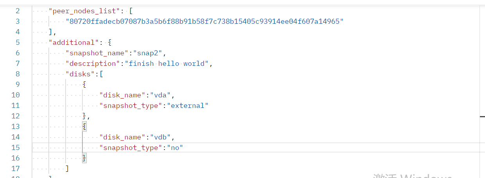
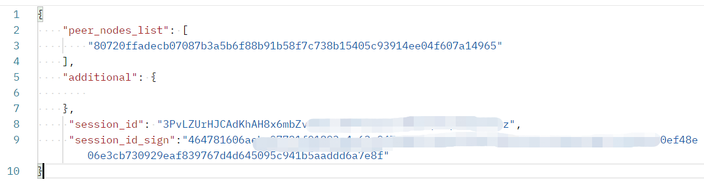
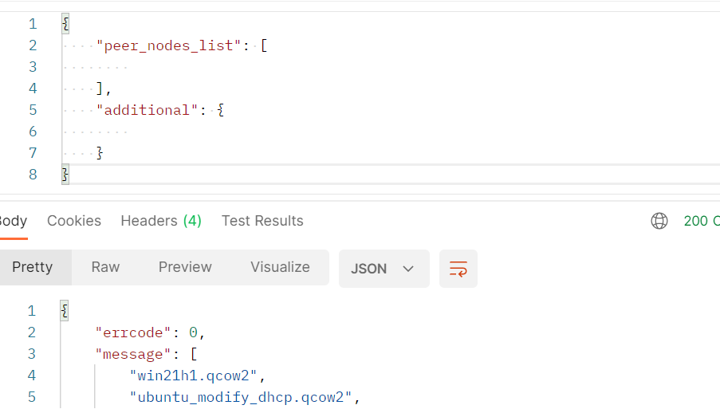

# HTTP client request API
#### ( The dbc_client_ip and dbc_client_port in the following HTTP request are the DBC client access addresses deployed by the user )
---

## GPU Node Manage

### 1. Querying GPU Node Machine Configuration Information
>`request method`：POST
>
>`request URL`：http://<**dbc_client_ip**>:<**dbc_client_port**>/api/v1/mining_nodes
>
>`request body`：
>    ```
>    {
>        "peer_nodes_list": [
>            // node_id of GPU Node
>            "58fb618aa482c41114eb3cfdaefd3ba183172da9e25251449d045043fbd37f45"
>        ],
>        "additional": {
>
>        }
>    }
>    ```
Example：


<br/>

### 2. Tenant query to get session_id
>`request method`：POST
>
>`request URL`：http://<**dbc_client_ip**>:<**dbc_client_port**>/api/v1/mining_nodes/session_id
>
>`request body`：
>    ```
>    {
>        "peer_nodes_list": [
>            // node_id of GPU Node
>            "58fb618aa482c41114eb3cfdaefd3ba183172da9e25251449d045043fbd37f45"
>        ],
>        "additional": {
>
>        },
>       //Identity authentication information, use tenant signature or multi-signature account signature (refer to the description of HTTP request format), choose one of the two
>       ...
>    }
>    ```
Example (the tenant's signature is used here, and a multi-signature account signature can also be used)：


<br/>

## Virtual Machine Manage

### 1. Create a virtual machine
>`request method`：POST
>
>`request URL`：http://<**dbc_client_ip**>:<**dbc_client_port**>/api/v1/tasks/start
>
>`request body`：
>    ```
>    {
>        "peer_nodes_list": [
>            // node_id of GPU Node
>            "58fb618aa482c41114eb3cfdaefd3ba183172da9e25251449d045043fbd37f45"
>        ],
>        "additional": {
>            // remote login linux virtual machine, ssh port (linux)
>            "ssh_port": "5684",
>            // remote login windows virtual machine, rdp port (windows) 
>            "rdp_port": "5685",
>            // vnc connect port
>            "vnc_port": "5904",
>            // image name
>            "image_name": "ubuntu.qcow2",
>            // custom image name/ID, such as: my-ubuntu-1804
>            "custom_image_name": "my-ubuntu-1804"
>            // operation system type: ubuntu、win
>            "operation_system": "ubuntu",
>            // bios mode:
>            //   linux: "legacy"
>            // windows: "uefi"
>            "bios_mode": "legacy",
>            // multicast address: 224.0.0.0~239.0.0.0
>            "multicast":["230.0.0.1:5558"]
>            // Number of gpus (greater than or equal to 0)
>            "gpu_count": "0",
>            // Number of CPUs (greater than 0)
>            "cpu_cores": "4",
>            // Memory size (greater than 0, unit: G)
>            "mem_size": "8",
>            // Disk size (greater than 0, unit: G)
>            "disk_size": "10",
>        },
>
>        "session_id": "The session_id distributed by the renter",
>        "session_id_sign": "session_id_sign distributed by the renter"
>    }
>    ```
Example：


* The length of the creation process will vary depending on the configuration, ranging from five to fifteen minutes.
* You can query the `login method` of the virtual machine and the `current status` of the virtual machine by requesting `virtual machine details` (when the status value is "creating", it means that the virtual machine is in the process of being created)

<br/>

### 2. Querying Virtual Machine Details
>`request method`：POST
>
>`request URL`：http://<**dbc_client_ip**>:<**dbc_client_port**>/api/v1/tasks/<task_id value to query>
>
>`request body`：
>   ```
>   {
>       "peer_nodes_list": [
>           // node_id of GPU Node
>           "58fb618aa482c41114eb3cfdaefd3ba183172da9e25251449d045043fbd37f45"
>       ],
>       "additional": {
>            
>       },
>
>       "session_id": "The session_id distributed by the renter",
>       "session_id_sign": "session_id_sign distributed by the renter"
>  }
>  ```

Example：


### 3. Query the list of virtual machines
>`request method`：POST
>
>`request URL`：http://<**dbc_client_ip**>:<**dbc_client_port**>/api/v1/tasks
>
>`request body`：
>   ```
>   {
>       "peer_nodes_list": [
>           // node_id of GPU Node
>           "58fb618aa482c41114eb3cfdaefd3ba183172da9e25251449d045043fbd37f45"
>       ],
>       "additional": {
>            
>       },
>
>       "session_id": "The session_id distributed by the renter",
>       "session_id_sign": "session_id_sign distributed by the renter"
>  }
>  ```
Example：


### 4. Stop Virtual Machine
>`request method`：POST
>
>`request URL`：http://<**dbc_client_ip**>:<**dbc_client_port**>/api/v1/tasks/stop/<task_id>
>
>`request body`：
>   ```json
>   {
>       "peer_nodes_list": [
>           // node_id of GPU Node
>           "58fb618aa482c41114eb3cfdaefd3ba183172da9e25251449d045043fbd37f45"
>       ],
>       "additional": {
>            
>       },
>
>       "session_id": "The session_id distributed by the renter",
>       "session_id_sign": "session_id_sign distributed by the renter"
>  }
>  ```
Example：


### 5. Start Virtual Machine
>**Wakes a sleeping virtual machine， also use this api**
>
>`request method`：POST
>
>`request URL`：http://<**dbc_client_ip**>:<**dbc_client_port**>/api/v1/tasks/start/<task_id>
>
>`request body`：
>   ```json
>   {
>       "peer_nodes_list": [
>           // node_id of GPU Node
>           "58fb618aa482c41114eb3cfdaefd3ba183172da9e25251449d045043fbd37f45"
>       ],
>       "additional": {
>            
>       },
>
>       "session_id": "The session_id distributed by the renter",
>       "session_id_sign": "session_id_sign distributed by the renter"
>  }
>  ```
Example：


### 5. delete virtual machine
>`request method`：POST
>
>`request URL`：http://<**dbc_client_ip**>:<**dbc_client_port**>/api/v1/tasks/delete/<task_id>
>
>`request body`：
>   ```
>   {
>       "peer_nodes_list": [
>           // node_id of GPU Node
>           "58fb618aa482c41114eb3cfdaefd3ba183172da9e25251449d045043fbd37f45"
>       ],
>       "additional": {
>            
>       },
>
>       "session_id": "The session_id distributed by the renter",
>       "session_id_sign": "session_id_sign distributed by the renter"
>  }
>  ```
Example：


### 7. Restart Virtual Machine
>`request method`：POST
>
>`request URL`：http://<**dbc_client_ip**>:<**dbc_client_port**>/api/v1/tasks/restart/<task_id>
>
>`request body`：
>   ```json
>   {
>       "peer_nodes_list": [
>           // node_id of GPU Node
>           "58fb618aa482c41114eb3cfdaefd3ba183172da9e25251449d045043fbd37f45"
>       ],
>       "additional": {
>            
>       },
>       "session_id": "The session_id distributed by the renter",
>       "session_id_sign": "session_id_sign distributed by the renter"
>  }
>  ```
::: warning
发送重启请求后，管理程序将选择它认为最好的关闭方法。请注意，虚拟机可能会忽略该请求。若要强制重启虚拟机，请给url加上force_reboot参数，参数等于true或者1即强制重启，等于false或者0或者不带参数则仍旧使用上面传统的方式重启。强制重启虚拟机的请求url如下：

http://<**dbc_client_ip**>:<**dbc_client_port**>/api/v1/tasks/restart/<task_id>?force_reboot=true
:::

### 8. Query Virtual Machine Logs
>`request method`：POST
>
>`request URL`：http://<**dbc_client_ip**>:<**dbc_client_port**>/api/v1/tasks/logs/<task_id>?flag=tail&line_num=10
>
>`request body`：
>   ```json
>   {
>       "peer_nodes_list": [
>           //GPU节点的node_id
>           "58fb618aa482c41114eb3cfdaefd3ba183172da9e25251449d045043fbd37f45"
>       ],
>       "additional": {
>            
>       },
>
>       "session_id": "The session_id distributed by the renter",
>       "session_id_sign": "session_id_sign distributed by the renter"
>  }
>  ```

:::tip 注意！
查询虚拟机日志的请求url有两个参数，flag表示查询日志的方向，参数等于tail即从日志文件的尾部开始查询，等于head即从日志文件的头部开始查询。line_num表示要查询的日志行数，如果超过文件的实际行数，则以文件实际行数为准。最后，此请求最多返回1024个字节，超出范围的日志会被截断。
:::

<br/>

## Snapshot Manage

### 1.创建快照

:::tip 注意！
创建快照是请确保虚拟机为关闭状态
:::

- 请求方式： POST

- 请求 URL：

```
http://{{dbc_client_ip}}:{{dbc_client_port}}/api/v1/snapshot/<task_id>/create
```

- 请求 Body:

```json
{
  "peer_nodes_list": [
    //GPU节点的node_id
    "80720ffadecb07087b3a5b6f88b91b58f7c738b15405c93914ee04f607a14965"
  ],
  "additional": {
    "snapshot_name": "snap2", //自定义的镜像名
    "description": "finish hello world", // 自定义的镜像描述（可不写）
    "disks": [
      //选择磁盘创建（可以不写，如果没有"disks"，则默认对所有磁盘做外部增量快照，快照文件由 libvirt 自动生成）
      {
        "disk_name": "vda", //磁盘名称
        "snapshot_type": "external" //external创建外部快照
      },
      {
        "disk_name": "vdb", //磁盘名称
        "snapshot_type": "no" //no不创建快照(不填写默认使用external)
      }
    ]
  },
  "session_id": "租用者分发的 session_id",
  "session_id_sign": "租用者分发的 session_id_sign"
}
```

- 实例：



### 2.查看快照列表

- 请求方式：POST

- 请求 URL：

```
http://{{dbc_client_ip}}:{{dbc_client_port}}/api/v1/snapshot/<task_id>
```

- 请求 Body:

```json
{
  "peer_nodes_list": [
    //GPU节点的node_id
    "80720ffadecb07087b3a5b6f88b91b58f7c738b15405c93914ee04f607a14965"
  ],
  "additional": {},
  "session_id": "租用者分发的session_id",
  "session_id_sign": "租用者分发的session_id_sign"
}
```

- 实例：



### 3.查看快照详情信息

- 请求方式：POST

- 请求 URL：

```
http://{{dbc_client_ip}}:{{dbc_client_port}}/api/v1/snapshot/<task_id>/<snap_name>
```

- 请求 Body:

```json
{
  "peer_nodes_list": [
    //GPU节点的node_id
    "80720ffadecb07087b3a5b6f88b91b58f7c738b15405c93914ee04f607a14965"
  ],
  "additional": {},
  "session_id": "租用者分发的session_id",
  "session_id_sign": "租用者分发的session_id_sign"
}
```

- 实例：


## Image Manage

### 1. 查询镜像中心ID列表

- 请求方式：POST

- 请求 URl：

```
http://{{dbc_client_ip}}:{{dbc_client_port}}/api/v1/images/servers`
```

- 请求 Body:

```json
{
  "peer_nodes_list": [],
  "additional": {}
}
```

### 2.查询镜像列表

- 请求方式：POST

- 请求 URl：

```
http://{{dbc_client_ip}}:{{dbc_client_port}}/api/v1/images`
```

- 请求 Body:

**1. 查询镜像中心的镜像列表**
```json
{
  "peer_nodes_list": [],
  "additional": {
    // 【必填】指定要查询的镜像中心ID
    "image_server": "ID_1"
  }
}
```
**2. 查询GPU节点的镜像列表**
```json
{
  "peer_nodes_list": [
    //GPU节点的node_id
    "80720ffadecb07087b3a5b6f88b91b58f7c738b15405c93914ee04f607a14965"
  ],
  "additional": {
    // 【选填】指定要查询的镜像中心ID
    "image_server": "ID_1"
  }
}
```
**3. 查询GPU节点上某个用户的镜像列表**
```json
{
  "peer_nodes_list": [
    //GPU节点的node_id
    "80720ffadecb07087b3a5b6f88b91b58f7c738b15405c93914ee04f607a14965"
  ],
  "additional": {
    // 指定要查询的镜像中心ID
    "image_server": "ID_1"
  },
  "session_id": "租用者分发的session_id",
  "session_id_sign": "租用者分发的session_id_sign"
}
```

- 实例：



### 3.上传镜像

- 请求方式：POST

- 请求 URL：

```
http://{{dbc_client_ip}}:{{dbc_client_port}}/api/v1/images/upload
```

- 请求 Body:

**1. 将GPU节点上的某个镜像上传到镜像中心**

```json
{
  "peer_nodes_list": [
    //GPU节点的node_id
    "80720ffadecb07087b3a5b6f88b91b58f7c738b15405c93914ee04f607a14965" 
  ],
  "additional": {
    "image_filename": "ubuntu.qcow2",
    // 指定要查询的镜像中心ID
    "image_server": "ID_1"
  },
  "session_id": "租用者分发的session_id",
  "session_id_sign": "租用者分发的session_id_sign"
}
```
**2. 将客户端节点上的某个镜像上传到镜像中心**
```json
{
  "peer_nodes_list": [],
  "additional": {
    "image_filename": "ubuntu.qcow2",
    // 指定要查询的镜像中心ID
    "image_server": "ID_1"
  }
}
```

- 实例：


### 4.下载镜像

- 请求方式：POST

- 请求 URL：

```
http://{{dbc_client_ip}}:{{dbc_client_port}}/api/v1/images/download
```

- 请求 Body:

**从镜像中心下载镜像到GPU节点**
```json
{
  "peer_nodes_list": [
    //GPU节点的node_id
    "80720ffadecb07087b3a5b6f88b91b58f7c738b15405c93914ee04f607a14965"
  ],
  "additional": {
    // 指定要查询的镜像中心ID
    "image_server": "ID_1",
    "image_filename": "ubuntu.qcow2",
    // 本地存储路径
    "local_dir": "/my_local_dir"
  },
  "session_id": "租用者分发的session_id",
  "session_id_sign": "租用者分发的session_id_sign"
}
```

- 实例：


