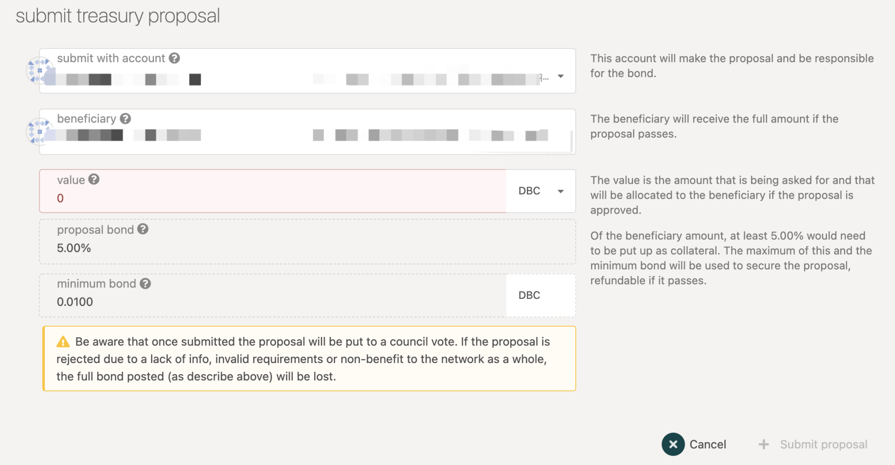
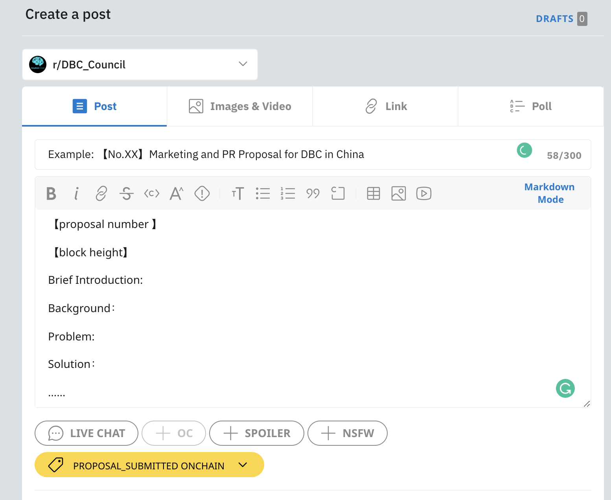

# How to apply funds from DBC Treasury

## 1. proposal draft

prepare your proposal draft according to the template

https://docs.google.com/document/d/1cqjBCHtvqhdx-0kymg66T7zlW_dkhAM1JVx5RUUuCII/edit?usp=sharing

## 2. off-chain discussion

Before submitting a proposal on-chain, the proposer can discuss the proposal with the council and community members on any occasion off the chain, such as WeChat, telegram community, etc., and integrate the opinions of multiple parties to continuously improve the proposal.

Currently, DBC has established a subreddit community DBC_Council (https://www.reddit.com/r/DBC_Council/ ) on Reddit. The community has also established a proposal discussion flair [proposal_draft discussion]. Proposers can also publish the draft to the community and add flair【proposal_draft discussion】for discussion.

## 3. on-chain submission

submit your proposal on https://www.dbcwallet.io/#/treasury.
Of the beneficiary amount, at least 5.00% would need to be put up as collateral. The maximum of this and the minimum bond will be used to secure the proposal, refundable if it passes.

::: warning
⚠️ Be aware that once submitted the proposal will be put to a council vote. If the proposal is rejected due to a lack of info, invalid requirements or non-benefit to the network as a whole, the full bond posted will be lost.
Please pay attention to the preparation of the proposal and submit a complete and feasible proposal.
:::

Meanwhile，post the final version of your proposal to the DBC subreddit flair【proposal_submitted onchain】(or edit the flair of the draft), with the on-chain proposal number and block height.

## 4. waiting for the council voting

## 5. After voting

After voting，the admin of the DBC subreddit will move the proposal to flair【proposal_approved】or【proposal_rejected】according to the outcome。

## 6.Funds payment

The funds will be divided on installments

The proposer who have successfully applied are requested to continue to update their outcomes. Please specify the funds required for each stage in the proposal. The outcomes of the proposal is monitored by community members (except members of the council)
