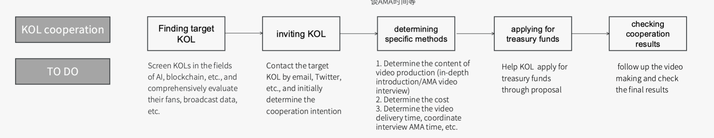

# Council's Proposal to Mobilize Community Members for Global Outreach

With the explosion of ChatGPT, the field of AI continues to be hot, and DBC has also received more and more attention. We believe that DBC should take advantage of this momentum to carry out multi-channel publicity, and it is easier to achieve twice the result with half the effort. The specific methods of publicity can include KOL cooperation, online community activities, technical salons, offline meetups, etc.

The essence of blockchain projects is openness, open source, community autonomy, co-construction, sharing, and co-governance. DBC has been committed to establishing a complete on-chain governance and community governance mechanism, attracting a large number of outstanding talents who agree with the DBC vision to join the DBC community and contribute to the ecological development of the community. At present, DBC has realized the DAO through the council system - the council is elected by community members and participates in project governance on behalf of their interests. Among them, the management of treasury funds is one of the main ways of governance of the council. According to the planning of the council system, the DBC fund pool is used for infrastructure deployment and continued operation, network security operations (monitoring services, continuous auditing), ecosystem provisions (collaborations with friendly chains), marketing activities (advertising, paid features, collaborations), community events and outreach (meetups, pizza parties, hackerspaces), software development (wallets and wallet integration, clients and client upgrades) and more.

In order to mobilize the enthusiasm of the community and give full play to the power of the council and the community, we hope to establish a marketing mechanism led by the DBC council and the community, further optimize community governance and the efficiency of the use of treasury funds, and enhance the influence of DBC on a global scale. In the initial stage of the establishment of the mechanism, KOL cooperation will be used as a pilot operation, and it will be extended to other marketing methods after the mechanism matures.

KOL cooperation in the English-speaking region is currently a relatively mature and effective way of overseas promotion. We hope that through cooperation with YouTube KOLs in fields such as blockchain and AI, we can use the influence of KOLs to enhance the popularity of DeepBrain Chain in the global market through comprehensive project interpretations, video AMA interviews and other forms.

KOL cooperation basically includes screening KOLs, inviting KOLs, determining specific cooperation methods, applying for treasury funds, and checking and accepting cooperation results. Under the marketing mechanism led by the council and the community, active members of the council and the community can participate in all aspects of KOL cooperation, actively explore high-quality cooperation opportunities, and assist KOL to complete the cooperation. As a reward, the cooperation leader can apply for a certain amount of DBC from the national treasury as a service fee. In order to mobilize everyone's enthusiasm in the early stage, we suggest that it be 20%-30% of the cooperation funds (approved by the DBC council), especially excellent cooperation cases It can reach 50%. For example, the transaction price of a youtube cooperation is 4000U, and the cooperation leader can get 800U, so the treasury approval fee is 4800U, and so on. (except for the founder of the foundation, everyone can apply for service remuneration)

The following is the KOL cooperation link and the specific implementation work of each link. The specific service remuneration ratio can be determined by the council after discussion according to the difficulty and influence of the actual case. 

Attached is the list and follow-up status of some English-language youtube bloggers that have been screened and sorted out, for your reference.https://docs.google.com/spreadsheets/d/1cL6i-sGW8uOnyj-jtxJ5pAa_Fdy7IeIiaX9j96Vfs8c/edit#gid=0

