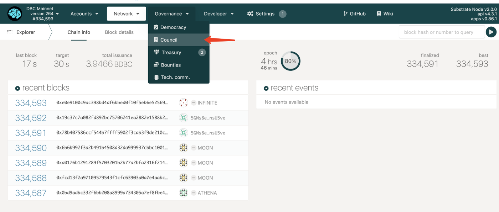
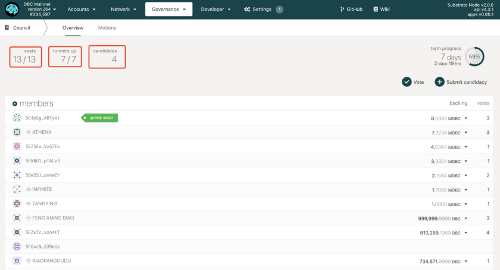
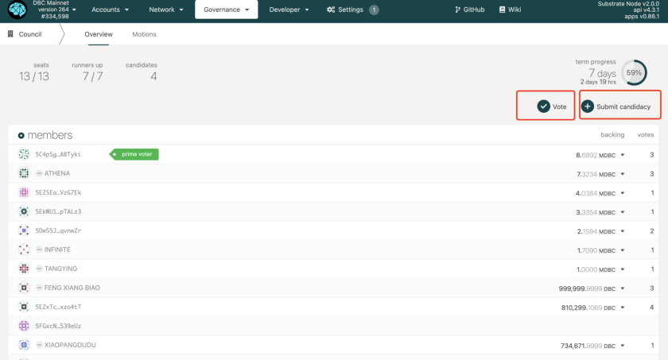
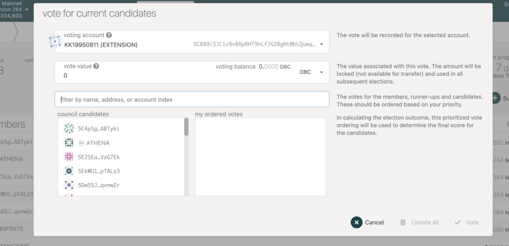
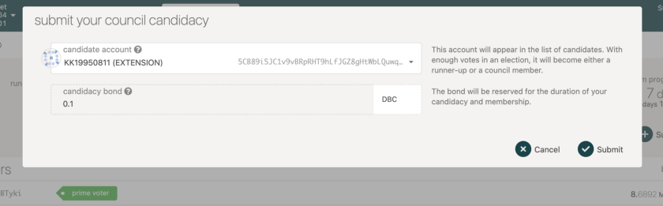

# How to participate in Council voting? A step by step guide

First, you need to have a wallet on DBC mainnet https://www.dbcwallet.io/

Here is a video guide about how to create a wallet https://www.youtube.com/watch?v=uQ6XUJVbCzs&t=18s

Open https://www.dbcwallet.io/ and click [Governance — Council]

Then you can get an overview of the current state of the council elections.

seats — the number of current councillors

runners up — the number of candidates which will remain in the queue with their votes intact

candidates — Candidates who have not entered the top 20

You can find [Vote] and [Submit candidacy] at the top right of the member list.

If you want to vote for a candidate, just click [vote], and then you can vote follow the guide on the page.

1 DBC counts as 1 vote. Note that votes with less than 1 DBC will not be successful

As for [submit candidate],

Choose the account you want to participate in the election and bond 0.1 DBC, then the account is qualified for election.

After clicking submit and waiting for confirmation on the chain, you can go back to the “voting” step to vote for yourself.

You can also promote yourself in the community to attract more people to vote for you

It is worth mentioning that, DBCs staked for supernode can also be used for council voting.
