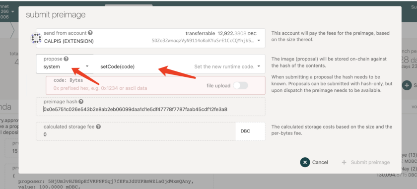
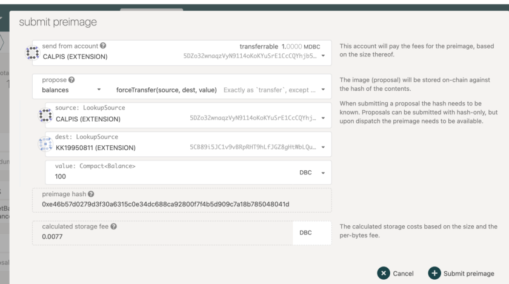
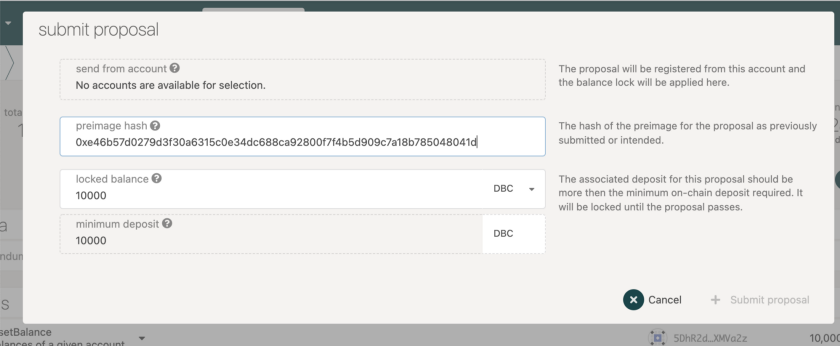
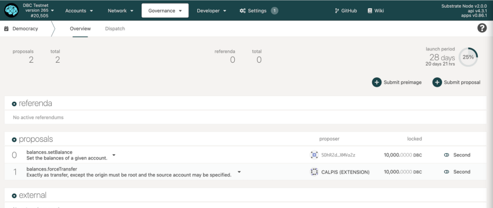
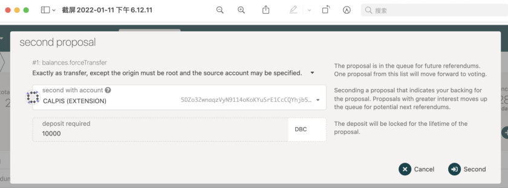
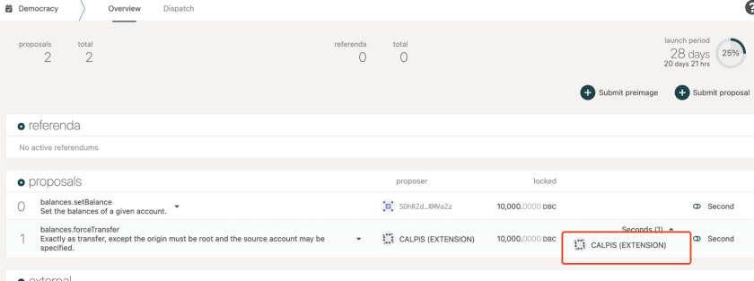

# Guide | Proposing a referendum

Referenda are discrete events, have a fixed period where voting happens, and then are tallied and the function call is made if the vote is approved.

Referenda can be started in one of several ways for example, from the public and council. This guide shows how the general public can propose a referendum.

Anyone can propose a referendum by depositing the minimum amount of tokens for a certain period (number of blocks). If someone agrees with the proposal, they may deposit tokens to support it — this action is called second. The proposal with the highest amount of bonded support will be selected to be a referendum in the next voting cycle.

## 1. Submitting a Preimage

Before submitting a proposal, you need to submit a preimage first.

Click on the “Submit preimage” button

Choose the system you want to change, fill in the required set code, and **copy the preimage hash**.

For example, if someone wants to propose a force transfer, he needs to choose a “balances” system and provide the source, dest and value.

## 2. Submitting a proposal

After submitting the preimage, click on “submit proposal”, and paste the preimage hash here.

Once the transaction is included you should see the information for your already submitted proposal.

You can post detailed proposals to our reddit community [https://www.reddit.com/r/DBC_Council/](https://www.reddit.com/r/DBC_Council/)

## 3. Seconding a Proposal

Seconding a proposal means that you are agreeing with the proposal and backing it with tokens. The bonded tokens will be released once the proposal is tabled (that is, brought to a vote), just like the original proposer’s bond. By seconding a proposal you will move it higher up the rank of proposals. The most seconded proposal — in value, not number of supporters — will be brought to a referendum every launch period. Note that it is possible for a single account to second a proposal multiple times.

To second a proposal, navigate to the proposal you want to second and click on the “Second” button.

Once successful you will see your second appear in the proposal details.

## 4. More Details about the mechanism

DBC mainnet is developed through Polkadot substrate, so the democracy mechanism of DBC is similar to that of Polkadot. To learn more about the referendum system, you can see

[https://wiki.polkadot.network/docs/learn-governance#referenda](https://wiki.polkadot.network/docs/learn-governance#referenda)

[https://wiki.polkadot.network/docs/maintain-guides-democracy](https://wiki.polkadot.network/docs/maintain-guides-democracy)
