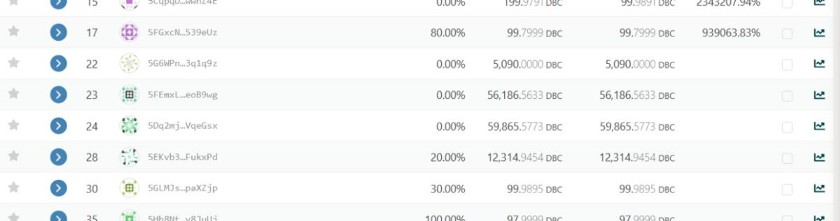
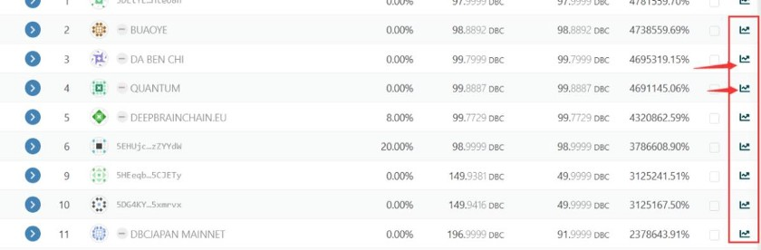
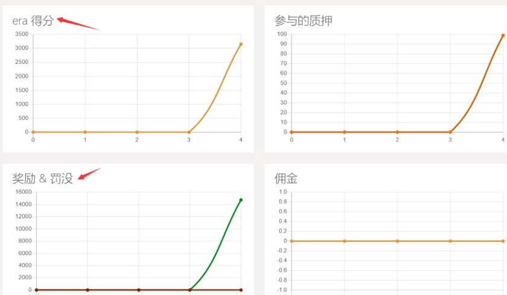
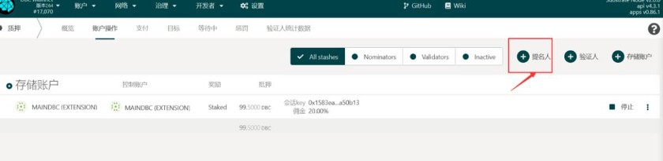

# DBC Account Creation, Pledge, Supernode Election Voting Tutorial

How to get node pledge revenue in the wallet if you hold DBC tokens?

(If you don't like to read, you can watch this video below which is also very detailed.)

Link to the video:

https://v.qq.com/x/page/d3247jd4vjb.html?url_from=share&second_share=0&share_from=copy

## I. Preliminary preparation

1. Have a working computer

2. DBC wallet backup phrase; if not, it does not matter, there will be a tutorial on how to create a new wallet in the mainnet;

3. Install Firefox (you must use Firefox, other browsers can not use the plug-ins we need later on, and Google Chrome requires special means to use these plug-ins, so you must install Firefox)

[Firefox official download address](https://www.mozilla.org/en-US/):

Click the link and click download and then install it

4. Install the Polka JS wallet plug-in

Plugin download address: [Polka's official plug-in download address](https://addons.mozilla.org/en-US/firefox/addon/polkadot-js-extension/)

After entering the official download address, you can see this page:

Just click on the blue box to download and add it. The page will look like this when you are done adding:

The blue box turns white and the icon for this plugin appears in the upper right corner at the red arrow. At this point the plugin has been added.

## II. Import (or create) DeepBrain Chain mainnet wallet

After the completion of the previous step, you can click the plugin icon to create a mainnet wallet.

\*Note that the above backup phrase is very important, be sure to save them in a safe place and make backup, after documenting the backup phrase you can click 'Next Step' to set the password

Once you set the password you can go to the next step. Click on the plugin icon then you will see your DBC wallet address.

## III. Officially entering the DeepBrain Chain mainnet pledge process, nominate the verifier node (supernode pledge)

::: tip
Important Notes:

1. Here, supernode pledge is a way to get voting revenue that everyone can participate in, without any threshold, without hardware resources such as servers, you just need to hold a certain number of DBC tokens.

2. Here, we will introduce some of the problems that may be encountered in pledge mining and introduce some pledge techniques to get the highest return possible by pledging the same amount of DBC tokens.
   :::

3. Go to the mainnet address of [DeepBrainChain](https://www.dbcwallet.io/#/explorer)

After you click in, you can see your wallet address and the balance in your wallet.

Then click on the ‘pledge’ option on the network and you will see the supernodes info list

There are 21 supernodes in the very first quarter,and 10 nodes will be added every quarter, with a total of 41 nodes currently. ([https://dbc.subscan.io/validator](https://dbc.subscan.io/validator))

The next step is to give you an analysis of the status of the 41 supernodes.

::: tip
(Note: Supernodes are elected every 24 hours, there are no permanent supernodes, whether you can be elected as a supernode is based on the ranking of the total pledge volume on this supernode, the top 41 will be automatically selected as supernodes, no operation needed)
:::

On the supernode page we can see that the 41 nodes with the largest total amount pledged by themselves plus the total amount pledged by others will be elected as Supernodes, but there are other nodes that want to participate in the election, but since the round is over or that their pledged amount is ranked after 41, these nodes will appear on this page:

By clicking on 'Target', we can see all the supernodes participating in the election, and then we will analyze the data of these supernodes to decide which supernodes we will vote for to maximize our benefits as much as possible while ensuring that we gain benefits every day.

After seeing all supernodes, we need to analyze the below data:

::: tip
Notes:

'return': refers to the profit you can get if you pledge on that node ,according to the DBC in your account. If you click in and find that the return is not shown, you can click return and it will be automatically sorted from largest to smallest.

Total equity: refers to the total number of DBC of the node itself plus the total amount of DBC of the nominee who pledged on said node, the top 41 are elected, and whether you can be elected as a supernode only depends on this data.

Commission: The DBC network will send equal amount of DBC to these supernodes every day, but the supernodes need servers to help the network to verify the blocks, all supernodes can set their own commission percentage themselves, the higher the commission percentage, the more the supernode can get, then the user who pledges on said supernode will get less, because the total number is set.

In order for you to understand the pledge model in layman's terms, here is an easy-to-understand example:

DBC mainnet will prepare 41 pieces of cake for users every day, but how to share these cakes to ensure it's fair and convincing? DBC will set countless group leader quotas, that is, supernodes, but the cake is only 41 pieces, all these group leaders are running in the election, how can you guarantee that you will be elected? It all comes down to the total number of votes in your hands, that is, the number of DBC this supernode can pledge by themself and the number of DBCs pledged on said node by others, as long as the total amount ranks in the top 41. What needs to be done is for these supernodes to go to the major communities to pull votes or hold a large amount of DBC to ensure the number of votes, in order to guarantee that in the next round they can be ranked in the first 41 to get this piece of cake.

There is another problem, the cake is there, but how to share the cake? I gave this supernode vote(s) now how do I calculate the specific benefits I will get?

First of all, the DBC mainnet will give this piece of cake to the supernode, that is, every day the supernode will get 6,772 (calculated according to 41 nodes) or so DBC, now the data on the target page can help us to filter the supernodes better.

The formula for calculating the earned cake (DBC) = (total amount of cake _ (1 - commission) _ (the percentage of your own DBC in the total equity of the node))

Tips: Supernodes earn their income in two ways, the first is the commission percentage you set \* the weight of the cake (DBC) earned +

Total cake _ (1 - commission) _ (the proportion of the supernode's DBC to the node's total equity))

To explain the formula, the first thing to look at is the number below the commission, the percentage is set up by the supernode itself. For example, if you set it up as 0%, that means once the supernode itself got the cake, it will not get itself any extra DBC rewards, it will share with the ones that pledged on it, and then according to their DBC holdings positions, the higher the position the more you get.

But truthfully no nodes will set their ratio at 0%. The bigger the ratio is set, the more the supernode will get as extra and then share the rest with its pledgers. If the ratio is set to 100%, that means the supernode will not give a bite of the cake to the pledger, you can ignore such node(s), because by pledging on such node(s) you will not get any revenue.
:::

But it's not that the lower the ratio the better, otherwise there will not be so many other screening conditions.

So the cause and effect is that the total amount of equity in this node accounted for by this commission and your position determines your earnings, which is the size of the RETURN.

::: tip
Note: When you are pledging in accordance with the RETURN ranking after choosing the first 21 in the relatively high RETURN ratio, and then look for some reliable nodes, why should you choose a reliable node? The reason is that some nodes you see might have set their commission ratio very low, or even set to 0, so that their return will naturally be higher, to attract pledgers to vote, but when such node is elected as a supernode, they are able to change their commission ratio, that is, to improve the DBC earnings they get, so others get a lot less naturally. So we need to find some reliable nodes, so that although we get a smaller income compared to choosing another node, this may ensure that our income is very stable. This requires us to join some official voting community to really get in touch with such supernodes candidates to ensure that the supernodes we vote for are reliable.
:::

Another factor that needs to be considered is the condition of the supernode's machine.

After clicking on these curve icons we can see some penalties and rewards. If the image often has some points of a sudden fall, it means that this supernode is often punished, once a node is punished it means that your earnings today will be much less.

After the analysis of these nominees we will then proceed to the specific operation.

Do not pledge the entire amount when setting up the binding amount, leave one DBC out for the transfer online.

Keep clicking next to go to this page to enter your password to finish

After the nomination is completed, you can see the waiting information of the supernode you nominated in this list. If the pledged supernode can be elected in the next round of election, you can get the corresponding reward.
