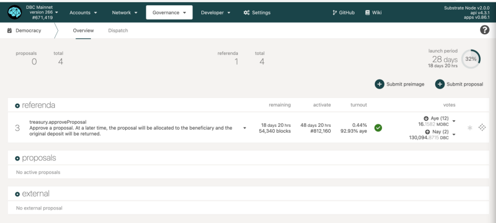
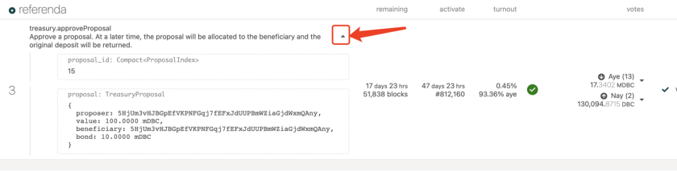
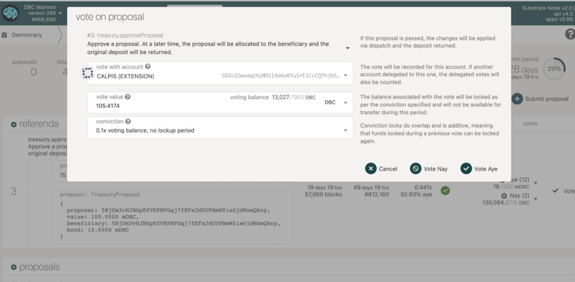
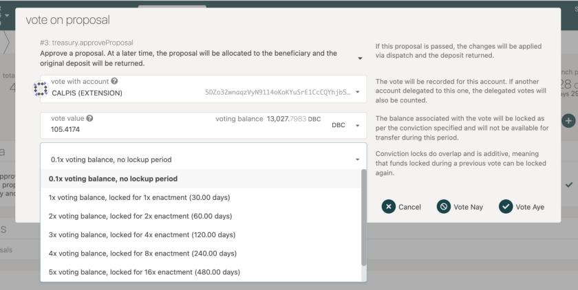
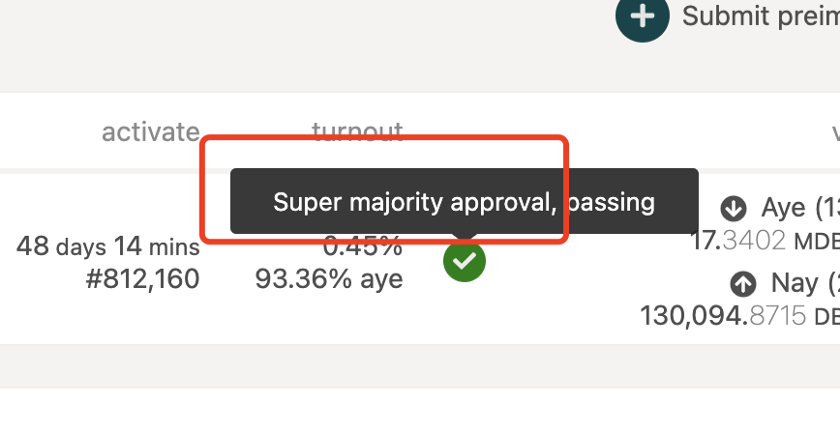

# Guide | Voting on Referenda on DBC Mainnet

## 1. The democracy page

[https://www.dbcwallet.io/#/democracy](https://www.dbcwallet.io/#/democracy)

- **proposal** — Publicly submitted proposals. At the end of each launch period (every 28 days), the most seconded proposal will move to referenda.

- **external** — Proposals submitted by the council, either through a majority or unanimously.

- **launch Period** — How often new public referenda are launched.

Click the highlighted button to see the proposal. More details may show on https://www.reddit.com/r/DBC_Council/

remaining — remain xx days to vote on the referenda.

activate — If the outcome is “pass”, xx days before the proposal become activated.

turnout — the total number of voting tokens (does not include conviction), and the outcome showing here is just a temporary outcome instead of a final one.

## 2. Voting

At the end of each launch period, the most seconded proposal will move to a referendum. During this time you can cast a vote for or against the proposal. You may also lock up your tokens for a greater length of time to weigh your vote more strongly. During the time your tokens are locked, you are unable to transfer them, however, they can still be used for further votes. If you don’t want to lock your tokens, you still can participate in voting.

Click “vote” and see this page.

If you would like to cast your vote for the proposal select the “Vote Aye” option. If you would like to cast your vote against the proposal in referendum you will select the “Vote Nay” option.

One notable option is “conviction”. This option means that you can decide for yourself how long to lock the tokens within the given range. The longer you are willing to lock your tokens, the stronger your vote will be weighted. The timeline for the conviction starts after the voting period ends.

## 3. Tallying

Depending on which entity proposed the proposal and whether all council members voted yes, there are three different scenarios.

approve — the number of aye votes

against — the number of nay votes

turnout — the total number of voting tokens (does not include conviction)

electorate — the total number of tokens issued in the network

## 4. More Details about the mechanism

DBC mainnet is developed through Polkadot substrate, so the democracy mechanism of DBC is similar to that of Polkadot. To learn more about the referendum system, you can see

[https://wiki.polkadot.network/docs/learn-governance#referenda](https://wiki.polkadot.network/docs/learn-governance#referenda)

[https://wiki.polkadot.network/docs/maintain-guides-democracy](https://wiki.polkadot.network/docs/maintain-guides-democracy)
