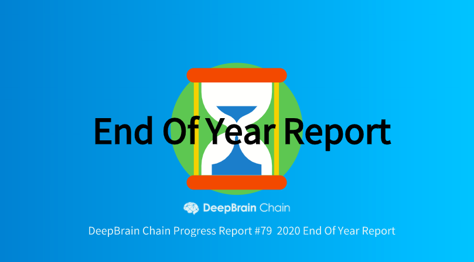
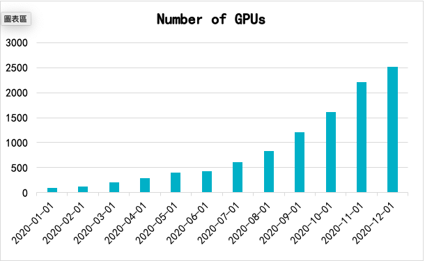
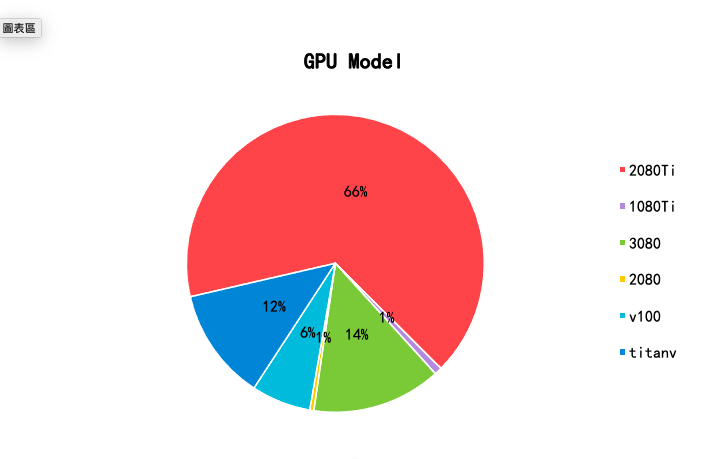
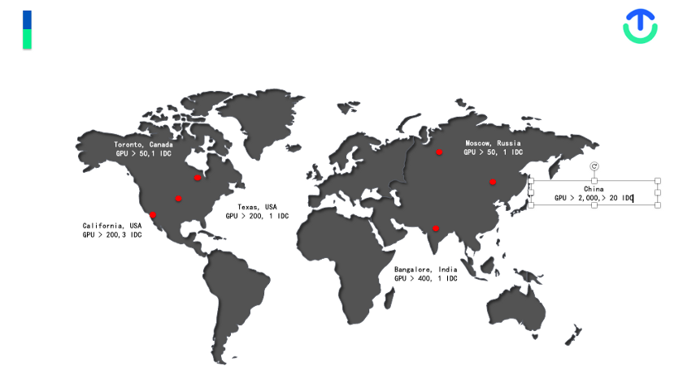
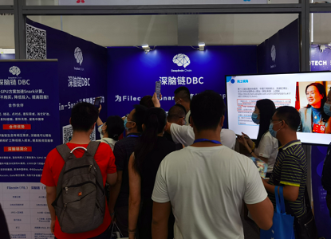
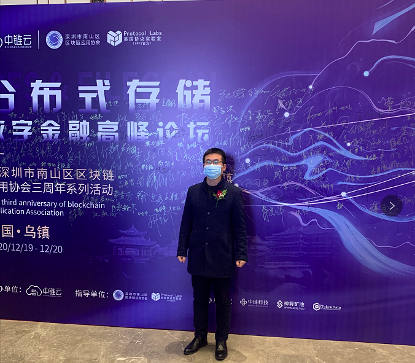
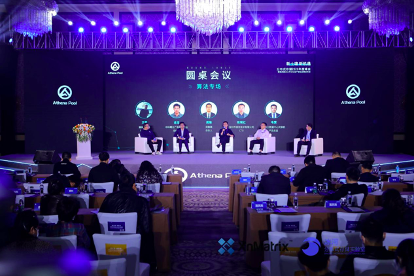

# 2020 End of Year Report

> [https://deepbrainchainglobal.medium.com/deepbrain-chain-2020-end-of-year-report-79-f9f100b76740](https://deepbrainchainglobal.medium.com/deepbrain-chain-2020-end-of-year-report-79-f9f100b76740)

Dear DeepBrain Chain community members,

Thank you for standing with us throughout 2020, let’s take a look at the steps we’ve made forward in the last year and look forward to 2021.

I. Product Development Progress

1. GPU docker and CPU docker functionality went live;

2. Restart of ‘’sleeping docker’’ (docker that ceased to operate) function added, you can now restart these dockers and use them as GPU docker or CPU docker. If you have more than 20k DBC in your wallet balance once your docker cease to operate it will be reserved for a maximum of 7 days, you can restart your docker anytime within the 7 days. If your wallet balance is less than 20k DBC once your docker cease to operate all data will be destroyed;

3. Added the Switching Between CPU Docker and GPU Docker function, user can switch to CPU docker staking mode when they are not using GPU docker, so that they don’t have to pay fee(s);

4. Launched not-in-use docker clearing and not-in-use mirror image clearing function;

5. Auto restart of DBC under anomaly function launched;

6. The automatic verification function of newly added machines went live. After miners add machines, the system will automatically verify the availability of the machines, so that the whole process from DeepBrain Chain payment network to AI computing network to cloud platform can be fully automated without any human intervention;

7. The docker image supporting TensorFlow2.0 was uploaded, so users can use it directly without installing TensorFlow2.0 by themselves;

8. Added a mechanism to check whether GPUs are being used, releasing idle GPUs in a timely manner;

9. Added an automatic detection mechanism for working containers, invalid container(s) will be automatically shut down within a few minutes once detected;

10. Solved the problem of containers cannot switching directly between GPU and CPU when a single file of a docker container is larger than 8g;

11. Now support the starting of container(s) when the container contains a single large file (more than 10G);

12. The private cloud storage function went live, which facilitates most novice users to upload files to GPU servers;

13. SSH auto-detection mechanism development and testing completed, when the machine is in SSH stuck mode or offline, it will automatically detected and reconnect to prevent containers from being unable to connect;

14. CPU containers added SWAP function, the number of SWAP is equal to the number of RAM;

15. Development completion of automatic process RAM overload kill mechanism;

16. Mirror image supporting drug molecular dynamics simulation went online, facilitating the use of GPU computing power by the majority of drug R&D workers;

17. The cloud platform went online with the function of re-sending emails for successful rentals;

18. Added tensorboard support to facilitate visualization for AI users during training;

19. Went live with Ngrok auto-detection mechanism to prevent container dropouts;

20. Automatic mirror image list fetching went live;

21. Added a mechanism for SSH authentication for miners to go online;

22. Security hardening of the cloud platform servers to prevent data loss was completed;

23. Put online the GPU machine classification mechanism, which classifies machines according to RAM space and hard disk space;

24. Improved the machine rental notification message display, making it easy for miners to view machine earnings;

25. Added a payment verification mechanism to prevent payment failures caused by network problems;

26. Development completion of automatic image acquisition and production of new versions of mirror images;

27. Added a limit on the absolute number of CPU cores for CPU containers to prevent malicious mining of wasting own resources;

28. Improved the mechanism for bringing machines online and offline;

29. Added a hard disk full restart limit and a hard disk space shortage alert mechanism;

30. Improved the switching mechanism of GPU container and CPU container, which no longer depends on the size of data in the container and greatly improves the usage experience. The original 100g of data takes 1 hour to start the container, the new version takes only 3 minutes to start;

31. Addition of a scripted startup mechanism to the distributed computing network layer;

32. Produced a new version of the mirror image, unified python execution environment, unified jupyter and private cloud storage file directory;

33. Optimized the docker container stop auto-detection mechanism;

34. Added support for custom docker container paths;

35. Added support for access to nextcloud security mechanisms with domain miners;

36. Added automatic recovery mechanism in case of GPU container and CPU container switching failure;

37. Added automatic recovery mechanism for disconnection of jupyter, private ngrok;

38. Added automatic recovery mechanism for abnormal termination of ssh, jupyter and private netdisk processes;

39. Development and production of new mirrors for tersorflow 2.1, tersorflow 2.0, tensorflow 1.14, pytorch 1.2, pytorch 1.4, pytorch 1.5, mxnet 1.5, mxnet 1.6 completed;

40. A new upgrade to the deep learning mirrors, removed a lot of junk content and making the mirrors more lightweight;

41. Added mxnet1.5, mxnet1.6, tensorflow2.1, pytorch1.5, to support an environment for molecular kinetic;

42. Each mirror now has the corresponding version of ipykernel, to make it easier to use for jupyter;

43. Added auto-activation of the virtual environment for the corresponding version to the mirror, easier to use;

44. Unified the jupyter in virtual environment and the python version under terminal access;

45. Mirror Ubuntu version upgraded to 18.04;

46. Gcc upgraded to 7.3.0, cudnn upgraded to 7.6.5;

47. Installed opencv compiler version in mirror, massively improved the opencv user experience;

48. Added docker auto-examination and reboot functions;

49. Added detailed server usage document and help document;

50. Optimized AI computing network’s response mechanism;

51. Upgraded Deep Learning mirror and the DBC network. Pre-installed opencv compiled version in mirror, greatly improved the opencv user experience;

52. Added Tsinghua as the default source of download for pip;

53. Optimized respond mechanism for AI computing network;

54. Now support cuda9 in default;

55. Added filecoin snark compute mirror, support using API to visit filecoin seal’s c1 and c2 computing;

56. Added support for Filecoin snark GPU computing;

57. Added discounts for monthly, quarterly and annual machine subscriptions;

58. Added the possibility of renting all the GPUs in one machine;

59. Added AI inference zone, if users rent the machine(s) in this zone they can use the additional APIs;

60. The layout of the website interface has been revamped to make the categories clearer;

61. Added the function of renting DBC Super Node, if you want to participate in DBC Super Node, you don’t need to buy your own machine, you just need to pledge a certain amount of DBC then you will be able to rent machines inside the DBC network and participate in producing blocks;

62. Added pledging function , and to access the High-Stability AI training zone, a machine needs to run reliably for at least 144 hours and pledge a certain amount of DBC;

63. Added shelving and de-shelving of machine(s) function;

64. Optimized the GPU acceleration algorithm;

65. Optimized the cloud platform wallet with the addition of gas functionality;

66. A mining smart contract based on the DBC mainnet is being developed, taking into account a variety of factors such as the length of time the machine is online, the number of graphics cards, whether it is interrupted, whether it is pledged, whether it has a fixed IP address, etc. as criteria for judging mining revenues;

67. Research into the integration of privacy computing and DBC networks;

68. Optimized node dynamic scaling on DBC network;

69. Upgraded deep learning mirror to support deepshare courses and paper;

70. To cope with the continuous increase in the number of machines in the DBC network, further optimized the dynamic scaling of DBC nodes;

71. Launched AIM machines, all machines are now online and ready to be delivered to AIM buyers;

72. Further optimization of the DBC network node message forwarding function;

73. Development of GPU-based virtual machine scheduling engines for cloud gaming and rendering user requirements;

74. Modification of the substrate-based web wallet;

75. Continuing to develop mining smart contract and pledging smart contract, mining contract for different uses of GPU machines are classified, the current classification are: cloud games, high-performance computing, AI inference, AI training, graphics rendering. Different classifications of machines will yield different amount of DBC with mining, also, minimum hardware configuration requirements are added;

76. Ongoing internal testing of security and other related features of the mainchain;

77. Supported nearly 30 GPU cloud platforms based on DeepBrain Chain to go live:

AI image algorithm and processing platform: https://www.cvstudy.com/.

DeepMind Chinese web training platform: https://www.deepmind.ink/.

When Traffic Meets Machine Learning: https://www.transportation-ml.cn/.

Shan Shi AI: https://ai.sdnu.club/.

Tensor GPU: https://www.tensorgpu.com/.

OpenGPU: https://www.opengpu.cn/.

Planet C: https://www.planetc.cn/.

GPUHub: https://www.gpuhub.top/.

Area 51: https://www.district51.top/.

FreeGPU: https://www.freegpu.top/.

Aivc: https://www.leonglearnai.com

Algorithm Earth: https://cloud.boincplanet.com

freegpu: https://www.freegpu.com/

Carry And Smart Things: https://gpu.shareaiot.net/.

TopGpu: https://www.topgpu.top.

ThinkOTech: https://www.thinkotech.ai.

Ingenuity Cloud: https://www.nvidiaai.top/.

longway: https://www.longway-gpu.com/.

Shared Arithmetic: https://www.sharedgpu.com/

StarCraft Cloud: https://www.scclouds.cn/, the

AI Power: https://www.aipower.xyz/.

CoolCard: https://www.coolgpu.com/,

DeliGPU: https://www.dbchain.ru/.

Leiphone’s AI studies association: https://cloud.yanxishe.com/.

Mayuan: https:www.codefate.cn.

2021 Product Development Outlook

1. Completion of mainchain testing and go-live in the first half of the year;

2. Mining smart contracts going live in the first half of the year;

3. Supporting the dual mode of containers and virtual machines;

4. Dbchain web platform to support mainchain DBC payment settlement;

5. Further adaptation in the 4 main GPU application area: AI training and inference, cloud gaming, rendering, blockchain computing;

6. Improve DBC decentralized GPU network scheduling system.

II. Marketing Progress

The new coronavirus that devastated the world in 2020 changed everything, but it also accelerated the digital transformation and upgrading of traditional industries. It sped up the arrival of the 5G+AIOT era, now more industries need a massive amount of high-performance compute power, and the distributed high-performance compute power network lead by GPU will become an important infrastructure, which will bring huge development opportunities to DeepBrain Chain.

In 2020, we withstood various challenges and made great progress in the expansion of DBC application scenario, commercialization, solving historical problems of AIMs and expanding the scale of the computing network, laying a solid foundation for the official launch of the main network in 2021.

1. AI Developer Users Continue To Grow Rapidly

AI developer users increased from 2,500 at the beginning of the year to nearly 17,000 by the end of the year. The users come from Beijing University, Tsinghua University, Fudan University, Shanghai Jiao Tong University, Zhejiang University, University of Chinese Academy of Sciences, University of Electronic Science and Technology, Nankai University, Wuhan University, Huazhong University of Science and Technology, University of Science and Technology of China, Southeast University, Central South University, Dalian University of Technology, Zhongshan University, Renmin University of China, Beijing University of Technology, Beijing University of Posts and Telecommunications, Chongqing University, Sichuan University, Xi’an Jiaotong University, Harvard University, Tokyo Institute of Technology, University of Sydney, Chinese University of Hong Kong, University of Melbourne and other universities with AI-related majors; currently the DeepBrain Chain computing network has become one of the most commonly used GPU cloud service platforms for AI developers in China. Especially when the epidemic first broke out in China, many students faced graduation and needed to prepare their thesis but were unable to return to school to use the servers in the school server room because of the epidemic. The traditional cloud computing vendors were very expensive and the students could not afford them, so the large number of cost-effective GPU servers provided by DeepBrain Chain helped them solve their urgent needs and won the praise of many AI developer users. In addition, we have given free sponsorship of GPU computing power to some university research organizations engaged in the research and development of new coronavirus drugs (such as the Research Center for Drug Discovery (RCDD) of Sun Yat-Sen University

) to support the research and development of new coronavirus drugs;

2. Finding More Industry Customers

In the past year, excluding the period of the COVID-19 outbreak, our colleagues were traveling around China to expand our customer scoop more than 70% of the time, and it was the norm for our technical staff to be working until 1–2AM every night. With everyone’s effort, DeepBrain Chain’s compute power network have made great progress in acquiring enterprise customers, covering blockchain, fintech, biopharmaceutical, remote sensing image, cloud gaming, autopilot, AI education and training, rendering and many other scenarios, and gained the recognition of customers, proving that DeepBrain Chain’s compute network has been able to initially meet the needs of commercial customers and take solid steps in the commercialization of the product;

3. AIMs Released

Thanks to everyone’s patience and support, finally in October 2020 we delivered all the DBC AI Mining machines and is now hosting them in the designated IDC server room. Meanwhile, we have helped the miners to find good customers, and these customers pay to the miners in advance on a monthly basis;

4. DeepBrain Chain’s Compute Network is Growing Rapidly

In the past year, the number of GPUs in DeepBrain Chain compute network increased from less than 100 cards in January to more than 2,000 cards in December, maintaining a stable growth trend overall, and the utilization rate is over 90%;

At the same time, the variety of servers has grown and the quality has been improving, mainly at from mid-to-high-end GPU;

DeepBrain Chain’s computing power network nodes have achieved an initial global coverage and are rapidly increasing, which will provide better high-performance computing power service experience to global customers in the future.

5. Outlook

In the past 2 years, DeepBrain Chain has been firmly taking the road of commercialization, although it is difficult, there is finally a small success; our mainnet will be officially launching in 2021, mining, pledging and burning will be launched at the same time; meanwhile, we will appropriately increase our marketing, PR, so that more partners and new and old investors can see the achievements of DeepBrain Chain.

III. Ecosystem Building

The core work of DBC in 2020 revolved around three aspects of the DBC computing power application, computing power supply and product promotion activities (blockchain and mining summit), and the following is the summary of the DBC ecosystem building work in 2020:

1. Computing Power Application

1.1 Currently focused on four major areas: AI training and inferring, cloud gaming, rendering, and blockchain computing, targeting customers including hundreds of universities and research institutions around the world, as well as dozens of enterprises; while laying out scenarios that need high performance computing power, such as artificial intelligence biopharmaceuticals;

1.2 Our compute power network grew more than 20 times and over compare to 2019, with more than 2,000 GPUs being active across the DBC network at present;

1.3 Gradually starting the globalization of DBC computing power applications across four continents: Asia, North America, Europe and Australia;

2. Computing Power Supply

2.1 The main computing power supply in the DBC network comes from idle computing power around the world, spreading across China, the United States, Russia, Canada, India and many other countries; we are also gradually including computing power from miners, with dozens of mining companies joining;

2.2 GPU supply mainly includes 2080ti, 3080, V100, 1080ti, 2080, etc.;

2.3 The number of GPUs currently being prepared to join the DBC network exceeds 3,000;

3. Product Promotion Activities

3.1 Invited to a number of artificial intelligence conferences and blockchain (including mining) conferences in 2020, including Distributed Storage Shanghai, Hangzhou, Chengdu, Wuhan, Shenzhen and other series of conferences, 2020 WEB3.0 China Summit, Lieyun Finance (https://www.lieyuncj.com/), IPFS News (https://ipfsnews.net/index), Coin Koala (https://www.coinkaola.co/), etc.;

3.2 In 2020 we were also invited by many partners to participate in conferences and concluded many commercial cooperation on these occasions;

4. Outlook

4.1 Computing Power Application Scenario Targets

- More than 100 companies and 10,000 GPUs in large-scale applications of compute power in the artificial intelligence related field;

- More than 100 enterprises and 10,000 GPUs in the field of blockchain;

- Further development in the four major areas: AI training and inferring, cloud gaming, rendering and blockchain computing;

4.2 Computing Power Supply Targets

- Expanding the proportion of compute power supply from blockchain space;

- Increasing the construction of computing power nodes in China, with the goal of covering core large and medium-sized cities in China;

- Further development of globalization, with three important centers: China, the United States and Europe;

3. Product Promotion Activities

- Participate in more than 5 blockchain summits, more than 5 artificial intelligence summits, more than 5 cloud gaming summits, and more than 5 partner-sponsored summits.

— — — — — — — — — — — — — — — — — — — — — — —

Try our product as an AI user or a GPU power provider:

www.dbchain.ai

Main social media platform:

Telegram (English) ： https://t.me/DeepBrainChainGlobal

Twitter: https://twitter.com/DeepBrainChain

About DeepBrain Chain

DeepBrain Chain is the world‘s first AI computing platform driven by blockchain. It uses blockchain technology to help AI companies save up to 70% of computing costs while protecting data privacy in AI training. Its vision is to build a “Decentralized AI Cloud Computing Platform”.

Yours sincerely,

The DeepBrain Chain Team

