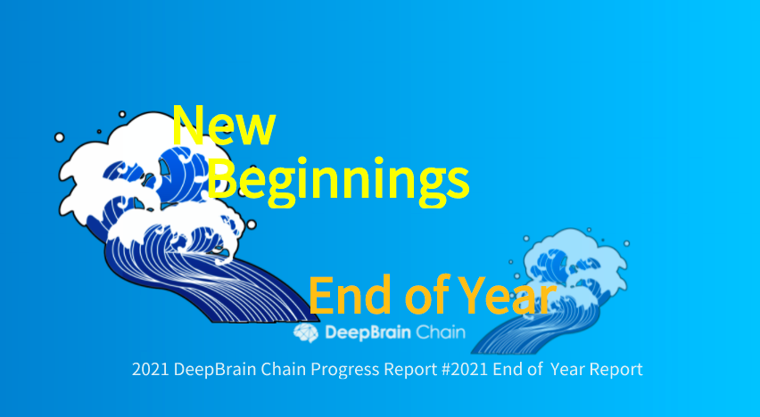

# DeepBrain Chain 2021 End of Year Report

Dear DeepBrain Chain community members,

This is the 5th year of DeepBrain Chain, since the establishment of the project, we have been through it all. We have seen the project rise and fall, and some have thought we’ve met our end.

But here we stand, in 2022, in a world of unknown, what we know is that our faith in our vision remains unchanged and unshaken. We thank you for believing in us and let us look forward to great things in the new year.

::: tip
「From 2017 to 2021, DBC has gone through four years, not without twists and turns, but with determination, especially in 2021, great achievements have been made: supernodes have been successfully launched and are running stably, from 21 nodes at the beginning to 41 nodes; the mainchain has been successfully launched and is running stably; the Council has been successfully launched, marking a new stage of community autonomy; the GPU computing power mainnet has been launched, and now the network has nearly 1,000 GPUs, and the occupancy rate is over 96%, and the token destruction mechanism will be activated automatically when the network has more than 5,000 GPUs; the DBC ecosystem has 14 computing pools and dozens of AI cloud platforms, serving nearly 20,000 AI developers and hundreds of enterprises, including AI, metaverse, visual rendering, blockchain and many other industries. DBC is committed to the vision of building the world’s largest distributed high-performance computing network and becoming the computing infrastructure in the era of AI+metaverse.」— Lee, DBC Co-founder

## I. Product Development Progress

::: tip
DeepBrain Chain’s products and technologies have experienced two important milestones in 2021, namely, the blockchain mainnet launching on May 20th and the GPU computing mainnet launching on November 24th.
:::

**The features that launched on GPU computing power mainnet are:**

1. Online Reward Module

2. Machine audit module

3. On-chain rental module

4. On-chain governance module and other modules

**The GPU distributed computing network is live with the following features:**

1. Implementation of asymmetric encrypted communication between nodes

2. Support for renting machines using multi-signature accounts

3. Support for creating multiple virtual machines from one physical machine

4. Non-renters can operate functional nodes through the session_id distributed by the renter

5. Support for virtual machine snapshot management

6. Support for virtual machine image management

7. Support users to create and join groups, isolation between groups on the network, interoperability within groups, etc.

**Also,**

- https://github.com/DeepBrainChain/DeepBrainChain-MainChain: DBC Computing Mainnet codebase saw 570 commits, 2,425 files modified, 74788 lines of code inserted

- https://github.com/DeepBrainChain/DBC-Wiki: DBC document library saw 88 commits, 1,053 files modified, 20,705 lines of code inserted

- https://github.com/DeepBrainChain/Rosetta-DBC：supported coinbase to list DBC, API library saw 20 commits, 70 files modified, 3,189 lines of code inserted

- https://github.com/DeepBrainChain/substrate-api-sidecar：DBC substrate API library saw 8 commits, 17 files modified, 535 lines of code inserted

- https://github.com/DeepBrainChain/PolkaWallet_Plugin_DBC：DBC mobile wallet saw 5 commits, 23 files modified, 77 lines of code inserted

- https://github.com/DeepBrainChain/DBC-AIComputingNet：GPU distributed computing power network codebase saw 242 commits, 290,213 lines of code inserted

- https://github.com/DeepBrainChain/DBChainWebsite：dbchain cloud platform saw 38 commits, 72,998 lines of code inserted

At present, all the underlying technologies of DeepBrain Chain are mature and available, and developers will be able to develop abundant PaaS or SaaS high-performance computing applications based on DeepBrain Chain’s IaaS services.

::: tip
Feng, the founder of DeepBrain Chain, predicts the following ten applications that may be born in the future of DeepBrain Chain network, each of these applications is a huge entrepreneurial opportunity, we expect the developers of DeepBrain Chain platform to create the miracle of GPU cloud service applications.
:::

- jupyter cloud: jupyter is deployed on top of the DeepBrain Chain as a cloud service for AI developers

- omniverse cloud: omniverse is deployed on top of DeepBrain Chain and provided to designers and artists in the form of cloud services

- Cloud game Paas service: traditional games are cloudified by calling API interface

- Meta-universe paas service:

  - Meta-universe world realistic scenes need edge cloud GPU servers for rendering calculations, and the calculated images are transmitted to the VR headset end for display in real time, thus avoiding the helmet to perform a lot of calculations and reducing the cost and volume of the helmet.

  - VR live streaming will also begin to rise as an important application of the meta-universe, the technical architecture of VR will be completely different from the live stream from mobiles. The anchor side requires multiple cameras to shoot 360 degrees without dead ends, and the shot is transmitted to the edge cloud GPU server for rendering calculations to form a three-dimensional world effect, and then the results of this calculation are transmitted to the VR headset side.

    ::: tip
    「The real realization of the metaverse will require a huge number of edge GPU cloud servers, which will be spread over hundreds of thousands of edge rooms around the world, with tens of millions of servers.」— Feng, founder of DeepBrain Chain
    :::

- Cloud Rendering Paas Service: Real-time movie rendering through API interface

- Distributed AI training Paas service: Distributed training of geographically distributed nodes through parameter compression and small data learning, etc.

- Grid computing service: suitable for a large task split into multiple small tasks for parallel computing scenarios

- AI inference container scheduling service: by deploying containers in the DeepBrain Chain virtual machine, distributed scheduling of containers is carried out

- Biomolecule analysis SaaS service: DNA, protein and RNA analysis platform with GPU computing as the core

- Physical simulation service: the simulation service implemented on traditional CPU supercomputing can be migrated to GPU

## II. Marketing Progress & Media Reports

In the past year, many famous media within China and abroad have reported on the progress of DeepBrain Chain in terms of products, technology and our ecosystem expansion:

- Well-known technology media 36Kr reported on DeepBrain Chain: One Article to Understand DeepBrain Chain: A Distributed High-performance Computing Network With Unlimited Expansion Capacity, report link: https://36kr.com/p/1253772390861320

- Well-known blockchain media BlockBeats reported on DeepBrain Chain: Is DeepBrain Chain The High-performance Computing Just What Is Needed In The Web 3.0 Era? Report link: https://www.theblockbeats.info/news/24626?search=1

- Yahoo Finance reported: DeepBrain Chain mainnet will be online soon, the only large-scale landing cloud computing project of Polka ecosystem, report link: https://finance.yahoo.com/news/deepbrain-chain-dbc-mainnet-launching-052000902.html

- Multiple reports on ‘’DBC: Metaverse Supported by DeepBrain Chain, a Distributed High-performance Computing Network’’, original links:https://coindeals.info/metaverse-supported-by-deepbrain-chain-a-distributed-high-performance-computing-network/； http://finance.dailyherald.com/dailyherald/news/read/42013419； http://business.theeveningleader.com/theeveningleader/markets/news/read/42013419 ； https://coins.group/metaverse-supported-by-deepbrain-chain-a-distributed-high-performance-computing-network/

- Well-known media Coinspeaker home page report on DBC :

![./assets/2022-01-01.assets/2.jpg]

Link to article: https://www.coinspeaker.com/deepbrain-chain-new-infrastructure-computing-power-metaverse-era/

    + AP News reports on DBC’s GPU computing power mainnet: https://apnews.com/press-release/marketersmedia/technology-blockchain-artificial-intelligence-5baa7937549a0f02b1cb0612f9afefa5

    + Korea Economic Daily reports: 딥브레인체인(DBC), 블록체인 기반 GPU 컴퓨팅 클라우드-메타버스 타고 성장, report link:http://kpenews.com/View.aspx?No=2173120

    + DBC joint many famous communities to hold more than 15 AMAs in total and got great responses, here are some of the community AMA recap:
    https://cryptotalkz.in/ama-recap-crypto-talkz-x-deepbrain-chain/

https://cryptoscreen.org/ama-recap-cryptoscreen-with-deepbrainchain/

https://medium.com/@mdsakibhasan19711626/eliena-hi-jack-lee0-d2d97a9c7c5c

https://medium.com/@cryptoroyals09/deepbrain-chain-ama-recap-495a364c62a3

https://medium.com/p/deepbrainchain-ama-recap-cryptotech-community-4d5dc6 96a624

https://medium.com/p/ama-recap-crypto-squadx-x-deep-brain-chain-venue-crypto-squadx-date-22-nov-2021-time-02-00-35b03cf3eba

https://medium.com/p/ama-recap-id-crypto-x-deepbrain-chain-aced37ccf8d5

https://medium.com/p/deepbrainchain-x-im-community-ama-recap-67abc44c40e1

https://medium.com/p/ama-recap-of-crypto-eagles-with-deepbrain-chain-be5c9db 9ddf5

+ Participated in the Korea Science and Technology Fair 2021, visited some well-known local companies and data centers in Korea, etc. to accelerate the development of DBC in Korea;

+ In the past year, the number of official social media followers grew rapidly, twitter reached 53,000, telegram over 20,000; DBC tele group: https://t.me/deepbrainchainglobal; twitter: https://twitter.com/DeepBrainChain

+ Community participation in on-chain governance has further increased, and according to blockchain on-chain data, the number of pledged DBCs on the mainnet reached 734.32 million, with a pledge rate of 17.7%, a record high, as detailed at: https://dbc.subscan.io/

+ Community autonomy has made positive progress: 1 referendum and 19 council proposals in total, community is highly enthusiastic about the autonomy, the breadth and depth of community autonomy of DeepBrain Chain will be further improved in 2022, and active participation of community members is welcomed. For more details, please see: https://www.dbcwallet.io/#/democracy; https://www.dbcwallet.io/#/treasury

::: tip
“In 2022, we will focus our efforts on several fronts: promoting community autonomy with the Council as the core; developing the AI developer ecosystem and the meta-universe developer ecosystem globally, supporting developers to start up businesses based on the NVIDIA meta-universe Omniverse platform and the DeepBrain Chain ecosystem; and mobilizing community members to deploy more GPU computing nodes for the DeepBrain Chain network globally.” — Lee, DBC Co-founder
:::

## III. Ecosystem Building

::: tip
    In 2021, after two rounds of testnet and one round of pre-mainnet, the mainnet of computing power is officially launched, and the network computing power is increasing. According to the operation and maintenance costs and market conditions in different countries and regions, the computing power value model has been gradually improved after several adjustments, and computing power nodes in many countries and regions are planned to join the network. — Zhouyu
:::

**Development process:**

+ July 18th-August 18th testnet phase I

+ August 18th-September 18th testnet phase II

+ September 18th-November 24th pre-mainnet stage

+ The mainnet of computing power was officially launched on November 24th, and by the end of the year, there were 991 GPUs of 10 different models in the mainnet of computing power, with 219,203 computing power values(c), 14 computing power nodes with a comprehensive occupancy rate of over 96%, and a rich variety of GPUs, mainly medium and high-end GPUs

+ The testnet computing power model has undergone two major adjustments, and will continue to be upgraded in the light of market conditions

+ The application field of computing power has been expanded, with cloud games, artificial intelligence, rendering and cryptography computing as the main application directions, and more application scenarios will continue to be explored

**Regarding the development of the computing power in 2022, the community can expect the following:**

+ Globalization of computing nodes, globalization is the main key of computing power development in 2022, with key development targets in Japan, Korea, Southeast Asia, North America, the Middle East and Europe

+ Upgrading of the computing power value model, adding geographical influence coefficients, balancing the balance of computing power entry revenue in different countries and regions

+ Incubation program for more countries’ computing nodes, including technology joining up and market guidance

+ Global cloud computing platform expansion, in 2022, more cloud computing platforms in different countries will be developed to use the computing power provided by DeepBrain Chain network

+ In 2022, the target number of GPUs in the network will exceed 5,000, the comprehensive occupancy rate will remain above 90%, and more than 20 new cloud computing platforms based on DeepBrain Chain will be added

Contact information for joining the network:

E-mail: zhouyu@dbchain.ai or leo@deepbrainchain.org

WeChat：DeepBrainChain or DBC-Leo

Telegram：@Zhou_ME

---

Try our product as an AI user or a GPU power provider:

www.dbchain.ai

DBC Wiki：https://deepbrainchain.github.io/DBC-Wiki/

Main social media platform:

Telegram (English) ： https://t.me/DeepBrainChainGlobal

Twitter: https://twitter.com/DeepBrainChain

Reddit ：https://www.reddit.com/user/DeepBrainChainGlobal

Official e-mail address: service@deepbrainchain.org

About DeepBrain Chain

DeepBrain Chain is the world’s first AI computing network powered by blockchain technology.

Our Mission: To connect global computing power, build a distributed high-performance computing power network, and construct computing power infrastructure for the era of 5G +AI.

Our Vision: Become the world’s largest computing network.

DeepBrain Chain’s computing power network can help AI practitioners/enterprises/universities/research institutions, cloud gaming, rendering, blockchain and other users to save on computing power cost, improve computing efficiency and enhance product experience.

Yours sincerely,

The DeepBrain Chain Team
