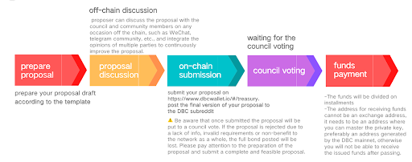

# Support for cloud platform

In order to help cloud platform operators get started quickly, solving core operational problems such as funding and customer acquisition, DBC team summarizes this solution based on the operating experience of previous cloud platforms.

## How to get funds？

### Treasury—— the pot of funds

As a decentralized project, DBC implements on-chain governance and has a fund pot dedicated to ecology development - Treasury. Starting from 2022, DBC Foundation will unlock 4.25 million DBC every month, and transfer these funds to the Treasury by a smart contract. Treasury is managed by the council (voted by the community). Funds are mainly used for: infrastructure deployment and ongoing operations; cyber security operations (monitoring services, ongoing audits), ecosystem support (cooperation with friendly chains), marketing activities (advertising, payments, cooperation), community events, and outreach activities (meetups, pizza parties, hackerspaces), software development, etc. Therefore, if the cloud platform needs financial support, it can apply to the Council for Treasury funds through a proposal.

### Application process

Guide | How to apply funds from DBC Treasury ：https://deepbrainchain.github.io/DBC-Wiki/en/dbc-democracy/apply-treasury.html
DeepBrain Chain Proposal - Template https://docs.google.com/document/d/1cqjBCHtvqhdx-0kymg66T7zlW_dkhAM1JVx5RUUuCII/edit?usp=sharing
DBC Council sub-Reddit：https://www.reddit.com/r/DBC_Council/

## Find users

(The users here are mainly personal users such as AI developers; if you need business users, we have another team to support them)

### How to find potential users？

The advantage of DBC computing power network is [high cost-effective GPU computing power]. At present, GPU computing power resources are mainly used in various scenarios such as blockchain, artificial intelligence, cloud games, visual rendering, biopharmaceuticals, and semiconductor simulation. Therefore, the places where practitioners in these fields and related majors gather is our target user gathering place, such as the AI developer community, modeling designer forum, design software user community, etc.

Here we also list some target user gathering places.

| GPU users                | 3D Rendering and Architectural Visualization                                 | https://www.facebook.com/groups/891302667703732  |
| ------------------------ | ---------------------------------------------------------------------------- | ------------------------------------------------ |
|                          | 3D Modeling, Texturing, Rendering, Rigging, Animation                        | https://www.facebook.com/groups/290530545401744  |
|                          | 3D Modeling, 2D Art, Drawing, Design, Animation, VFX, Rendering, illustrator | https://www.facebook.com/groups/488801081988816  |
| KOL (their comment area) | Benji-Sales                                                                  | https://www.youtube.com/benjisales               |
|                          | RedGaming Tech                                                               | https://www.youtube.com/c/RedGamingTech/featured |

## Bounty program

（the support period in this part is generally the first 3 months after the cloud platform start operating）

### Twitter event

#### Combo

use your personal Twitter account (must has been registered for more than three months）
Follow the Twitter accounts of DBC official and cloud platform
make 1 personal tweet about DeepBrainChain and the cloud platform, or retweet a given tweet, and add hashtag #DBC #GPU, and the hashtag of the cloud platform. This tweet (or retweet) must be kept for more than 24 hours.

#### Award

make 1 personal tweet: 2000DBC
retweet : 1000DBC
（Choose one of the above two, and each person is limited to get twitter bounty one time）

#### How to receive the award

Provide (1) Your Twitter profile link (2) the link or screenshot (have to show the time to prove you have keep it 24 hours) of the second item above, (3) DBC address to the GPU cloud platform operator

### Referral program

invite new users to complete Twitter combo, each participant can get this bonus 10 times at most

#### Award

1000dbc per people

#### How to receive the award

the invited people provide（1）inviter and his/her dbc address （2） Information required for the Twitter event to the GPU cloud platform operator

### Use cases bounty

Users post original videos about using cloud platforms on YouTube and tiktok, or post original introduction posts and other sharing posts about dbc and cloud platforms in AI developer forums or other communities where GPU users gather.

#### Award

The operator will provide 5000 ～ 30000 dbc rewards according to the length, quality, effect, etc. of the works, especially excellent works can also get NFT medals

#### How to receive the award

Provide the personal homepage screenshots and work links to the cloud platform operators, each work is limited to get award one time

## PR

1.DBC will use its own social media resources to assist the cloud platform in publicity and promotion;
2.DBC can connect with media resources around the world, help the cloud platform to connect with external media channels, and increase its popularity;
3.DBC can cooperate with GPU cloud platform to do product promotion and market activities.
