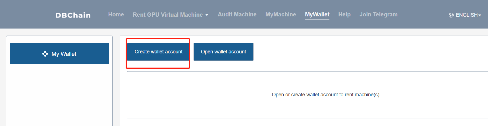
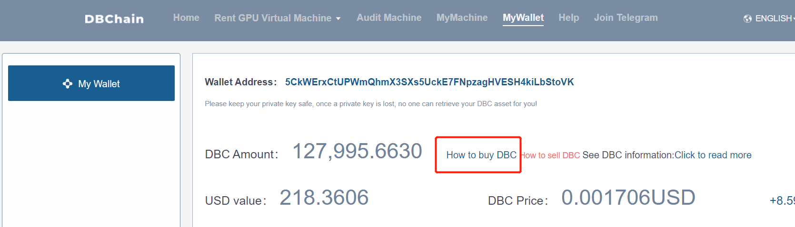
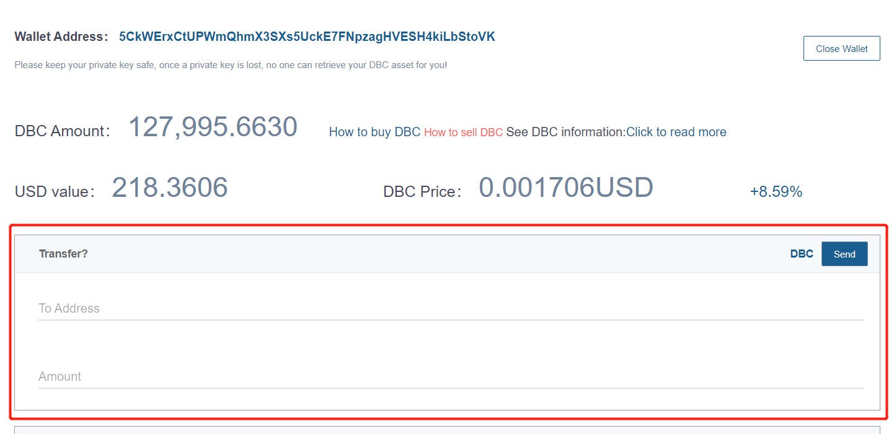
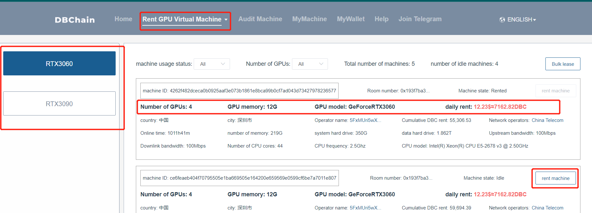
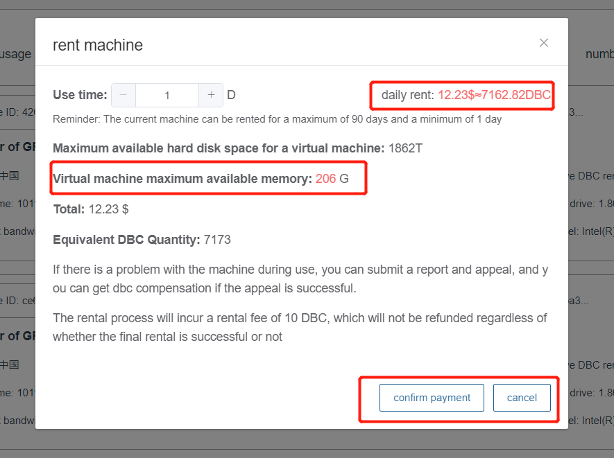
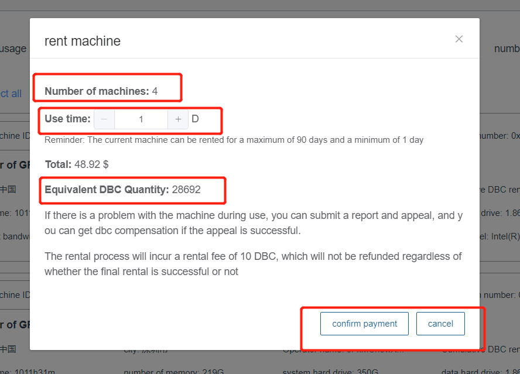
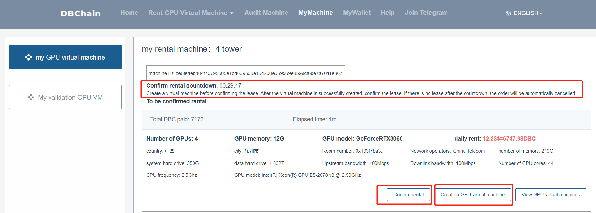
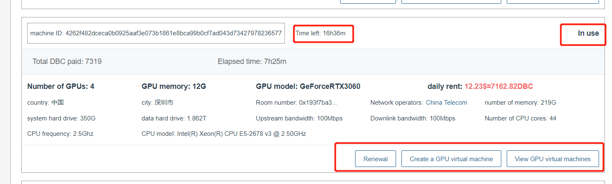
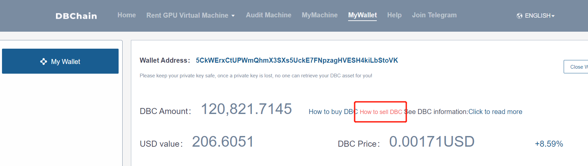
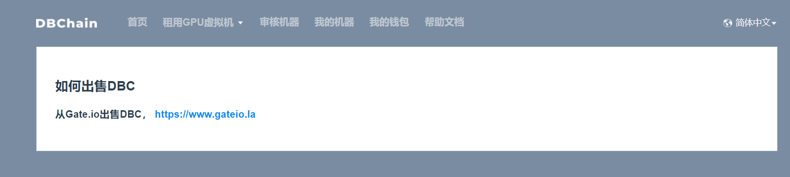

# Virtual Machine Rental Tutorial

## 1. Register the wallet

Go to the My Wallet page --> Click the Create Wallet Account button and follow the prompts to complete the operation

## 2. Buy DBC

When renting a virtual machine, you need a certain amount of DBC in the wallet. One DBC is currently less than 3 cents. Click How to buy DBC and enter the purchase

::: warning
DBC is not a point, it is a digital currency, and its price fluctuates all the time. After purchasing DBC, it can not only be used on the current website, but also can be transferred to other wallets or digital currency exchanges that support DBC, such as the following Figure, you can transfer to any other DBC wallet address, when the transfer is done, DBC will no longer belong to you, but to the owner of this wallet address.
:::

## 3. Lease a virtual machine

Enter the rental virtual machine page, the left side is the GPU model classification information of the existing machine, and the right side shows the machine details under the specific GPU model, such as GPU model, GPU quantity, video memory, daily rent, etc. Among them, the ways of renting virtual machines are single renting virtual machines and batch renting virtual machines, and users can use them flexibly according to their own needs.

##### 1. Single leased virtual machine

Click the rent a virtual machine button in the machine list, a pop-up box will pop up, fill in the rental duration by yourself, and the total required amount and the corresponding DBC quantity will be displayed, as well as relevant reminders. After confirming that the information is correct, click the Confirm payment button to start renting and changing the machine. , wait for about 30S, when the lease is successful, go to My Machine --> My GPU Virtual Machine page to view the relevant lease information

##### 2. Leasing virtual machines in batches

Click the batch leasing interface, a multi-select box will appear, select the machine you want to rent, click Confirm to submit, and fill in the rental duration. At this time, the total required amount and the corresponding DBC quantity will be displayed, as well as relevant reminders. After confirming that the information is correct, click Confirm Click the Pay button to start renting the changed machine. When the lease is complete, it will jump to the My Machine --> My GPU Virtual Machine page to view the relevant rental information.

## 4. My machine

Go to My Machine --> My GPU Virtual Machine page to display the virtual machine order information under the current wallet. The virtual machine order shows a total of four states: pending confirmation, in use, order ended, order canceled, and refunding coins. in, please wait (only before order cancellation status)

##### 1. To be confirmed rental

After renting a machine from the rental virtual machine page, a rental order to be confirmed will be generated. At this time, there will be a 30-minute rental confirmation time, which can be used to create a virtual machine and verify whether the machine is available. If the creation is successful, you can click Confirm rental. The order becomes in-use status. If the creation fails, no operation is required. After 30 minutes, the order becomes the order cancellation status, and the remaining DBC will be credited to the payment account.

##### 2. In use

After clicking the Confirm Lease button, the order becomes in-use status. At this time, operations such as creating a virtual machine and renewing fees can be performed. The page displays the amount of DBC to be paid, the used time, and the remaining time. After the machine expires, the order becomes an order. In the end state, the virtual machine information created by the user while in use will be retained for 10 days, and the virtual machine information will be automatically deleted after 10 days.

## 5. Sell DBC

Bought a lot of DBC, but not used up, you can choose to sell DBC, of course you can choose to keep it in your wallet, but keep it in your wallet, the price of DBC is always fluctuating, it may rise or fall, you need to do it yourself Good judgment, can bear the fall losses. If you want to sell DBC, go to My Wallet page, click How to sell DBC, you can learn about the selling rules

