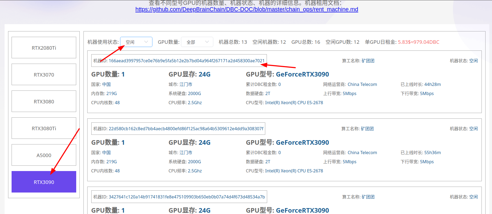
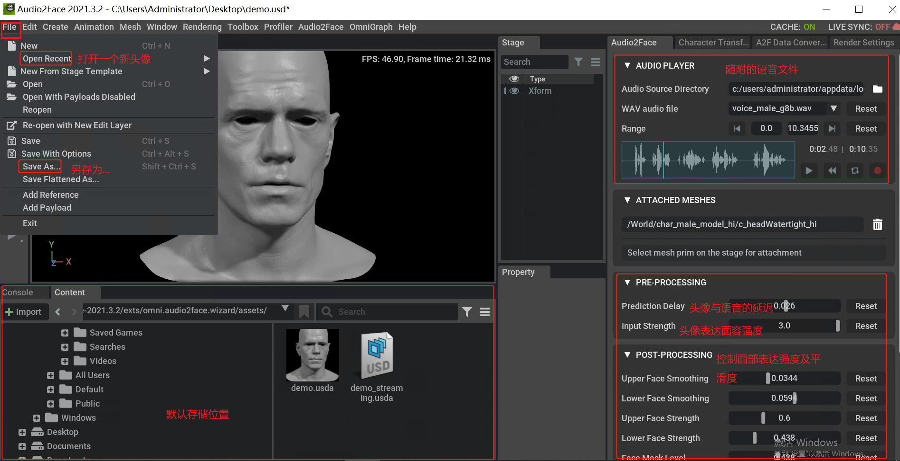

# Create windows virtual machine application omniverse

----

## Step 1: Determine which machine to rent

- Open [Mainnet Wallet](https://www.dbcwallet.io/?rpc=wss://info.dbcwallet.io)

- Create a wallet: Account-->Add Account (The mnemonic must be saved, if the mnemonic is lost, the account cannot be retrieved, and the coins are lost)

- Go to [Galaxy Race Machine List](https://galaxyrace.deepbrainchain.org/table) to find the corresponding type of idle machine

  

## Step 2: Rent an on-chain machine

- Navigate to `developer`---`transaction`---`rentMachine` ----`rentMachine(machine_id, duration)`

- machine_id Enter the id of the machine to be rented, and delete the `0x` in the input box first

- duration Enter the number of days to rent

- After the input is complete, click Submit Transaction and confirm whether the machine is available within 30 minutes. (If the lease is not confirmed within 30 minutes, the `dbc` paid will be refunded, but the transaction fee of 10 `dbc` cannot be refunded)

- Create a windows virtual machine:

  >`request method`：POST
  >
  >`request URL`：http://<**dbc_client_ip**>:<**dbc_client_port**>/api/v1/tasks/start
  >
  >`request body`：
  >
  >```json
  >{
  >   "peer_nodes_list": [
  >       // The node_id of the requesting machine
  >       "58fb618aa482c41114eb3cfdaefd3ba183172da9e25251449d045043fbd37f45"
  >   ],
  >   "additional": {
  >        "ssh_port": "",
  >       //Default port for remote login (set a different value for each virtual machine)
  >        "rdp_port":"3389",
  >       //Virtual machine image name (make sure the image name written in the virtual machine or image management center)
  >        "image_name": "windows_1909.qcow2",
  >       // Fill in the name of the data disk (you can leave it blank, if you leave it blank, dbc exists in the form of data_1_<task_id>.qcow2 by default,
             If you fill in, it will check whether the file exists, and if it exists, the data disk will exist in the form of .qcow2 of the filled file)
  >        "data_file_name": "",
  >        // Number of gpus (greater than or equal to 0)
  >        "gpu_count": "1",
  >       // Number of CPUs (greater than 0)
  >        "cpu_cores": "8",
  >       // Memory size (greater than 0, unit: G)
  >        "mem_size": "32",
  >       // Disk size (greater than 0, unit: G)
  >        "disk_size": "1",
  >       // The port number when connecting to this virtual machine using vnc (set a different value for each virtual machine)
  >        "vnc_port": "5907",
  >       // windows system (required)
  >        "operation_system": "win10",
  >        "bios_mode": "uefi",
  >        "vm_xml": "",
  >        "vm_xml_url": ""
  >   },
  >
  >   "session_id": "The session_id distributed by the renter",
  >   "session_id_sign": "session_id_sign distributed by the renter"
  >}
  >```
  >
  >示例：
  >

  * The length of the creation process will vary depending on the configuration, ranging from five to fifteen minutes.
  * You can query the `login method` of the virtual machine and the `current status` of the virtual machine by requesting `virtual machine details` (when the status value is "creating", it means that the virtual machine is in the process of being created)

  For related operations, please [Reference](https://github.com/DeepBrainChain/DBC-DOC/blob/master/creat_macine/create_macine.md)

## Step 3: Confirm availability and lease

::: warning
Before confirming, you must confirm that the virtual machine can be started normally. After confirming that the lease is successful, it means that the machine is leased successfully, and the DBC rent cannot be refunded.
:::

- Navigate to `Developer`----`Transaction`----`rentMachine`----`confirmRent(machine_id)`

- Enter the machine id and submit the transaction

## Step 4: Machine lease renewal

::: warning
When the machine expires, the virtual machine will be automatically stopped to ensure that the lease is successfully renewed before the lease expires.
:::

- Navigate to `developer`----`transaction`----`rentMachine`----`reletMachine(machine_id, add_duration)`
- Enter the machine id and the number of days to renew the lease and submit the transaction

## Step 5: Connect to the virtual machine remotely

* After viewing the login method of the virtual machine, open a remote connection locally

  

## Step 6: Download omniverse

* Open `NVIDIA` official website to download `NVIDIA omniverse`: https://www.nvidia.cn/omniverse/#

* After the installation is complete according to the documentation on the official website: Navigate to `EXCHANGE`, find `Audio2Face` in the `Apps` section, then click `"Install"` and `"Launch" )`.

  

* After startup, you can see the default avatar and accompanying voice and template parameters (it will take a few minutes to load the template engine)

  For more operation details, please [Reference](https://docs.omniverse.nvidia.com/app_audio2face/app_audio2face/overview.html)

  
