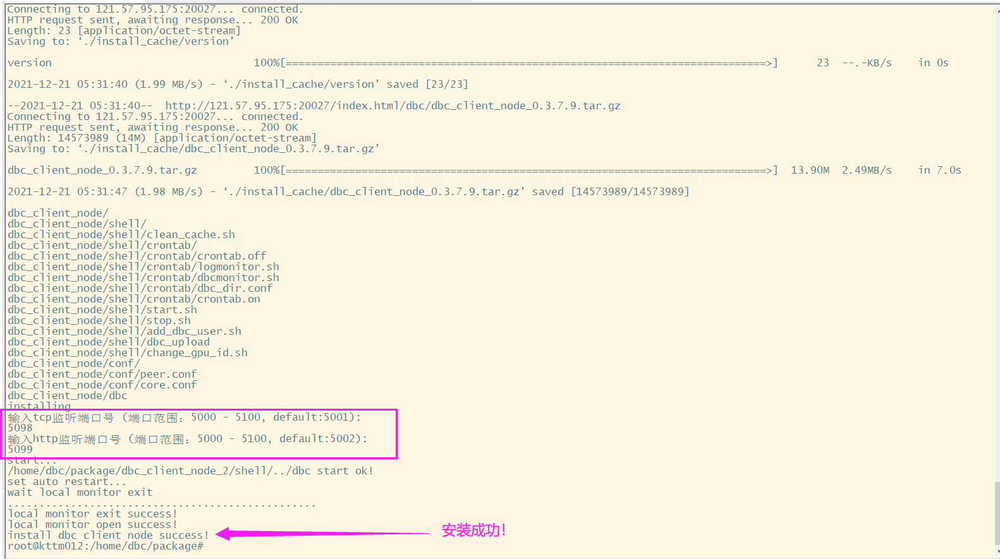

## The role of the client node

+ The DBC client node acts as the identity of the trustee in the entire network, and can query the machine where the function node is correctly deployed in the current network. When the function node is deployed, you can request the client node through http to check whether your function node is successfully connected to the client node. When the machine ID of your function node can be successfully seen through the client request, it means that you have successfully deployed the function node.
+ Suggestion: Since the official client nodes cannot remain stable online forever, it is recommended that each mining pool set up two client nodes as a backup, and at the same time, it can also strengthen the DBC network.
+ Tip: The client node has very low requirements for hardware equipment. Any public network server that can run normally can be built(container mode can also be used), and the memory is very small, as long as it can be accessed through the public network.


## (一) Install DBC Client
---

#### 0. install environment
&nbsp;&nbsp;&nbsp;&nbsp;&nbsp;`apt-get  install libvirt-clients` libvirt-daemon-system

#### 1. download install script：
  &nbsp;&nbsp;&nbsp;&nbsp;&nbsp;https://github.com/DeepBrainChain/DBC-AIComputingNet/releases/
  &nbsp;&nbsp;&nbsp;&nbsp;download the install_client.sh file
#### 2. add executable permission：
&nbsp;&nbsp;&nbsp;&nbsp;&nbsp;```chmod +x install_client.sh```

#### 3. run the script:
&nbsp;&nbsp;&nbsp;&nbsp;&nbsp;```./install_client.sh [install_dir]```

During the installation process, you need to input two listen port:


<br/>

## (二) Update DBC Client
---

#### 1. download update client script：
  &nbsp;&nbsp;&nbsp;&nbsp;&nbsp;https://github.com/DeepBrainChain/DBC-AIComputingNet/releases/
  &nbsp;&nbsp;&nbsp;&nbsp;download update_client.sh file
#### 2. add executable permission：
&nbsp;&nbsp;&nbsp;&nbsp;&nbsp;```chmod +x update_client.sh```

#### 3. run the script:
&nbsp;&nbsp;&nbsp;&nbsp;&nbsp;```./update_client.sh [install_dir]```


