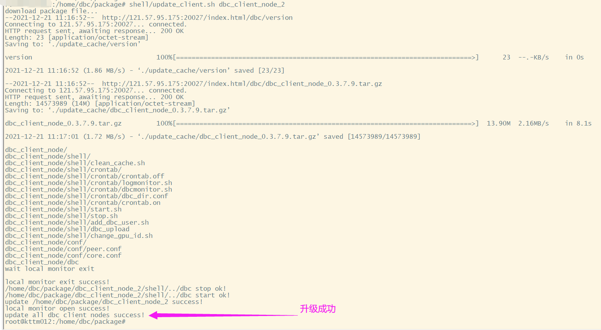

# Install And Update DBC Client Node

+ The DBC client node acts as the identity of the trustee in the entire network, and can query the machine where the function node is correctly deployed in the current network. When the function node is deployed, you can request the client node through http to check whether your function node is successfully connected to the client node. When the machine ID of your function node can be successfully seen through the client request, it means that you have successfully deployed the function node.
+ Suggestion: Since the official client nodes cannot remain stable online forever, it is recommended that each mining pool set up two client nodes as a backup, and at the same time, it can also strengthen the DBC network.
+ Tip: The client node has very low requirements for hardware equipment. Any public network server that can run normally can be built(container mode can also be used), and the memory is very small, as long as it can be accessed through the public network.

## (一) deploy image server
操作系统：ubuntu
+ 设置开机启动rsync-daemon
```shell
sudo vim /etc/default/rsync
修改：将false改true
RSYNC_ENABLE=true   
```
+ 修改配置文件rsyncd.conf

手动复制：
sudo cp /usr/share/doc/rsync/examples/rsyncd.conf /etc

修改 /etc/rsyncd.conf：
```shell
######### 全局: 配置参数 ##########
port=873    # 指定rsync端口。默认873
uid = nobody # rsync服务的运行用户，默认是nobody，文件传输成功后属主将是这个uid
gid = nogroup # rsync服务的运行组，默认是nobody，文件传输成功后属组将是这个gid
use chroot = yes # rsync daemon在传输前是否切换到指定的path目录下，并将其监禁在内
max connections = 0 # 指定最大连接数量，0表示没有限制
timeout = 60  # 确保rsync服务器不会永远等待一个崩溃的客户端，0表示永远等待
motd file = /var/rsyncd/rsync.motd   # 客户端连接过来显示的消息
lock file = /var/run/rsync.lock      # 指定锁文件
log file = /var/log/rsyncd.log       # 指定rsync的日志文件，而不把日志发送给syslog
dont compress = *.gz *.tgz *.zip *.z *.Z *.rpm *.deb *.bz2  # 指定哪些文件不用进行压缩传输

######### 模块: 配置参数 ##########
[images]        # 模块ID
path = /data/ # 指定该模块的路径，启动rsync服务前该目录必须存在
ignore errors = yes     # 忽略某些IO错误信息
ignore nonreadable = yes
read only = no  # 指定该模块是否可读写，即能否上传文件，no表示可读写，yes表示可读不可写
write only = no # 指定该模式是否支持下载，设置为yes表示客户端不能下载
list = no       # 客户端请求显示模块列表时，该模块是否显示出来，设置为no则该模块为隐藏模块
# hosts deny = 0.0.0.0/32   # 指定不允许连接到该模块的机器
transfer logging = no
strict modes = yes
```
+ 启动：rsync --daemon

+ 客户端节点上配置镜像中心地址

`image_server=<id>,<ip>,<port>,<modulename>`

id: 用户自定义ID，用于标识改镜像中心

ip: 镜像中心ip地址

port: 镜像中心服务器上rsync-server的监听地址，默认873，见上述配置文件

modulename: 镜像中心上配置的模块ID，默认images，见上述配置文件

例如：
image_server=ID_1,127.0.0.1,22,873,images


## (二) Install DBC Client

---

**install environment**
```bash
sudo apt-get  install libvirt-clients libvirt-daemon-system expect -y
```

**1. download install script：**

http://116.169.53.132:9000/dbc/install_update_script/mainnet/install_client.sh

**2. add executable permission：**
```bash
chmod +x install_client.sh
```

**3. run the script:**
```bash
./install_client.sh [install_dir]
```

During the installation process, you need to input two listen port:


<br/>

## (三) Update DBC Client
---

**1. download update client script：**
http://116.169.53.132:9000/dbc/install_update_script/mainnet/update_client.sh

**2. add executable permission：**
```bash
chmod +x update_client.sh
```

**3. run the script:**
```bash
./update_client.sh [install_dir]
```


