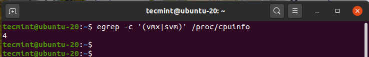
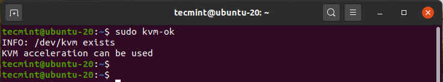
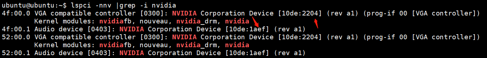
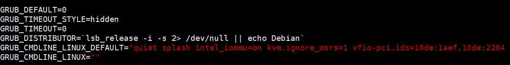
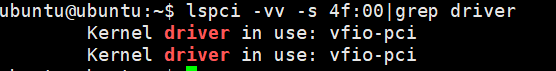
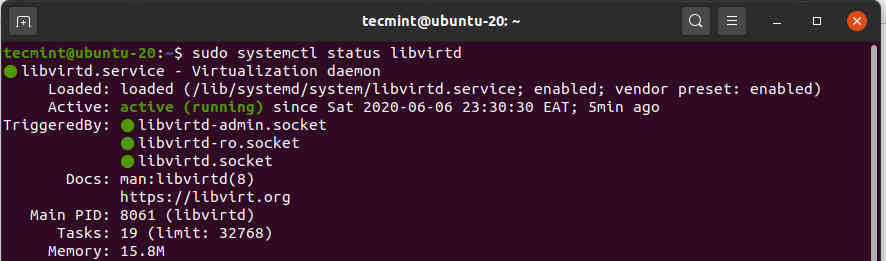
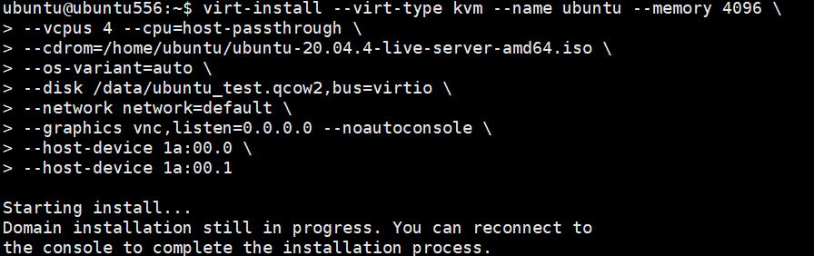
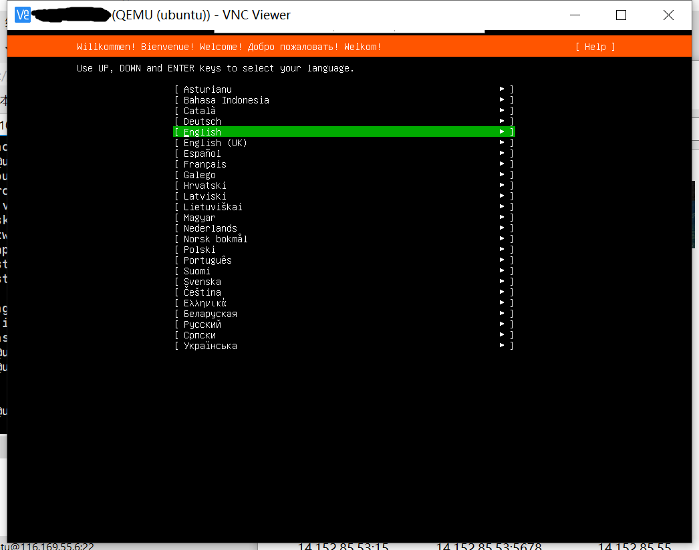
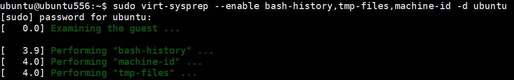

# Make image steps (with gpu driver)

Make a user's own virtual machine image that can be used to create multiple instances of a virtual machine. To create a virtual machine template follow the steps below

# Step 1: Installing KVM in Linux

1. Install kvm and other software on linux host
	```Bash
	sudo apt install qemu-kvm libvirt-clients libvirt-daemon-system bridge-utils virt-manager ovmf cpu-checker vim expect -y
	```
	
2. Check virtualization support
	After installing kvm and other software, you need to make sure the current machine supports kvm, use the following command to check virtualization support
	```Bash
	egrep -c '(vmx|svm)' /proc/cpuinfo
	
	```
	
	Any non-zero result means virtualization is supported. From the output below, we have confirmed that our server is working properly.
	
	
	
	Then check the system support for kvm virtualization, using the following command
	```Bash
	sudo kvm-ok
	```
	
	
	
	If you have the output of the above picture, you can proceed, if not please check the host bios settings
3. VFIO Preparation
	Set kernel module blacklist
	```Bash
	sudo vim /etc/modprobe.d/blacklist.conf
	#Add these at the bottom of the file：
	blacklist snd_hda_intel
	blacklist amd76x_edac
	blacklist vga16fb
	blacklist nouveau
	blacklist rivafb
	blacklist nvidiafb
	blacklist rivatv
	```
	
	Set gpu passthrough
	```Bash
	#search gpu ID
	lspci -nnv|grep -i NVIDIA
	#Record the graphics ID as shown below ,like 10de:2204 10de:1aef
	```
	
	
	
	```Bash
	#Modify kernel file
	sudo vim /etc/default/grub
	#Add in GRUB_CMDLINE_LINUX_DEFAULT field (if AMD platform, intel_iommu=on to amd_iommu=on)
	#”quiet splash intel_iommu=on kvm.ignore_msrs=1 vfio-pci.ids=graphics ID <--Separated by commas“
	
	```
	
	
	
	```Bash
	#update kernel
	sudo update-grub
	```
	
	Then restart the machine and check the graphics card usage after the machine starts
	```Bash
	#4f:00.0 as an example
	lspci -vv -s 4f:00 |grep driver
	```
	
	If vfio-pci is shown after driver, it is correct
	
	
	
4. Checking libvirt running
	Check that the libvirt service is running, if it is not, you need to start it manually
	```Bash
	sudo systemctl status libvirtd
	```
	
	
	
	You can enable it to start if not running:
	```Bash
	sudo systemctl enable --now libvirtd
	```
	

# Step 2: Create a KVM Virtual Image

Before we get to creating a template, we need to, first of all, have an installation instance. On the command-line, we are going to create a 50G Ubuntu KVM image using the qemu-img command as shown.

```Bash
sudo qemu-img create -f qcow2 /data/ubuntu.qcow2 50G
```


Then create the ubuntu virtual machine with the virt-install command as shown below. Note that  the iso file after the "--cdrom" is the installation image of the OS you want to install, you need to download it yourself

```Bash
virt-install --virt-type kvm --name ubuntu --memory 4096 \
--vcpus 4 --cpu=host-passthrough \
--cdrom=/data/ubuntu_install_dvd_base.iso \
--os-variant=auto \
--disk /data/ubuntu.qcow2,bus=virtio \
--network network=default \
--graphics vnc,listen=0.0.0.0 --noautoconsole \
--host-device 4f:00.0 \
--host-device 4f:00.1
```




This launches the virtual machine instance. You can confirm this by heading over to the [v](https://www.tecmint.com/create-virtual-machines-in-kvm-using-virt-manager/)nc viewer and opening the console window as shown. What you can see is the default welcome page for the installer. Be sure to complete the installation to the very end.



# Step 3: Create KVM Virtual Machine Template Image

Once the installation is complete, log into the VM and update all the system packages.

```Bash
sudo apt update

```


Install the prerequisite packages that you feel are essential to get started with.(Be sure to install qemu-guest-agent and nvidia gpu driver)

```Bash
sudo apt install qemu-guest-agent
sudo systemctl enable qemu-guest-agent --now
#NVIDIA graphics card drivers need to go to the official website to download the corresponding version
#Or use apt install to install nvidia drivers
```


Once you are done, be sure to power off your virtual machine and clean up the VM template image as shown.

```Bash
sudo virt-sysprep --enable bash-history,tmp-files,machine-id -d ubuntu
```




Lastly, invoke the command shown to undefine the VM domain. And he template image is now ready for cloning and deployment.


