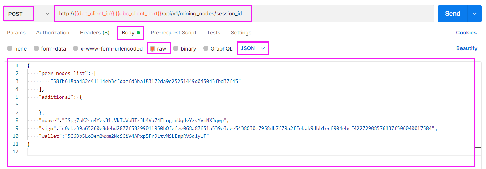
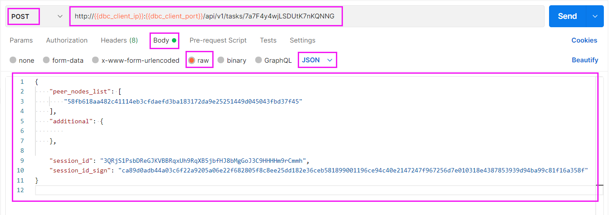
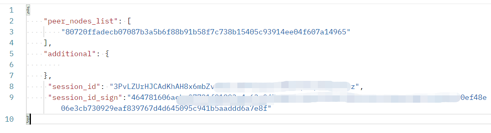

# HTTP client request API

#### ( The dbc_client_ip and dbc_client_port in the following HTTP request are the DBC client access addresses deployed by the user )

---

## GPU Node Manage

### 1. Querying GPU Node Machine Configuration Information

> `request method`：POST
>
> `request URL`：http://<**dbc_client_ip**>:<**dbc_client_port**>/api/v1/mining_nodes
>
> `request body`：
>
> ```json
> {
>   "peer_nodes_list": [
>     // node_id of GPU Node
>     "58fb618aa482c41114eb3cfdaefd3ba183172da9e25251449d045043fbd37f45"
>   ],
>   "additional": {}
> }
> ```
>
> Example：
> 

<br/>

### 2. Tenant query to get session_id

> `request method`：POST
>
> `request URL`：http://<**dbc_client_ip**>:<**dbc_client_port**>/api/v1/mining_nodes/session_id
>
> `request body`：
>
> ```json
> {
>     "peer_nodes_list": [
>         // node_id of GPU Node
>         "58fb618aa482c41114eb3cfdaefd3ba183172da9e25251449d045043fbd37f45"
>     ],
>     "additional": {
>
>     },
>    //Identity authentication information, use tenant signature or multi-signature account signature (refer to the description of HTTP request format), choose one of the two
>    ...
> }
> ```
>
> Example (the tenant's signature is used here, and a multi-signature account signature can also be used)：
> 

<br/>

## Virtual Machine Manage

### 1. Create a virtual machine

> `request method`：POST
>
> `request URL`：http://<**dbc_client_ip**>:<**dbc_client_port**>/api/v1/tasks/start
>
> `request body`：
>
> ```json
> {
>   "peer_nodes_list": [
>     // node_id of GPU Node
>     "58fb618aa482c41114eb3cfdaefd3ba183172da9e25251449d045043fbd37f45"
>   ],
>   "additional": {
>     // 镜像名字
>     "image_name": "ubuntu.qcow2",
>     // 描述
>     "desc": "...",
>     // 操作系统类型: linux、windows (默认值：linux)
>     "operation_system": "linux",
>     // 引导方式:（默认值：legacy）
>     //   linux系统设置: legacy
>     // windows系统设置: uefi
>     //        pxe方式: pxe
>     "bios_mode": "legacy",
>     // 远程登录linux虚拟机，ssh端口号（linux）
>     "ssh_port": "5684",
>     // 远程登录windows虚拟机，rdp端口号（windows）
>     "rdp_port": "5685",
>     // vnc连接端口号
>     "vnc_port": "5904",
>     //自定义端口映射
>     // [
>     //    宿主机的123转发到虚拟机的123
>     //    "tcp/udp,123",
>     //    宿主机的111转发到虚拟机的222
>     //    "tcp/udp,111:222",
>     //    宿主机的333-444转发到虚拟机的444
>     //    "tcp/udp,333-444",
>     //    宿主机的[555-666]转发到虚拟机的[777-888]
>     //    "tcp/udp,555-666:777-888"
>     // ]
>     "custom_port": [],
>
>     // gpu数量（大于等于 0）
>     "gpu_count": "2",
>     // cpu数量（大于0）
>     "cpu_cores": "8",
>     // 内存大小（大于0，单位：G）
>     "mem_size": "8",
>     // 磁盘大小（大于0，单位：G）
>     "disk_size": "10",
>     // 已存在的数据盘文件（如：xxx.qcow2）
>     "data_file_name": "xxx.qcow2",
>
>     // 不同虚拟机之间互相传输的组播地址,范围为224.0.0.0~239.0.0.0
>     // 添加多组播地址续在括号中用","相隔,也可不填
>     "multicast": ["230.0.0.1:5558"],
>     //内网名称（创建虚拟机网络时填的名称）
>     "network_name": "test",
>     // 公网ip地址
>     "public_ip": "",
>     // 安全组
>     // [
>     //    使 TCP 端口 22 (ssh) 和 3389 (rdp) 可访问
>     //    "in,tcp,22,0.0.0.0/0,accept",
>     //    "in,tcp,3389,0.0.0.0/0,accept",
>     //    接受所有流出虚拟机的流量
>     //    "out,all,all,0.0.0.0/0,accept",
>     //    丢弃其他所有流入虚拟机的流量
>     //    "in,all,all,0.0.0.0/0,drop"
>     // ]
>     "network_filters": []
>   },
>
>   "session_id": "The session_id distributed by the renter",
>   "session_id_sign": "session_id_sign distributed by the renter"
> }
> ```
>
> Example：
> 

- The length of the creation process will vary depending on the configuration, ranging from five to fifteen minutes.
- You can query the `login method` of the virtual machine and the `current status` of the virtual machine by requesting `virtual machine details` (when the status value is "creating", it means that the virtual machine is in the process of being created)

<br/>

### 2. Querying Virtual Machine Details

> `request method`：POST
>
> `request URL`：http://<**dbc_client_ip**>:<**dbc_client_port**>/api/v1/tasks/<task_id value to query>
>
> `request body`：
>
> ```json
> {
>   "peer_nodes_list": [
>     // node_id of GPU Node
>     "58fb618aa482c41114eb3cfdaefd3ba183172da9e25251449d045043fbd37f45"
>   ],
>   "additional": {},
>
>   "session_id": "The session_id distributed by the renter",
>   "session_id_sign": "session_id_sign distributed by the renter"
> }
> ```

Example：


### 3. Query the list of virtual machines

> `request method`：POST
>
> `request URL`：http://<**dbc_client_ip**>:<**dbc_client_port**>/api/v1/tasks
>
> `request body`：
>
> ```json
> {
>   "peer_nodes_list": [
>     // node_id of GPU Node
>     "58fb618aa482c41114eb3cfdaefd3ba183172da9e25251449d045043fbd37f45"
>   ],
>   "additional": {},
>
>   "session_id": "The session_id distributed by the renter",
>   "session_id_sign": "session_id_sign distributed by the renter"
> }
> ```
>
> Example：
> 

### 4. Shut down the virtual machine

> `request method`：POST
>
> `request URL`：http://<**dbc_client_ip**>:<**dbc_client_port**>/api/v1/tasks/shutdown/<task_id>
>
> `request body`：
>
> ```json
> {
>   "peer_nodes_list": [
>     //node_id of GPU Node
>     "58fb618aa482c41114eb3cfdaefd3ba183172da9e25251449d045043fbd37f45"
>   ],
>   "additional": {},
>
>   "session_id": "The session_id distributed by the renter",
>   "session_id_sign": "session_id_sign distributed by the renter"
> }
> ```
>
> 示例：
> 

### 5. Shut down the virtual machine (forced power off)

> `request method`：POST
>
> `request URL`：http://<**dbc_client_ip**>:<**dbc_client_port**>/api/v1/tasks/poweroff/<task_id>
>
> `request body`：
>
> ```json
> {
>   "peer_nodes_list": [
>     //node_id of GPU Node
>     "58fb618aa482c41114eb3cfdaefd3ba183172da9e25251449d045043fbd37f45"
>   ],
>   "additional": {},
>
>   "session_id": "The session_id distributed by the renter",
>   "session_id_sign": "session_id_sign distributed by the renter"
> }
> ```
>
> 示例：
> 

### 6. Start Virtual Machine

> **Wakes a sleeping virtual machine， also use this api**
>
> `request method`：POST
>
> `request URL`：http://<**dbc_client_ip**>:<**dbc_client_port**>/api/v1/tasks/start/<task_id>
>
> `request body`：
>
> ```json
> {
>   "peer_nodes_list": [
>     // node_id of GPU Node
>     "58fb618aa482c41114eb3cfdaefd3ba183172da9e25251449d045043fbd37f45"
>   ],
>   "additional": {},
>
>   "session_id": "The session_id distributed by the renter",
>   "session_id_sign": "session_id_sign distributed by the renter"
> }
> ```
>
> Example：
> 

### 7. delete virtual machine

> `request method`：POST
>
> `request URL`：http://<**dbc_client_ip**>:<**dbc_client_port**>/api/v1/tasks/delete/<task_id>
>
> `request body`：
>
> ```json
> {
>   "peer_nodes_list": [
>     // node_id of GPU Node
>     "58fb618aa482c41114eb3cfdaefd3ba183172da9e25251449d045043fbd37f45"
>   ],
>   "additional": {},
>
>   "session_id": "The session_id distributed by the renter",
>   "session_id_sign": "session_id_sign distributed by the renter"
> }
> ```
>
> Example：
> 

### 8. Restart Virtual Machine

> `request method`：POST
>
> `request URL`：http://<**dbc_client_ip**>:<**dbc_client_port**>/api/v1/tasks/restart/<task_id>
>
> `request body`：
>
> ```json
> {
>   "peer_nodes_list": [
>     // node_id of GPU Node
>     "58fb618aa482c41114eb3cfdaefd3ba183172da9e25251449d045043fbd37f45"
>   ],
>   "additional": {},
>   "session_id": "The session_id distributed by the renter",
>   "session_id_sign": "session_id_sign distributed by the renter"
> }
> ```
>
> ::: warning
> After sending the restart request, the hypervisor will choose what it thinks is the best shutdown method. Note that the request may be ignored by the virtual machine. To force restart the virtual machine, please add the force_reboot parameter to the url. If the parameter is equal to true or 1, it will be forced to restart. If it is equal to false or 0 or no parameter, it will still use the above traditional method to restart. The request url to force restart the virtual machine is as follows:

http://<**dbc_client_ip**>:<**dbc_client_port**>/api/v1/tasks/restart/<task_id>?force_reboot=true
:::

### 9. Query Virtual Machine Logs

> `request method`：POST
>
> `request URL`：http://<**dbc_client_ip**>:<**dbc_client_port**>/api/v1/tasks/logs/<task_id>?flag=tail&line_num=10
>
> `request body`：
>
> ```json
> {
>   "peer_nodes_list": [
>     //node_id of GPU Node
>     "58fb618aa482c41114eb3cfdaefd3ba183172da9e25251449d045043fbd37f45"
>   ],
>   "additional": {},
>
>   "session_id": "The session_id distributed by the renter",
>   "session_id_sign": "session_id_sign distributed by the renter"
> }
> ```

:::tip
The request url for querying virtual machine logs has two parameters. The flag indicates the direction of the query log. If the parameter is equal to tail, the query starts from the end of the log file. If it is equal to head, the query starts from the head of the log file. line_num indicates the number of log lines to be queried. If it exceeds the actual number of lines in the file, the actual number of lines in the file shall prevail. Finally, this request returns up to 1024 bytes, and logs that are out of range are truncated.
:::

### 10. Modify virtual machine configuration

:::tip
Some changes require a restart of the virtual machine to take effect
:::

> `request method`：POST
>
> `request URL`：http://<**dbc_client_ip**>:<**dbc_client_port**>/api/v1/tasks/modify/<task_id>
>
> `request body`：
>
> ```json
> {
>   "peer_nodes_list": [
>     //node_id of GPU Node
>     "58fb618aa482c41114eb3cfdaefd3ba183172da9e25251449d045043fbd37f45"
>   ],
>   "additional": {
>     "new_ssh_port": "5586",
>     "new_vnc_port": "5986",
>     "new_rdp_port": "5786",
>     "new_custom_port": [
>       "tcp,123", // host的123转发到guest的123
>       "udp,111:222", // host的111转发到guest的222
>       "tcp,333-444", // host的333-444转发到guest的444
>       "udp,555-666:777-888" // host的[555-666]转发到guest的[777-888]
>     ],
>     "new_gpu_count": "2", // >= 0
>     "new_cpu_cores": "8", // > 0, 单位G
>     "new_mem_size": "8" // > 0, 单位G
>   },
>
>   "session_id": "The session_id distributed by the renter",
>   "session_id_sign": "session_id_sign distributed by the renter"
> }
> ```

### 11. Modifying the virtual machine login password

> `request method`：POST
>
> `request URL`：http://<**dbc_client_ip**>:<**dbc_client_port**>/api/v1/tasks/passwd/<task_id>
>
> `request body`：
>
> ```json
> {
>   "peer_nodes_list": [
>     //node_id of GPU Node
>     "58fb618aa482c41114eb3cfdaefd3ba183172da9e25251449d045043fbd37f45"
>   ],
>   "additional": {
>     "username": "dbc",
>     "password": "vm123456"
>   },
>
>   "session_id": "The session_id distributed by the renter",
>   "session_id_sign": "session_id_sign distributed by the renter"
> }
> ```

:::warning

1. Only the running virtual machine can change the password.

2. The qemu guest agent or dbc guest agent must be installed in the virtual machine to support using this API to change the password.

3. The Ubuntu system uses the default username "dbc", and the Windows system uses the default username "Administrator". For custom images, please set your own username.
   :::

<br/>

## Disk management

### 1. Query disk list

> `request method`：POST
>
> `request URL`：http://<**dbc_client_ip**>:<**dbc_client_port**>/api/v1/disk/list/<task_id>
>
> `request body`：
>
> ```json
> {
>   "peer_nodes_list": [
>     //node_id of GPU Node
>     "58fb618aa482c41114eb3cfdaefd3ba183172da9e25251449d045043fbd37f45"
>   ],
>   "additional": {},
>
>   "session_id": "The session_id distributed by the renter",
>   "session_id_sign": "session_id_sign distributed by the renter"
> }
> ```

### 2. Data disk expansion

> `request method`：POST
>
> `request URL`：http://<**dbc_client_ip**>:<**dbc_client_port**>/api/v1/disk/resize/<task_id>
>
> `request body`：
>
> ```json
> {
>   "peer_nodes_list": [
>     //node_id of GPU Node
>     "58fb618aa482c41114eb3cfdaefd3ba183172da9e25251449d045043fbd37f45"
>   ],
>   "additional": {
>     "disk": "vdb", //盘符
>     "size": 20 //单位: G
>   },
>
>   "session_id": "The session_id distributed by the renter",
>   "session_id_sign": "session_id_sign distributed by the renter"
> }
> ```

### 3. Add a new data disk

> `request method`：POST
>
> `request URL`：http://<**dbc_client_ip**>:<**dbc_client_port**>/api/v1/disk/add/<task_id>
>
> `request body`：
>
> ```json
> {
>   "peer_nodes_list": [
>     //node_id of GPU Node
>     "58fb618aa482c41114eb3cfdaefd3ba183172da9e25251449d045043fbd37f45"
>   ],
>   "additional": {
>     "size": 20, //单位: G
>     "mount_dir": "/data" //挂载目录，默认：/data
>   },
>
>   "session_id": "The session_id distributed by the renter",
>   "session_id_sign": "session_id_sign distributed by the renter"
> }
> ```

### 4. Delete data disk

> `request method`：POST
>
> `request URL`：http://<**dbc_client_ip**>:<**dbc_client_port**>/api/v1/disk/delete/<task_id>
>
> `request body`：
>
> ```json
> {
>   "peer_nodes_list": [
>     //node_id of GPU Node
>     "58fb618aa482c41114eb3cfdaefd3ba183172da9e25251449d045043fbd37f45"
>   ],
>   "additional": {
>     "disk": "vdb" //盘符
>   },
>
>   "session_id": "The session_id distributed by the renter",
>   "session_id_sign": "session_id_sign distributed by the renter"
> }
> ```

<br />

## Snapshot Manage

### 1. Query snapshot list

> `request method`：POST
>
> `request URL`：http://<**dbc_client_ip**>:<**dbc_client_port**>/api/v1/snapshot/list/<task_id>
>
> `request body`：
>
> ```json
> {
>   "peer_nodes_list": [
>     //node_id of GPU Node
>     "58fb618aa482c41114eb3cfdaefd3ba183172da9e25251449d045043fbd37f45"
>   ],
>   "additional": {},
>
>   "session_id": "The session_id distributed by the renter",
>   "session_id_sign": "session_id_sign distributed by the renter"
> }
> ```

### 2. Querying snapshot details

> `request method`：POST
>
> `request URL`：http://<**dbc_client_ip**>:<**dbc_client_port**>/api/v1/snapshot/list/<task_id>/<snapshot_name>
>
> `request body`：
>
> ```json
> {
>   "peer_nodes_list": [
>     //node_id of GPU Node
>     "58fb618aa482c41114eb3cfdaefd3ba183172da9e25251449d045043fbd37f45"
>   ],
>   "additional": {},
>
>   "session_id": "The session_id distributed by the renter",
>   "session_id_sign": "session_id_sign distributed by the renter"
> }
> ```

### 3. Create snapshot

:::tip 注意！
To create a snapshot, make sure the virtual machine is powered off.
:::

- request method： POST

- request URL：

```
http://{{dbc_client_ip}}:{{dbc_client_port}}/api/v1/snapshot/create/<task_id>
```

- request body:

```json
{
  "peer_nodes_list": [
    //node_id of GPU Node
    "80720ffadecb07087b3a5b6f88b91b58f7c738b15405c93914ee04f607a14965"
  ],
  "additional": {
    "snapshot_name": "snap1", //快照名
    "desc": "...", //描述
    "image_server": "ID_2" //创建的快照上传到此镜像中心
  },
  "session_id": "The session_id distributed by the renter",
  "session_id_sign": "session_id_sign distributed by the renter"
}
```

### 4. Delete snapshot

- request method： POST

- request URL：

```
http://{{dbc_client_ip}}:{{dbc_client_port}}/api/v1/snapshot/delete/<task_id>/<snapshot_name>
```

- request body:

```json
{
  "peer_nodes_list": [
    //node_id of GPU Node
    "80720ffadecb07087b3a5b6f88b91b58f7c738b15405c93914ee04f607a14965"
  ],
  "additional": {},
  "session_id": "The session_id distributed by the renter",
  "session_id_sign": "session_id_sign distributed by the renter"
}
```

<br />

## Image Manage

### 1. Query the mirror center ID list

- request method：POST

- request URL：

```
http://{{dbc_client_ip}}:{{dbc_client_port}}/api/v1/images/servers`
```

- request body:

```json
{
  "peer_nodes_list": [],
  "additional": {}
}
```

### 2. Query image list

- request method：POST

- request URL：

```
http://{{dbc_client_ip}}:{{dbc_client_port}}/api/v1/images`
```

- request body:

**1. Query the image list of the image center**

```json
{
  "peer_nodes_list": [],
  "additional": {
    // 【必填】指定要查询的镜像中心ID
    "image_server": "ID_1"
  }
}
```

**2. Query the image list of GPU nodes**

```json
{
  "peer_nodes_list": [
    //node_id of GPU Node
    "80720ffadecb07087b3a5b6f88b91b58f7c738b15405c93914ee04f607a14965"
  ],
  "additional": {
    // 【选填】指定要查询的镜像中心ID
    "image_server": "ID_1"
  }
}
```

**3. Query the image list of a user on a GPU node**

```json
{
  "peer_nodes_list": [
    //node_id of GPU Node
    "80720ffadecb07087b3a5b6f88b91b58f7c738b15405c93914ee04f607a14965"
  ],
  "additional": {
    // 指定要查询的镜像中心ID
    "image_server": "ID_1"
  },
  "session_id": "The session_id distributed by the renter",
  "session_id_sign": "session_id_sign distributed by the renter"
}
```

- examples：


### 3. Upload image

- request method：POST

- request URL：

```
http://{{dbc_client_ip}}:{{dbc_client_port}}/api/v1/images/upload
```

- request body:

**1. Upload an image on the GPU node to the image center**

```json
{
  "peer_nodes_list": [
    //node_id of GPU Node
    "80720ffadecb07087b3a5b6f88b91b58f7c738b15405c93914ee04f607a14965"
  ],
  "additional": {
    "image_filename": "ubuntu.qcow2",
    // 指定要查询的镜像中心ID
    "image_server": "ID_1"
  },
  "session_id": "The session_id distributed by the renter",
  "session_id_sign": "session_id_sign distributed by the renter"
}
```

**2. Upload an image on the client node to the image center**

```json
{
  "peer_nodes_list": [],
  "additional": {
    "image_filename": "ubuntu.qcow2",
    // 指定要查询的镜像中心ID
    "image_server": "ID_1"
  }
}
```

- examples：



### 4. Download image

- request method：POST

- request URL：

```
http://{{dbc_client_ip}}:{{dbc_client_port}}/api/v1/images/download
```

- request body:

**Download the image from the image center to the GPU node**

```json
{
  "peer_nodes_list": [
    //node_id of GPU Node
    "80720ffadecb07087b3a5b6f88b91b58f7c738b15405c93914ee04f607a14965"
  ],
  "additional": {
    // 指定要查询的镜像中心ID
    "image_server": "ID_1",
    "image_filename": "ubuntu.qcow2",
    // 本地存储路径
    "local_dir": "/my_local_dir"
  },
  "session_id": "The session_id distributed by the renter",
  "session_id_sign": "session_id_sign distributed by the renter"
}
```

- examples：


### 5. Query download progress

- request method：POST

- request URL：

```
http://{{dbc_client_ip}}:{{dbc_client_port}}/api/v1/images/downloadprogress
```

- request body:

```json
{
  "peer_nodes_list": [
    //node_id of GPU Node
    "80720ffadecb07087b3a5b6f88b91b58f7c738b15405c93914ee04f607a14965"
  ],
  "additional": {
    "image_filename": "ubuntu.qcow2"
  },
  "session_id": "The session_id distributed by the renter",
  "session_id_sign": "session_id_sign distributed by the renter"
}
```

### 6. Query upload progress

- request method：POST

- request URL：

```
http://{{dbc_client_ip}}:{{dbc_client_port}}/api/v1/images/uploadprogress
```

- request body:

```json
{
  "peer_nodes_list": [
    //node_id of GPU Node
    "80720ffadecb07087b3a5b6f88b91b58f7c738b15405c93914ee04f607a14965"
  ],
  "additional": {
    "image_filename": "ubuntu.qcow2"
  },
  "session_id": "The session_id distributed by the renter",
  "session_id_sign": "session_id_sign distributed by the renter"
}
```

### 7. Stop download

- request method：POST

- request URL：

```
http://{{dbc_client_ip}}:{{dbc_client_port}}/api/v1/images/download_stop
```

- request body:

```json
{
  "peer_nodes_list": [
    //node_id of GPU Node
    "80720ffadecb07087b3a5b6f88b91b58f7c738b15405c93914ee04f607a14965"
  ],
  "additional": {
    "image_filename": "ubuntu.qcow2"
  },
  "session_id": "The session_id distributed by the renter",
  "session_id_sign": "session_id_sign distributed by the renter"
}
```

### 8. Stop upload

- request method：POST

- request URL：

```
http://{{dbc_client_ip}}:{{dbc_client_port}}/api/v1/images/upload_stop
```

- request body:

```json
{
  "peer_nodes_list": [
    //node_id of GPU Node
    "80720ffadecb07087b3a5b6f88b91b58f7c738b15405c93914ee04f607a14965"
  ],
  "additional": {
    "image_filename": "ubuntu.qcow2"
  },
  "session_id": "The session_id distributed by the renter",
  "session_id_sign": "session_id_sign distributed by the renter"
}
```

### 9. Delete image file

- request method：POST

- request URL：

```
http://{{dbc_client_ip}}:{{dbc_client_port}}/api/v1/images/delete
```

- request body:

```json
{
  "peer_nodes_list": [
    //node_id of GPU Node
    "80720ffadecb07087b3a5b6f88b91b58f7c738b15405c93914ee04f607a14965"
  ],
  "additional": {
    "image_filename": "ubuntu.qcow2"
  },
  "session_id": "The session_id distributed by the renter",
  "session_id_sign": "session_id_sign distributed by the renter"
}
```

## Virtual LAN networking

### 1. Create a network

:::tip 注意！
the created network can only be used in the same computer room
:::

- request method：POST

- request URL：

```
http://{{dbc_client_ip}}:{{dbc_client_port}}/api/v1/lan/create
```

- request body:

```json
{
  "peer_nodes_list": [
    // node_id of GPU Node
    "441f631da912b2186a3ef0452430f139cf01641bf4e2dce07e06103d8d70e533"
  ],
  "additional": {
    // 创建网络的名称(6-10位字母或者数字组合)
    "network_name": "testnet",
    // 网段/ 掩码位数
    "ip_cidr": "192.168.66.0/24"
  },
  "session_id": "The session_id distributed by the renter",
  "session_id_sign": "session_id_sign distributed by the renter"
}
```

### 2. Delete the network

:::tip 注意！
DBC will automatically clean up the network that has not been used by the virtual machine for a long time
:::

- request method：POST

- request URL：

```
http://{{dbc_client_ip}}:{{dbc_client_port}}/api/v1/lan/delete/<network_name>
```

- request body:

```json
{
  "peer_nodes_list": [
    // node_id of GPU Node
    "441f631da912b2186a3ef0452430f139cf01641bf4e2dce07e06103d8d70e533"
  ],
  "additional": {},
  "session_id": "The session_id distributed by the renter",
  "session_id_sign": "session_id_sign distributed by the renter"
}
```

## Bare Metal Node Operations

To control operations such as switching on and off a bare metal server, you need a CPU server that is on the same network as the bare metal server. Run the bare metal node program of dbc on this CPU server, and then add the relevant information of the bare metal server (IP address and IPMI control information) to the node, and the node will generate a corresponding "node_id" for the bare metal server to join the dbc network, the bare metal server can be rented and controlled by "node_id".

To install dbc bare metal node, please refer to [dbc bare metal node](https://deepbrainchain.github.io/DBC-Wiki/en/install-update-dbc-node/install-update-dbc/dbc-bare-metal-node.html)

### 1. Query the list of bare metal servers

- request method：POST

- request URL：

```
http://{{dbc_client_ip}}:{{dbc_client_port}}/api/v1/bare_metal
```

- request body:

```json
{
  "peer_nodes_list": [
    // node_id of bare metal node
    "ccd9a2118ba3c95cd458302601f15281edc39d72dcf11a07527893d97ac1a573"
  ],
  "additional": {}
}
```

### 2. Add a bare metal server

- request method：POST

- request URL：

```
http://{{dbc_client_ip}}:{{dbc_client_port}}/api/v1/bare_metal/add
```

- request body:

```json
{
  "peer_nodes_list": [
    // node_id of bare metal node
    "ccd9a2118ba3c95cd458302601f15281edc39d72dcf11a07527893d97ac1a573"
  ],
  "additional": {
    // Informations of bare metal server
    "bare_metal_nodes": [
      {
        // The unique ID of the machine supplier to identify the bare metal, required.
        "uuid": "3156995b-da18-4268-9734-f8d168e90a7d",
        // The connection method provided by the bare metal server to the user. Required. A fixed IP address is recommended.
        "ip": "175.221.204.110",
        // Operating system of the bare metal server, optional.
        "os": "Ubuntu 20.04.3 LTS (Focal Fossa) 5.4.0-121-generic GNU/Linux",
        // A description customized by the machine owner, not required.
        "desc": "在xxx平台租用的裸金属服务器，用于xxx业务，机房id是9f01ca9c-38bd-46a9-9637-dac92b352a63",
        // The host ID of ipmi, required. A fixed IP address is recommended.
        "ipmi_hostname": "192.168.0.110",
        // ipmi username, required.
        "ipmi_username": "admin",
        // ipmi user password, required.
        "ipmi_password": "dbtu2017"
      }
    ]
  }
}
```

- return example：

```json
{
  "errcode": 0,
  "message": {
    "bare_metal_nodes": [
      {
        "node_id": "fcf2cd8b99958606d260ca00c5ac00c88c242bcf8eb38e7cc3f29e9719a73f39",
        "uuid": "3156995b-da18-4268-9734-f8d168e90a7d"
      }
    ]
  }
}
```

### 3. Delete bare metal servers

- request method：POST

- request URL：

```
http://{{dbc_client_ip}}:{{dbc_client_port}}/api/v1/bare_metal/delete
```

- request body:

```json
{
  "peer_nodes_list": [
    // node_id of bare metal node
    "ccd9a2118ba3c95cd458302601f15281edc39d72dcf11a07527893d97ac1a573"
  ],
  "additional": {
    // node_id list of bare metal server
    "bare_metal_node_ids": [
      // The node_id returned when adding a bare metal server
      "8c29b20da3fdb2d6c5ad7c2c85b303d9d337a1b82fa584a6b6cf1303331efd16"
    ]
  }
}
```

### 4. Bare Metal Server Power Control

- request method：POST

- request URL：

```
http://{{dbc_client_ip}}:{{dbc_client_port}}/api/v1/bare_metal/power
```

- request body:

```json
{
  "peer_nodes_list": [
    // node_id of bare metal server
    "fcf2cd8b99958606d260ca00c5ac00c88c242bcf8eb38e7cc3f29e9719a73f39"
  ],
  "additional": {
    // power control command
    // "on"     - power on
    // "off"    - power off
    // "reset"  - power reset
    // "status" - get power status
    "command": "on"
  },
  "session_id": "The session_id distributed by the renter",
  "session_id_sign": "session_id_sign distributed by the renter"
}
```

### 5. Modifying the boot device order of a bare metal server

- request method：POST

- request URL：

```
http://{{dbc_client_ip}}:{{dbc_client_port}}/api/v1/bare_metal/bootdev
```

- request body:

```json
{
  "peer_nodes_list": [
    // node_id of bare metal server
    "fcf2cd8b99958606d260ca00c5ac00c88c242bcf8eb38e7cc3f29e9719a73f39"
  ],
  "additional": {
    // boot device order
    // "pxe"    - Force PXE boot
    // "disk"   - Force boot from default Hard-drive
    // "cdrom"  - Force boot from CD/DVD
    // "bios"   - Force boot into BIOS Setup
    "device": "pxe"
  },
  "session_id": "The session_id distributed by the renter",
  "session_id_sign": "session_id_sign distributed by the renter"
}
```
