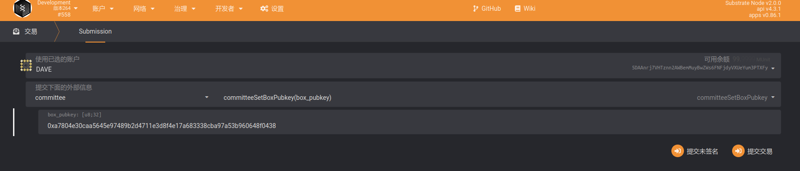

# DBC On-chain committee

> Please go to the mainnet to perform on-chain operations: https://www.dbcwallet.io/?rpc=wss://info.dbcwallet.io#/explorer

## 1. Responsibilities of the committee

In order to maintain the DBC network, we have set up a "committee" role. The committee has two main responsibilities:

1. Perform the task of machine verification when the machine is online. When a new machine wants to join the DBC network, three committees in normal state will be randomly selected. The selected committee can verify the machine configuration and submit it to the chain at a designated time.

2. Deal with the report of the renter during the renting period. When the renter encounters a machine fault, the problem will be reported to the chain. If the committee handles the report and the report is confirmed by other committee, the machine will be punished and a fine will be issued to the committee dealing with the problem.

## 2. Become a member of the verification committee

You can participate in the committee through democracy voting (submission of proposals).

## 3. Committee's rewards and punishments

In order to encourage committee members to actively maintain the DBC network, committees participating in the work will receive a portion of rewards.

1. Reward rules for machine verification: After the machine goes online, you will get "online rewards" every day, of which 25% of the rewards are released immediately, and 75% of the rewards are released in the subsequent 150 days. The committee reviewing the machine will share 1% of the machine unlocking reward. The reward time is 2 years. After the reward expires, it will stop and continue to release immediately.

2. (TODO) Rewards for handling reports from hirers:

## 4. Generate box_pubkey for information encryption

After passing the community vote, the applicant will be added to the committee module. Committee members need to submit the public key used for information encryption in order to dispatch and grab orders normally.

```bash
# Install node.js v14 by yourself
git clone https://github.com/DeepBrainChain/DeepBrainChain-MainChain.git && cd DeepBrainChain-MainChain
cd scripts/test_script/ && npm install

# To generate a public key, you need to use a script to specify your own private key
node gen_boxpubkey.js --key "0x868020ae0687dda7d57565093a69090211449845a7e11453612800b663307246"
```

## 5. Add box_pubkey to the chain

After generating the public key, go to `committee` --> `committeeSetBoxPubkey` and click "Submit Transaction" to set.

When this step is performed, 20000 DBC will be staked, and every time an order is dispatched, "1000 DBC used" will be recorded. After completing the dispatch task, "1000 DBC" will be refunded


