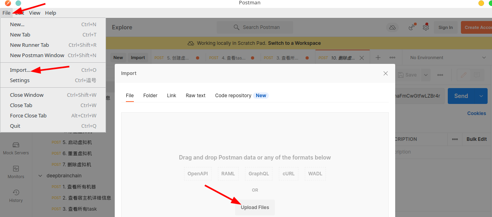
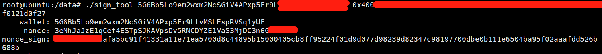
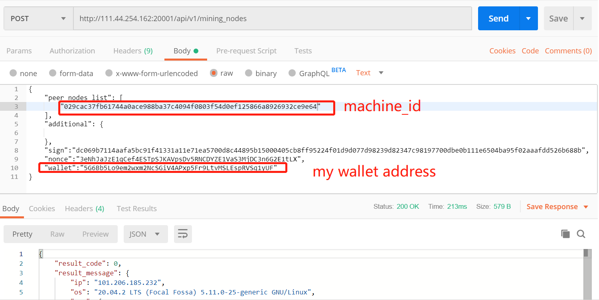
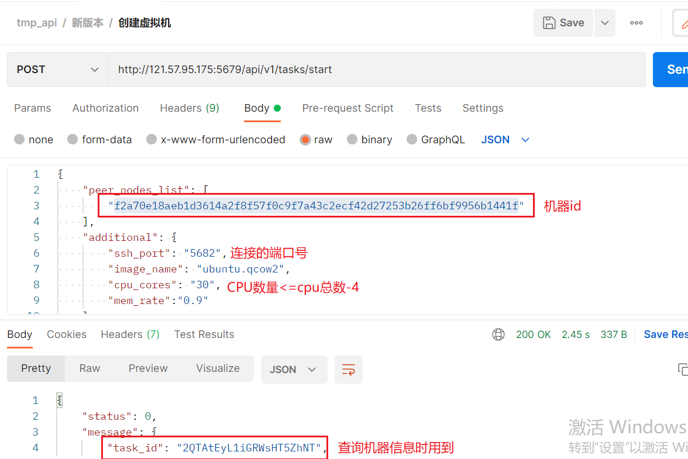
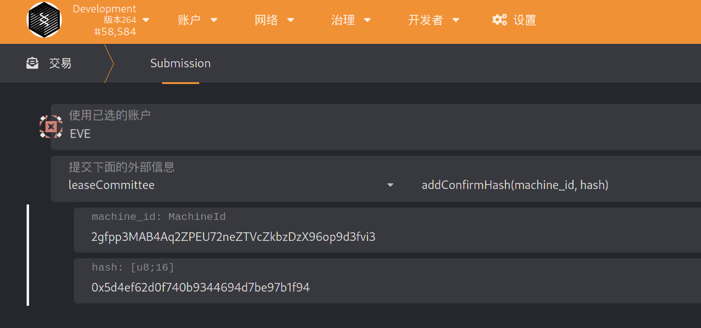
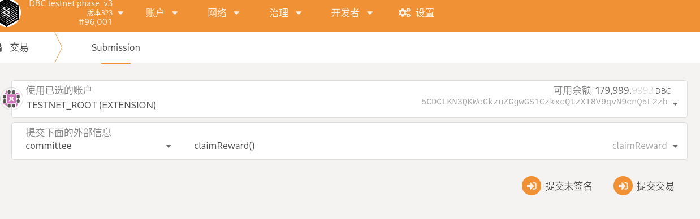
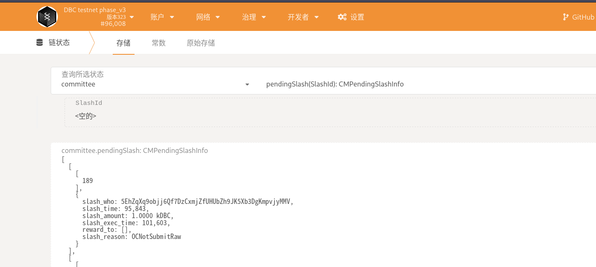

# The committee handles the machine on-chain request

## 1. View the orders assigned to you by the system

Navigate to `Developer`-->`Chain Status`-->`Storage`, select the `committeeMachine` storage of the `onlineCommittee` module, and click the `+` sign on the right to see the committee's order status. As is shown, the committee has an order assigned by the system


## 2. View the time interval allocated by the system to the committee for verification

Navigate to `Developer`--`Chain Storage`--`Storage`, select the `committeeOps` method of `onlineCommittee`, and enter your committee account, and the machine ID assigned in the previous step, you can find information similar to the following :


Among them, booked_time represents the order dispatch time. Note that the committee submits the original information between 36 and 48 hours after dispatching the order (that is, the block height booked_time + 4320 ~ booked_time + 5760).

`verify_time` represents the start time assigned by the system to verify the machine information by the committee. As shown in the figure, the committee was assigned 9 opportunities to verify the machine, each with a duration of 4 hours, which is 480 blocks high. At this time, the committee can choose its own convenient time, query the login information of the machine through the front end, and log in to the system to verify the machine.

## 3. Query machine information

### 3.1 Download Postman

Download and install postman. Please go to the official website and install it according to the operating system.

Download json file：http://114.116.21.175:22244/dbc-develop-0.3.7.5.postman_collection.json

Import json file: fiel----import----select json file to import import



Replace the client ip address and port with `121.57.95.175:5679`

### 3.2 View detailed host information:

```bash
Signing tool download address: https://github.com/DeepBrainChain/DBC-AIComputingNet/releases/download/0.3.7.3/sign_tool

# Installation dependencies libvirt：
## Ubuntu
sudo apt-get install libvirt
## Arch
yay -S libvirt

# Add execution permissions: ：
chmod +x sign_tool
 # Then execute to sign：
./sign_tool `Wallet address` `private key`
```



Replace in the following figure: sign, nonce, wallet (note: the sign and nonce of the same machine can only be used once), the machine information can be queried




View machine GPU information

### 3.3 Create a virtual machine



The creation process is relatively slow, about five minutes to fifteen minutes, check the virtual machine login information and virtual machine status in the view task details of postman. For example, in the returned result, "status": "creating" means that the virtual machine is being created , Just wait


### 3.4 Enter the created virtual machine and execute `nvidia-smi -L` to view the graphics card type


After the query is completed, the virtual machine is deleted, and OK appears, indicating that the deletion is successful


## 4. The committee calculates the hash of the machine information

We have provided a script to calculate the Hash of the information that needs to be filled in:

`https://github.com/DeepBrainChain/DeepBrainChain-MainChain/blob/master/scripts/hash_machine_info.py`

After obtaining the required information, modify the script and execute it to get the hash value. **Please save the information you filled in until the machine is successfully online or fails to go online**

```bash
python3 hash_machine_info.py
```

## 5. The Hash of the machine information submitted by the committee

As shown in the figure, submit the Hash of the machine information 36 hours ago (note that 0x must not be removed when submitting)

Note: In the picture, **leaseCommittee is replaced with onlineCommittee!!!** Others remain unchanged.



## 6. The committee submits the original information of the machine

**Please make sure to submit the original information of the machine within 36~48 hours after the order is dispatched!**


## 7. Inquiry and collection of committee awards

### 7.1 Check rewards

Navigate to Developer--Chain Status--Storage, and query the rewards corresponding to the committee account (committee module committeeStake method). As shown in the figure, `can_claim_reward` is the reward that can be claimed; `claimed_reward` is the reward that has been claimed.


### 7.2 Claim award

Navigate to Developer-Transaction, select the committee account, select the claimReward method of the committee module, and submit the transaction.



## 8. Other operations

### 8.1 The committee adds staking

You can call the `committee` --> `committeeAddStake` method. When (Staking Quantity-Pledge Used) > Staking Quantity\*40%, the committee status is "Order Available"

### 8.2 Committee reduces staking

Call the `committee` --> `committeeReduceStake` method. Note that the minimum pledge is currently 20,000 DBC. If it is less than the minimum pledge after reduction, it will not be possible to reduce the pledge.

### 8.3 Query Penalty (TODO)

The committee can query the rewards by Developer -> ChainStatus, then select method of the committee module. Among them, SlashId is self-incrementing, and this value may not be included, and all the penalties that have not been executed are queried.

As shown in the figure below, you can view the penalty amount (slash_amount), reason (slash_reason), penalty execution time (slash_exec_time), penalty generation time (slash_time) and other information.



### 8.4 Punishment Appeal (TODO)
