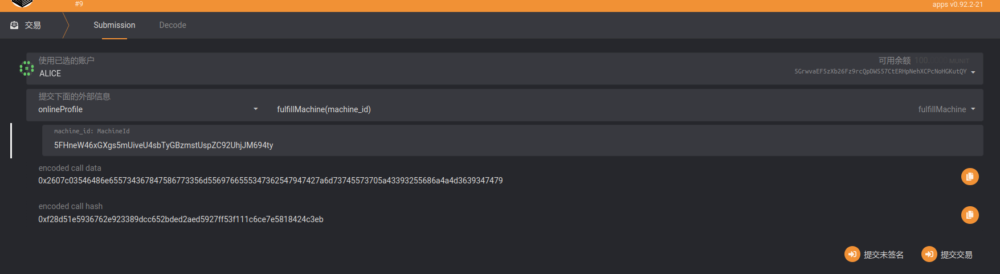
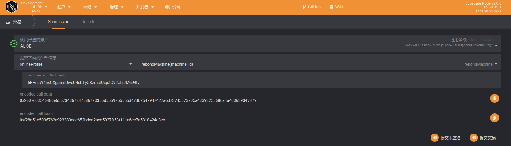
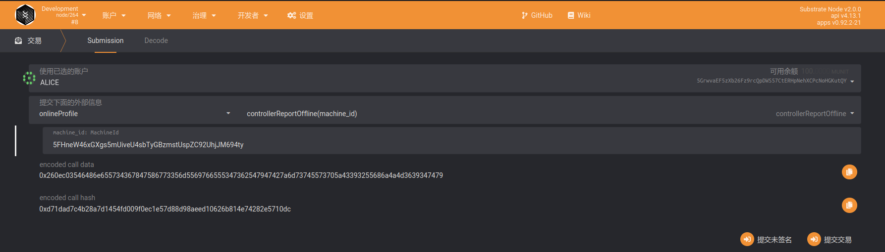
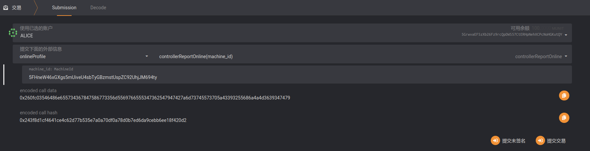
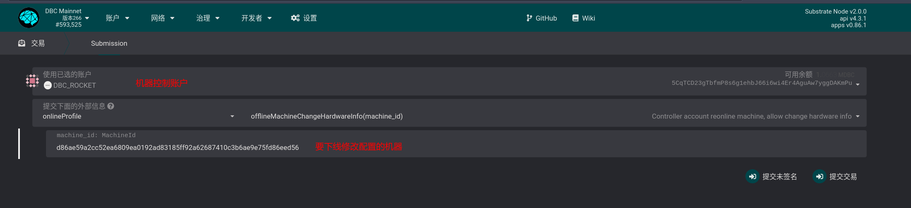

# The committee handles the renter’s report

## TODO

### Supplementary staking

> When the machine is bound for the first time, pledge the DBC required to bind a card. After the machine is approved by the committee, the system will check and increase the pledge corresponding to the number of cards based on the information submitted by the committee (the number of GPUs).
>
> At this time, when the staking is not enough, the machine ID will be placed in the `fulfilling_machine` field of the `online_profile module`--`live_machine` variable, indicating that it needs **supplemental pledge** to go online.

Operation of supplementary pledge:

### Rebind

> When the machine is rejected by the committee, there are 10 days to declare rebinding.

### The machine is declared offline due to a fault

> When a machine has fault, in order to avoid being reported, the machine maintainer needs to promptly declare the **machine is offline** to deal with the machine problem in time.

Operation：`onlineProfile` -- `controllerReportOffline`

### (After being declared offline due to failure) Declaring that the machine is online

> When the machine recovers from the failure, it is necessary to declare that the machine is online in time.

Operation：`onlineProfile`--`controllerReportOnline`

### Modify the machine configuration offline (will be re-verified)

Operation： onlineProfile -- offlineMachineChangeHardwareInfo

Then execute: onlineProfile - addMachineInfo After re-adding the machine information, it will be reassigned for verification

