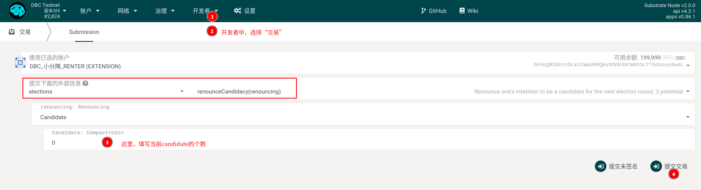

# Staking/Unbond common questions

## 1. How do validators/nominator increase/decrease staking?

On the web browser, navigate to:

1. Go to `Network-Stakign-Account Operation`, find the account you want to operate.

2. On the right side of the account, click the `⁝` symbol, and select according to your needs in the menu:

3. "Bond more": used to increase staking

4. "Unbound funds": used to reduce pledge

3. In case after clicking `Unbind Funds`, an interface for unbinding funds appears, select the amount you want to unbind, and click Unbind.

::: warning
To release the staking, you need to wait 14 days. After 14 days, you need to go to Figure 1 and choose to withdraw the bound funds. Or perform withdrawal of bound funds on the account page
:::

## 2. "The election of new validator candidates is currently underway. Because such staking operations are not allowed."

In the `Network-Staking-Account Operation` page, sometimes you will see such information

:::warning
The election of new validator candidates is currently underway. So such staking operations are not allowed.
:::

This is because there is half an hour every day to elect the block producer for the next day. During the election process, pledge-related operations cannot be performed.

Operate outside of this period (approximately between 10:00~10:30AM (Peking time)).

## 3. How to exit the validator

Go to `Network-Staking-Account Operation`, find the account you want to operate, and click the "Stop" button on the right side of the account.

## 4. How to release the staking in the council

When you vote for the council candidates on the page of `democracy-council`, DBC will be staked to this module, and you need to manually cancel the vote to unbind.

## 5. How to release the staking in democracy

- 5.1 Go to [Subscan](https://dbc.subscan.io) to query your own democratic voting records.

- 5.2 On the `Developer-Transaction` page, select `democracy`-`removeVote` and execute.

- 5.3 Then, on the `Developer-Transaction` page, select `democracy`-`unlock` and execute.

## 6. How to withdraw a candidate from the committee

