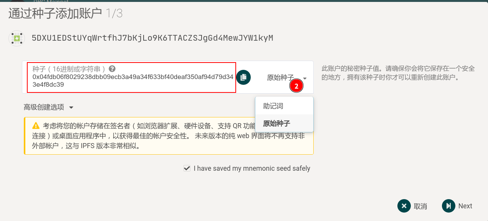

# Generate new DBC account

::: warning
No matter which method is used to generate the account, be sure to keep the mnemonic phrase and private key.
:::

## Option 1: By `polkadot{.js}` adds-on

- Chrome, install via [Chrome web store](https://chrome.google.com/webstore/detail/polkadot{js}-extension/mopnmbcafieddcagagdcbnhejhlodfdd)

- Firefox, install via [Firefox add-ons](https://addons.mozilla.org/en-US/firefox/addon/polkadot-js-extension/)

After the installation is complete, new account can be generated through the browser plug-in.

## Option 2: By command line

```shell
curl --proto '=https' --tlsv1.2 -sSf https://sh.rustup.rs | sh
cargo install --force subkey --git https://github.com/paritytech/substrate --version 2.0.1 --locked
subkey generate --scheme sr25519 # 生成账户，输出内容如下：
```

```
Secret phrase `final huge obscure action vacuum public banner autumn remove close exotic rotate` is account:
  Secret seed:       0x4b6490134a277f9d4ba36a5671eefa122159dbdecb1fb5f4e937bb8c3f0d2474
  Public key (hex):  0xbae85335116a2f65417d26226ac7d3de188c5160915378ceb4dd7e59a1f0c873
  Public key (SS58): 5GHmn7gTjf7JsXCdieFj7Ypu8gibCXdroU2jG182H2e3zMkf
  Account ID:        0xbae85335116a2f65417d26226ac7d3de188c5160915378ceb4dd7e59a1f0c873
  SS58 Address:      5GHmn7gTjf7JsXCdieFj7Ypu8gibCXdroU2jG182H2e3zMkf
```

> Install `subkey` and other flags, please reference：[https://substrate.dev/docs/en/knowledgebase/integrate/subkey](https://substrate.dev/docs/en/knowledgebase/integrate/subkey)

## Option 3: By browser wallet

Go to DBC wallet: [https://www.dbcwallet.io/?rpc=wss://info.dbcwallet.io#/explorer](https://www.dbcwallet.io/?rpc=wss://info.dbcwallet.io#/explorer), Click `Add Account`, a pop-up box will prompt `mnemonic phrase`, **click on the right side `mnemonic phrase`**, you can **switch to `original seed`, which is the private key that needs to be saved, properly save! **


<br>




## How to convert `secret phrase` to `private key`

Some operations on the chain sometimes need to be signed with a private key. When the mnemonic phrase is saved, you can use subkey to convert the mnemonic phrase into a private key.

```bash
subkey inspect "grief cabin hint replace chalk recall alpha crunch vacant range success rent"
```

The message generated is as follows:

```bash
Secret phrase `grief cabin hint replace chalk recall alpha crunch vacant range success rent` is account:
  Secret seed:       0xb4789ce6da4c3eece566ae7848f91822079d7e9b07e4cb77f00beafcb28fb611
  Public key (hex):  0xfabef9d9550ecc3247035be7091ea7d8b384cfdeb1dfae3ff80ba9515cca2570
  Public key (SS58): 5HjUZSGCZgBN86syLVRrW1mAHE6nFZcxK5AFephzoj5xc1FN
  Account ID:        0xfabef9d9550ecc3247035be7091ea7d8b384cfdeb1dfae3ff80ba9515cca2570
  SS58 Address:      5HjUZSGCZgBN86syLVRrW1mAHE6nFZcxK5AFephzoj5xc1FN
```
