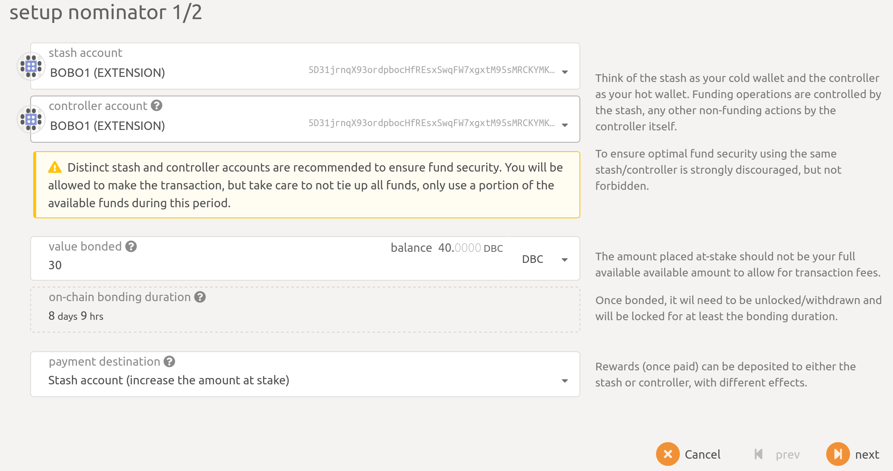

# How to nominate on DBC?

## 1. Generate stash account

（If you already have stash account, you can skip this）

Reference: [How to generate new account](generate-new-account.md)

## 2. Get some DBC.

Open [https://www.dbcwallet.io/?rpc=wss%3A%2F%2Finfo.dbcwallet.io#/accounts](https://www.dbcwallet.io/?rpc=wss%3A%2F%2Finfo.dbcwallet.io#/accounts) and you can see your account and your balance:

## 3. Nominator

- Navigate to `Network > Staking > Account actions`, click `Nominator`

- set your stash account，controller account and`value bonded`，then click next

- then, you should select the validator. (**You can nominate more than one validator**).

- Finally click `Bond & Nominate` to send the transaction and finished the nominate.

## 4. Check your nominate result

Navigate to`Network > Staking > Account actions`, you can see the balance of bonded DBC and the validator you nominated.

## 5. Nominate the second time

Nominate in `step 6` include two step: set `stash account` bond `controller` account and nominate a validator.

If we want to nominate the second time, only need to click `Nominate` button：

Navigate to `Staking > Account actions > stashes > Nominate`, select the validator you want to nominate. It's done!
