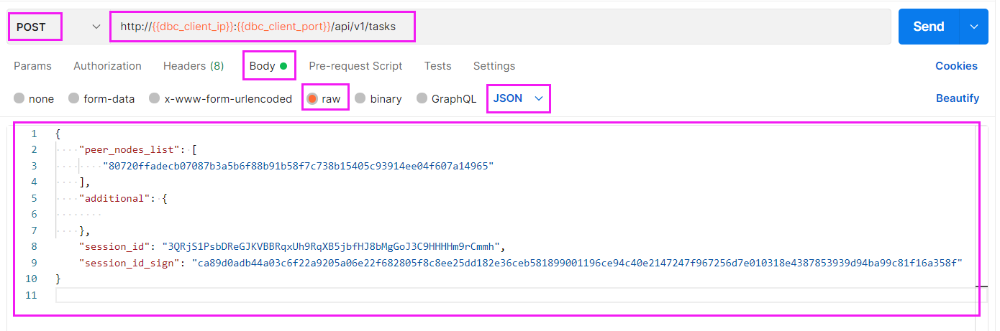
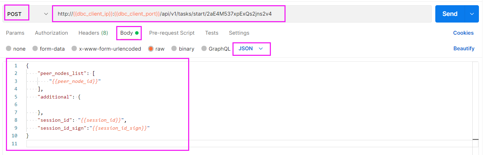

# HTTP客户端请求API
:::tip 注意！
以下HTTP请求其中的dbc_client_ip和dbc_client_port为用户自己部署的DBC客户端访问地址
:::

---

## GPU节点管理

### 1. 查询GPU节点机器配置信息
>`请求方式`：POST
>
>`请求URL`：http://<**dbc_client_ip**>:<**dbc_client_port**>/api/v1/mining_nodes
>
>`请求body`：
>    ```json
>    {
>        "peer_nodes_list": [
>            // 请求机器的node_id
>            "58fb618aa482c41114eb3cfdaefd3ba183172da9e25251449d045043fbd37f45"
>        ],
>        "additional": {
>
>        }
>    }
>    ```
示例：


<br/>

### 2. 租用者查询获取session_id
>`请求方式`：POST
>
>`请求URL`：http://<**dbc_client_ip**>:<**dbc_client_port**>/api/v1/mining_nodes/session_id
>
>`请求body`：
>    ```json
>    {
>        "peer_nodes_list": [
>            // 请求机器的node_id
>            "58fb618aa482c41114eb3cfdaefd3ba183172da9e25251449d045043fbd37f45"
>        ],
>        "additional": {
>
>        },
>       //身份认证信息，使用租用者签名或者多签账户签名（参考HTTP请求格式说明），两者选一
>       ...
>    }
>    ```
示例（此处使用的是租用者签名，也可以使用多签账户签名）：


<br/>

## 虚拟机管理

### 1. 创建虚拟机
>`请求方式`：POST
>
>`请求URL`：http://<**dbc_client_ip**>:<**dbc_client_port**>/api/v1/tasks/start
>
>`请求body`：
>    ```json
>    {
>        "peer_nodes_list": [
>            // 请求机器的node_id
>            "58fb618aa482c41114eb3cfdaefd3ba183172da9e25251449d045043fbd37f45"
>        ],
>        "additional": {
>            // ssh登录linux虚拟机时使用的端口号（每个虚拟机设置一个不同的值）
>            "ssh_port": "5684",
>            // 登录windows虚拟机时使用的端口号
>            "rdp_port": "5685",
>            // 使用vnc连接该虚拟机时的端口号（每个虚拟机设置一个不同的值）
>            "vnc_port": "5904",
>            // 镜像名字(查看机器信息时显示机器拥有的镜像或在镜像管理中心拥有的镜像均可填写应用)
>            "image_name": "ubuntu.qcow2",
>            // 操作系统名字: win 、ubuntu
>            "operation_system": "",
>            // 引导方式: legacy 、uefi
>            "bios_mode": "",
>            // gpu数量（大于等于 0）
>            "gpu_count": "2",
>            // cpu数量（大于0）
>            "cpu_cores": "8",
>            // 内存大小（大于0，单位：G）
>            "mem_size": "8",
>            // 磁盘大小（大于0，单位：G）
>            "disk_size": "10"
>        },
>
>        "session_id": "租用者分发的session_id",
>        "session_id_sign": "租用者分发的session_id_sign"
>    }
>    ```
示例：


* 创建过程的时间长短，会根据配置的不同而不同，大约在五分钟到十五分钟之间。
* 可以通过请求`虚拟机详细信息`，查询到虚拟机`登录方式`以及虚拟机的`当前状态`（当状态值为"creating"，表示虚拟机正在创建过程中）

<br/>

### 2. 查询虚拟机详细信息
>`请求方式`：POST
>
>`请求URL`：http://<**dbc_client_ip**>:<**dbc_client_port**>/api/v1/tasks/<要查询的task_id值>
>
>`请求body`：
>   ```json
>   {
>       "peer_nodes_list": [
>           // 请求机器的node_id
>           "58fb618aa482c41114eb3cfdaefd3ba183172da9e25251449d045043fbd37f45"
>       ],
>       "additional": {
>            
>       },
>
>       "session_id": "租用者分发的session_id",
>       "session_id_sign": "租用者分发的session_id_sign"
>  }
>  ```

示例：


### 3. 查询虚拟机列表
>`请求方式`：POST
>
>`请求URL`：http://<**dbc_client_ip**>:<**dbc_client_port**>/api/v1/tasks
>
>`请求body`：
>   ```json
>   {
>       "peer_nodes_list": [
>           // 请求机器的node_id
>           "58fb618aa482c41114eb3cfdaefd3ba183172da9e25251449d045043fbd37f45"
>       ],
>       "additional": {
>            
>       },
>
>       "session_id": "租用者分发的session_id",
>       "session_id_sign": "租用者分发的session_id_sign"
>  }
>  ```
示例：


### 4. 停止虚拟机
>`请求方式`：POST
>
>`请求URL`：http://<**dbc_client_ip**>:<**dbc_client_port**>/api/v1/tasks/<要停止的task_id值>
>
>`请求body`：
>   ```json
>   {
>       "peer_nodes_list": [
>           // 请求机器的node_id
>           "58fb618aa482c41114eb3cfdaefd3ba183172da9e25251449d045043fbd37f45"
>       ],
>       "additional": {
>            
>       },
>
>       "session_id": "租用者分发的session_id",
>       "session_id_sign": "租用者分发的session_id_sign"
>  }
>  ```
示例：


### 5. 启动虚拟机(唤醒处于睡眠状态的虚拟机)
>`请求方式`：POST
>
>`请求URL`：http://<**dbc_client_ip**>:<**dbc_client_port**>/api/v1/tasks/<要启动的task_id值>
>
>`请求body`：
>   ```json
>   {
>       "peer_nodes_list": [
>           // 请求机器的node_id
>           "58fb618aa482c41114eb3cfdaefd3ba183172da9e25251449d045043fbd37f45"
>       ],
>       "additional": {
>            
>       },
>
>       "session_id": "租用者分发的session_id",
>       "session_id_sign": "租用者分发的session_id_sign"
>  }
>  ```
示例：


### 6. 删除虚拟机
>`请求方式`：POST
>
>`请求URL`：http://<**dbc_client_ip**>:<**dbc_client_port**>/api/v1/tasks/<要删除的task_id值>
>
>`请求body`：
>   ```json
>   {
>       "peer_nodes_list": [
>           // 请求机器的node_id
>           "58fb618aa482c41114eb3cfdaefd3ba183172da9e25251449d045043fbd37f45"
>       ],
>       "additional": {
>            
>       },
>
>       "session_id": "租用者分发的session_id",
>       "session_id_sign": "租用者分发的session_id_sign"
>  }
>  ```
示例：


<br/>

## 快照/镜像管理

### 1.创建快照

:::tip 注意！
创建快照是请确保虚拟机为关闭状态
:::

- 请求方式： POST

- 请求 URL：

```
http://{{dbc_client_ip}}:{{dbc_client_port}}/api/v1/snapshot/<task_id>/create
```

- 请求 Body:

```json
{
  "peer_nodes_list": [
    "80720ffadecb07087b3a5b6f88b91b58f7c738b15405c93914ee04f607a14965" //请求的机器id
  ],
  "additional": {
    "snapshot_name": "snap2", //自定义的镜像名
    "description": "finish hello world", // 自定义的镜像描述（可不写）
    "disks": [
      //选择磁盘创建（可以不写，如果没有"disks"，则默认对所有磁盘做外部增量快照，快照文件由 libvirt 自动生成）
      {
        "disk_name": "vda", //磁盘名称
        "snapshot_type": "external" //external创建外部快照
      },
      {
        "disk_name": "vdb", //磁盘名称
        "snapshot_type": "no" //no不创建快照(不填写默认使用external)
      }
    ]
  },
  "session_id": "租用者分发的 session_id",
  "session_id_sign": "租用者分发的 session_id_sign"
}
```

- 实例：


### 2.查看快照列表

- 请求方式：POST

- 请求 URL：

```
http://{{dbc_client_ip}}:{{dbc_client_port}}/api/v1/snapshot/<task_id>
```

- 请求 Body:

```json
{
  "peer_nodes_list": [
    "80720ffadecb07087b3a5b6f88b91b58f7c738b15405c93914ee04f607a14965" // 请求的机器id
  ],
  "additional": {},
  "session_id": "租用者分发的session_id",
  "session_id_sign": "租用者分发的session_id_sign"
}
```

- 实例：


### 3.查看快照详情信息

- 请求方式：POST

- 请求 URL：

```
http://{{dbc_client_ip}}:{{dbc_client_port}}/api/v1/snapshot/<task_id>/<snap_name>
```

- 请求 Body:

```json
{
  "peer_nodes_list": [
    "80720ffadecb07087b3a5b6f88b91b58f7c738b15405c93914ee04f607a14965" // 请求的机器id
  ],
  "additional": {},
  "session_id": "租用者分发的session_id",
  "session_id_sign": "租用者分发的session_id_sign"
}
```

- 实例：


### 4.查询镜像管理中心的镜像列表(查看所有上传的镜像)

- 请求方式：POST

- 请求 URl：

```
http://{{dbc_client_ip}}:{{dbc_client_port}}/api/v1/images`
```

- 请求 Body:

```json
{
  "peer_nodes_list": [],
  "additional": {}
}
```

- 实例：


### 5.上传镜像

- 请求方式：POST

- 请求 URL：

```
http://{{dbc_client_ip}}:{{dbc_client_port}}/api/v1/images/upload/<images_name>
```

- 请求 Body:

```json
{
  "peer_nodes_list": [
    "80720ffadecb07087b3a5b6f88b91b58f7c738b15405c93914ee04f607a14965" // 请求的机器id
  ],
  "additional": {},
  "session_id": "租用者分发的session_id",
  "session_id_sign": "租用者分发的session_id_sign"
}
```

- 实例：


### 6.下载镜像

- 请求方式：POST

- 请求 URL：

```
http://{{dbc_client_ip}}:{{dbc_client_port}}/api/v1/images/download/<images_name>
```

- 请求 Body:

```json
{
  "peer_nodes_list": [
    "80720ffadecb07087b3a5b6f88b91b58f7c738b15405c93914ee04f607a14965" // 请求的机器id
  ],
  "additional": {},
  "session_id": "租用者分发的session_id",
  "session_id_sign": "租用者分发的session_id_sign"
}
```

- 实例：


