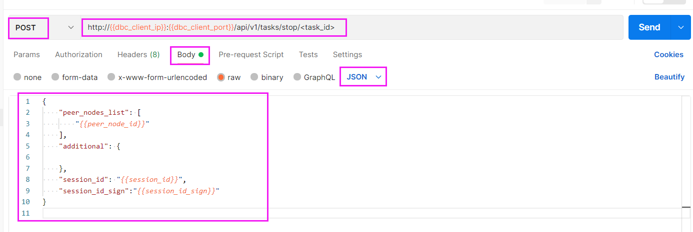
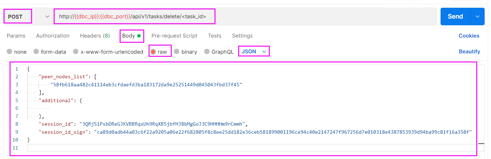
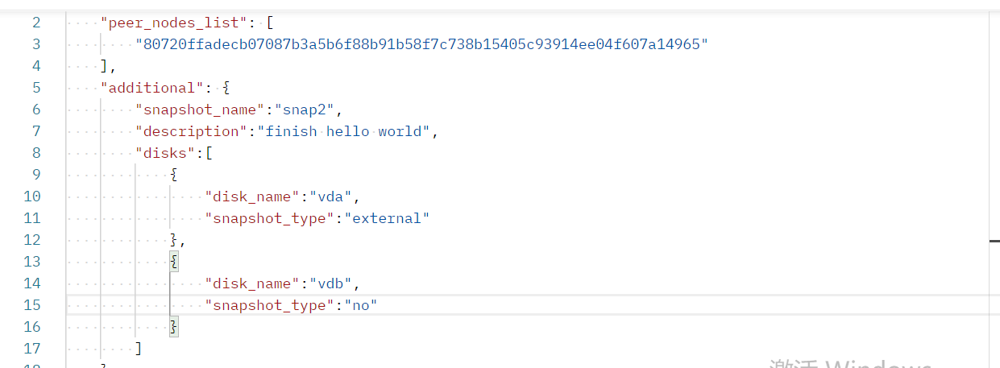

# HTTP客户端请求API
:::tip 注意！
以下HTTP请求其中的dbc_client_ip和dbc_client_port为用户自己部署的DBC客户端访问地址
:::

---

## GPU节点管理

### 1. 查询GPU节点机器配置信息
>`请求方式`：POST
>
>`请求URL`：http://<**dbc_client_ip**>:<**dbc_client_port**>/api/v1/mining_nodes
>
>`请求body`：
>    ```json
>    {
>        "peer_nodes_list": [
>            //GPU节点的node_id
>            "58fb618aa482c41114eb3cfdaefd3ba183172da9e25251449d045043fbd37f45"
>        ],
>        "additional": {
>
>        }
>    }
>    ```
示例：


<br/>

### 2. 租用者查询获取session_id
>`请求方式`：POST
>
>`请求URL`：http://<**dbc_client_ip**>:<**dbc_client_port**>/api/v1/mining_nodes/session_id
>
>`请求body`：
>    ```json
>    {
>        "peer_nodes_list": [
>            //GPU节点的node_id
>            "58fb618aa482c41114eb3cfdaefd3ba183172da9e25251449d045043fbd37f45"
>        ],
>        "additional": {
>
>        },
>       //身份认证信息，使用租用者签名或者多签账户签名（参考HTTP请求格式说明），两者选一
>       ...
>    }
>    ```
示例（此处使用的是租用者签名，也可以使用多签账户签名）：


<br/>

## 虚拟机管理

### 1. 创建虚拟机
>`请求方式`：POST
>
>`请求URL`：http://<**dbc_client_ip**>:<**dbc_client_port**>/api/v1/tasks/start
>
>`请求body`：
>    ```json
>    {
>        "peer_nodes_list": [
>            //GPU节点的node_id
>            "58fb618aa482c41114eb3cfdaefd3ba183172da9e25251449d045043fbd37f45"
>        ],
>        "additional": {
>            // 远程登录linux虚拟机，ssh端口号（linux）
>            "ssh_port": "5684",
>            // 远程登录windows虚拟机，rdp端口号（windows）
>            "rdp_port": "5685",
>            // vnc连接端口号
>            "vnc_port": "5904",
>            "custom_port": [
>               // 宿主机的123转发到虚拟机的123
>               "tcp/udp,123",
>               // 宿主机的111转发到虚拟机的222
>               "tcp/udp,111:222",
>               // 宿主机的333-444转发到虚拟机的444
>               "tcp/udp,333-444",
>               // 宿主机的[555-666]转发到虚拟机的[777-888]
>               "tcp/udp,555-666:777-888"
>            ],
>            // 镜像名字
>            "image_name": "ubuntu.qcow2",
>            // 自定义虚拟机标识（例如：my-ubuntu-1804）
>            "custom_image_name": "my-ubuntu-1804",
>            // 操作系统类型: ubuntu、win
>            "operation_system": "ubuntu",
>            // 引导方式: 
>            //   linux系统设置：legacy
>            // windows系统设置：uefi
>            "bios_mode": "legacy",
>            // 不同虚拟机之间互相传输的组播地址,范围为224.0.0.0~239.0.0.0
>            // 添加多组播地址续在括号中用","相隔,也可不填
>            "multicast":["230.0.0.1:5558"]
>            // gpu数量（大于等于 0）
>            "gpu_count": "2",
>            // cpu数量（大于0）
>            "cpu_cores": "8",
>            // 内存大小（大于0，单位：G）
>            "mem_size": "8",
>            // 磁盘大小（大于0，单位：G）
>            "disk_size": "10"
>        },
>
>        "session_id": "租用者分发的session_id",
>        "session_id_sign": "租用者分发的session_id_sign"
>    }
>    ```
示例：


* 创建过程的时间长短，会根据配置的不同而不同，大约在五分钟到十五分钟之间。
* 可以通过请求`虚拟机详细信息`，查询到虚拟机`登录方式`以及虚拟机的`当前状态`（当状态值为"creating"，表示虚拟机正在创建过程中）

<br/>

### 2. 查询虚拟机详细信息
>`请求方式`：POST
>
>`请求URL`：http://<**dbc_client_ip**>:<**dbc_client_port**>/api/v1/tasks/<要查询的task_id值>
>
>`请求body`：
>   ```json
>   {
>       "peer_nodes_list": [
>           //GPU节点的node_id
>           "58fb618aa482c41114eb3cfdaefd3ba183172da9e25251449d045043fbd37f45"
>       ],
>       "additional": {
>            
>       },
>
>       "session_id": "租用者分发的session_id",
>       "session_id_sign": "租用者分发的session_id_sign"
>  }
>  ```

示例：


### 3. 查询虚拟机列表
>`请求方式`：POST
>
>`请求URL`：http://<**dbc_client_ip**>:<**dbc_client_port**>/api/v1/tasks
>
>`请求body`：
>   ```json
>   {
>       "peer_nodes_list": [
>           //GPU节点的node_id
>           "58fb618aa482c41114eb3cfdaefd3ba183172da9e25251449d045043fbd37f45"
>       ],
>       "additional": {
>            
>       },
>
>       "session_id": "租用者分发的session_id",
>       "session_id_sign": "租用者分发的session_id_sign"
>  }
>  ```
示例：


### 4. 停止虚拟机
>`请求方式`：POST
>
>`请求URL`：http://<**dbc_client_ip**>:<**dbc_client_port**>/api/v1/tasks/stop/<要停止的task_id值>
>
>`请求body`：
>   ```json
>   {
>       "peer_nodes_list": [
>           //GPU节点的node_id
>           "58fb618aa482c41114eb3cfdaefd3ba183172da9e25251449d045043fbd37f45"
>       ],
>       "additional": {
>            
>       },
>
>       "session_id": "租用者分发的session_id",
>       "session_id_sign": "租用者分发的session_id_sign"
>  }
>  ```
示例：


### 5. 启动虚拟机
>**唤醒处于睡眠状态的虚拟机，也是用此接口**
>
>`请求方式`：POST
>
>`请求URL`：http://<**dbc_client_ip**>:<**dbc_client_port**>/api/v1/tasks/start/<要启动的task_id值>
>
>`请求body`：
>   ```json
>   {
>       "peer_nodes_list": [
>           //GPU节点的node_id
>           "58fb618aa482c41114eb3cfdaefd3ba183172da9e25251449d045043fbd37f45"
>       ],
>       "additional": {
>            
>       },
>
>       "session_id": "租用者分发的session_id",
>       "session_id_sign": "租用者分发的session_id_sign"
>  }
>  ```
示例：


### 6. 删除虚拟机
>`请求方式`：POST
>
>`请求URL`：http://<**dbc_client_ip**>:<**dbc_client_port**>/api/v1/tasks/delete/<要删除的task_id值>
>
>`请求body`：
>   ```json
>   {
>       "peer_nodes_list": [
>           //GPU节点的node_id
>           "58fb618aa482c41114eb3cfdaefd3ba183172da9e25251449d045043fbd37f45"
>       ],
>       "additional": {
>            
>       },
>
>       "session_id": "租用者分发的session_id",
>       "session_id_sign": "租用者分发的session_id_sign"
>  }
>  ```
示例：


### 7. 重启虚拟机
>`请求方式`：POST
>
>`请求URL`：http://<**dbc_client_ip**>:<**dbc_client_port**>/api/v1/tasks/restart/<要重启的task_id值>
>
>`请求body`：
>   ```json
>   {
>       "peer_nodes_list": [
>           //GPU节点的node_id
>           "58fb618aa482c41114eb3cfdaefd3ba183172da9e25251449d045043fbd37f45"
>       ],
>       "additional": {
>            
>       },
>
>       "session_id": "租用者分发的session_id",
>       "session_id_sign": "租用者分发的session_id_sign"
>  }
>  ```

::: warning
发送重启请求后，管理程序将选择它认为最好的关闭方法。请注意，虚拟机可能会忽略该请求。若要强制重启虚拟机，请给url加上force_reboot参数，参数等于true或者1即强制重启，等于false或者0或者不带参数则仍旧使用上面传统的方式重启。强制重启虚拟机的请求url如下：

http://<**dbc_client_ip**>:<**dbc_client_port**>/api/v1/tasks/restart/<要重启的task_id值>?force_reboot=true
:::

### 8. 查询虚拟机日志
>`请求方式`：POST
>
>`请求URL`：http://<**dbc_client_ip**>:<**dbc_client_port**>/api/v1/tasks/logs/<要查询的task_id值>?flag=tail&line_num=10
>
>`请求body`：
>   ```json
>   {
>       "peer_nodes_list": [
>           //GPU节点的node_id
>           "58fb618aa482c41114eb3cfdaefd3ba183172da9e25251449d045043fbd37f45"
>       ],
>       "additional": {
>            
>       },
>
>       "session_id": "租用者分发的session_id",
>       "session_id_sign": "租用者分发的session_id_sign"
>  }
>  ```

:::tip 注意！
查询虚拟机日志的请求url有两个参数，flag表示查询日志的方向，参数等于tail即从日志文件的尾部开始查询，等于head即从日志文件的头部开始查询。line_num表示要查询的日志行数，如果超过文件的实际行数，则以文件实际行数为准。最后，此请求最多返回1024个字节，超出范围的日志会被截断。
:::

### 9. 修改虚拟机配置

:::tip
需要先关闭虚拟机
:::

>`请求方式`：POST
>
>`请求URL`：http://<**dbc_client_ip**>:<**dbc_client_port**>/api/v1/tasks/modify/<task_id>
>
>`请求body`：
>   ```json
>   {
>       "peer_nodes_list": [
>           //GPU节点的node_id
>           "58fb618aa482c41114eb3cfdaefd3ba183172da9e25251449d045043fbd37f45"
>       ],
>       "additional": {
>         "new_ssh_port": "5586",
>         "new_vnc_port": "5986",
>         "new_rdp_port": "5786",
>         "new_custom_port": [
>             "tcp,123", // host的123转发到guest的123
>             "udp,111:222", // host的111转发到guest的222
>             "tcp,333-444", // host的333-444转发到guest的444
>             "udp,555-666:777-888" // host的[555-666]转发到guest的[777-888]
>         ],
>         "new_gpu_count": "2",  // >= 0
>         "new_cpu_cores": "8",  // > 0, 单位G
>         "new_mem_size": "8",  // > 0, 单位G
>         "increase_disk_size": "10" // > 0, 单位G
>       },
>
>       "session_id": "租用者分发的session_id",
>       "session_id_sign": "租用者分发的session_id_sign"
>  }
>  ```

<br/>

## 快照管理

### 1.创建快照

:::tip 注意！
创建快照是请确保虚拟机为关闭状态
:::

- 请求方式： POST

- 请求 URL：

```
http://{{dbc_client_ip}}:{{dbc_client_port}}/api/v1/snapshot/<task_id>/create
```

- 请求 Body:

```json
{
  "peer_nodes_list": [
    //GPU节点的node_id
    "80720ffadecb07087b3a5b6f88b91b58f7c738b15405c93914ee04f607a14965"
  ],
  "additional": {
    "snapshot_name": "snap2", //自定义的镜像名
    "description": "finish hello world", // 自定义的镜像描述（可不写）
    "disks": [
      //选择磁盘创建（可以不写，如果没有"disks"，则默认对所有磁盘做外部增量快照，快照文件由 libvirt 自动生成）
      {
        "disk_name": "vda", //磁盘名称
        "snapshot_type": "external" //external创建外部快照
      },
      {
        "disk_name": "vdb", //磁盘名称
        "snapshot_type": "no" //no不创建快照(不填写默认使用external)
      }
    ]
  },
  "session_id": "租用者分发的 session_id",
  "session_id_sign": "租用者分发的 session_id_sign"
}
```

- 实例：



### 2.查看快照列表

- 请求方式：POST

- 请求 URL：

```
http://{{dbc_client_ip}}:{{dbc_client_port}}/api/v1/snapshot/<task_id>
```

- 请求 Body:

```json
{
  "peer_nodes_list": [
    //GPU节点的node_id
    "80720ffadecb07087b3a5b6f88b91b58f7c738b15405c93914ee04f607a14965"
  ],
  "additional": {},
  "session_id": "租用者分发的session_id",
  "session_id_sign": "租用者分发的session_id_sign"
}
```

- 实例：


### 3.查看快照详情信息

- 请求方式：POST

- 请求 URL：

```
http://{{dbc_client_ip}}:{{dbc_client_port}}/api/v1/snapshot/<task_id>/<snap_name>
```

- 请求 Body:

```json
{
  "peer_nodes_list": [
    //GPU节点的node_id
    "80720ffadecb07087b3a5b6f88b91b58f7c738b15405c93914ee04f607a14965"
  ],
  "additional": {},
  "session_id": "租用者分发的session_id",
  "session_id_sign": "租用者分发的session_id_sign"
}
```

- 实例：


## 镜像管理

### 1. 查询镜像中心ID列表

- 请求方式：POST

- 请求 URl：

```
http://{{dbc_client_ip}}:{{dbc_client_port}}/api/v1/images/servers`
```

- 请求 Body:

```json
{
  "peer_nodes_list": [],
  "additional": {}
}
```

### 2.查询镜像列表

- 请求方式：POST

- 请求 URl：

```
http://{{dbc_client_ip}}:{{dbc_client_port}}/api/v1/images`
```

- 请求 Body:

**1. 查询镜像中心的镜像列表**
```json
{
  "peer_nodes_list": [],
  "additional": {
    // 【必填】指定要查询的镜像中心ID
    "image_server": "ID_1"
  }
}
```
**2. 查询GPU节点的镜像列表**
```json
{
  "peer_nodes_list": [
    //GPU节点的node_id
    "80720ffadecb07087b3a5b6f88b91b58f7c738b15405c93914ee04f607a14965"
  ],
  "additional": {
    // 【可选】指定要查询的镜像中心ID
    "image_server": "ID_1"
  }
}
```
**3. 查询GPU节点上某个用户的镜像列表**
```json
{
  "peer_nodes_list": [
    //GPU节点的node_id
    "80720ffadecb07087b3a5b6f88b91b58f7c738b15405c93914ee04f607a14965"
  ],
  "additional": {
    // 指定要查询的镜像中心ID
    "image_server": "ID_1"
  },
  "session_id": "租用者分发的session_id",
  "session_id_sign": "租用者分发的session_id_sign"
}
```

- 实例：


### 3.上传镜像

- 请求方式：POST

- 请求 URL：

```
http://{{dbc_client_ip}}:{{dbc_client_port}}/api/v1/images/upload
```

- 请求 Body:

**1. 将GPU节点上的某个镜像上传到镜像中心**

```json
{
  "peer_nodes_list": [
    //GPU节点的node_id
    "80720ffadecb07087b3a5b6f88b91b58f7c738b15405c93914ee04f607a14965" 
  ],
  "additional": {
    "image_filename": "ubuntu.qcow2",
    // 指定要查询的镜像中心ID
    "image_server": "ID_1"
  },
  "session_id": "租用者分发的session_id",
  "session_id_sign": "租用者分发的session_id_sign"
}
```
**2. 将客户端节点上的某个镜像上传到镜像中心**
```json
{
  "peer_nodes_list": [],
  "additional": {
    "image_filename": "ubuntu.qcow2",
    // 指定要查询的镜像中心ID
    "image_server": "ID_1"
  }
}
```

- 实例：


### 4.下载镜像

- 请求方式：POST

- 请求 URL：

```
http://{{dbc_client_ip}}:{{dbc_client_port}}/api/v1/images/download
```

- 请求 Body:

**从镜像中心下载镜像到GPU节点**
```json
{
  "peer_nodes_list": [
    //GPU节点的node_id
    "80720ffadecb07087b3a5b6f88b91b58f7c738b15405c93914ee04f607a14965"
  ],
  "additional": {
    // 指定要查询的镜像中心ID
    "image_server": "ID_1",
    "image_filename": "ubuntu.qcow2",
    // 本地存储路径
    "local_dir": "/my_local_dir"
  },
  "session_id": "租用者分发的session_id",
  "session_id_sign": "租用者分发的session_id_sign"
}
```

- 实例：


