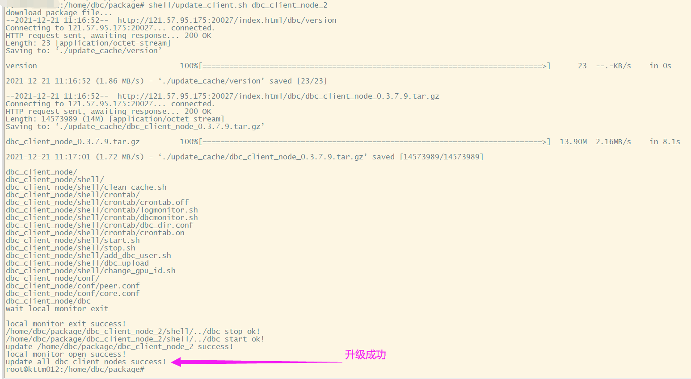

# 安装和升级DBC客户端

客户端节点的作用
+ DBC客户端节点在整个网络当中作为信任人的身份，可以查询到当前网络中的正确部署功能节点的机器。当功能节点部署完成后，可以通过http请求客户端节点来查看您的功能节点是否成功连接到客户端节点。当通过客户端请求能成功看到您的功能节点机器ID时，这代表您已经成功部署完成功能节点。
+ 建议：由于官方提供的客户端节点也并不能永久保持在线，所以，建议每家矿池搭建两个自己的客户端节点以作备用。
+ 提示：客户端节点对硬件设备要求很低，可以正常运行的公网服务器都可以搭建，占用内存非常小，只要可以通过公网访问即可。

## (一) 部署镜像中心
* **操作系统：ubuntu**
* **设置开机启动rsync-daemon**
    ```
    sudo vim /etc/default/rsync
    修改：将false改true
    RSYNC_ENABLE=true   
    ```
* **修改配置文件rsyncd.conf**

    手动复制：
    sudo cp /usr/share/doc/rsync/examples/rsyncd.conf /etc

    修改 /etc/rsyncd.conf：
    ```
    ######### 全局: 配置参数 ##########
    port=873    # 指定rsync端口。默认873
    uid = nobody # rsync服务的运行用户，默认是nobody，文件传输成功后属主将是这个uid
    gid = nogroup # rsync服务的运行组，默认是nobody，文件传输成功后属组将是这个gid
    use chroot = yes # rsync daemon在传输前是否切换到指定的path目录下，并将其监禁在内
    max connections = 0 # 指定最大连接数量，0表示没有限制
    timeout = 60  # 确保rsync服务器不会永远等待一个崩溃的客户端，0表示永远等待
    motd file = /var/rsyncd/rsync.motd   # 客户端连接过来显示的消息
    lock file = /var/run/rsync.lock      # 指定锁文件
    log file = /var/log/rsyncd.log       # 指定rsync的日志文件，而不把日志发送给syslog
    dont compress = *.gz *.tgz *.zip *.z *.Z *.rpm *.deb *.bz2  # 指定哪些文件不用进行压缩传输

    ######### 模块: 配置参数 ##########
    [images]        # 模块ID
    path = /data/ # 指定该模块的路径，启动rsync服务前该目录必须存在
    ignore errors = yes     # 忽略某些IO错误信息
    ignore nonreadable = yes
    read only = no  # 指定该模块是否可读写，即能否上传文件，no表示可读写，yes表示可读不可写
    write only = no # 指定该模式是否支持下载，设置为yes表示客户端不能下载
    list = no       # 客户端请求显示模块列表时，该模块是否显示出来，设置为no则该模块为隐藏模块
    # hosts deny = 0.0.0.0/32   # 指定不允许连接到该模块的机器
    transfer logging = no
    strict modes = yes
    ```
* **启动**
    
    `rsync --daemon`

* **客户端节点上配置镜像中心地址**

    `image_server=<id>,<ip>,<port>,<modulename>`

    id: 用户自定义ID，用于标识改镜像中心

    ip: 镜像中心ip地址

    port: 镜像中心服务器上rsync-server的监听地址，默认873，见上述配置文件

    modulename: 镜像中心上配置的模块ID，默认images，见上述配置文件

    示例：

    `image_server=ID_1,127.0.0.1,22,873,images`


## (二) 安装DBC客户端

* **安装环境**

    `sudo apt-get  install libvirt-clients libvirt-daemon-system expect -y`

* **下载安装脚本：**
    http://116.169.53.132:9000/dbc/install_update_script/mainnet/install_client.sh

* **给install_client.sh脚本文件添加执行权限：**

    `chmod +x install_client.sh`

* **运行安装脚本:**

    `./install_client.sh [安装目录]`

    安装过程中会要求用户输入2个端口号：

    

<br/>

## (三) 升级DBC客户端

* **下载升级脚本：**
    http://116.169.53.132:9000/dbc/install_update_script/mainnet/update_client.sh

* **给update_client.sh脚本文件添加执行权限：**
    
    `chmod +x update_client.sh`

* **运行升级脚本:**

    `./update_client.sh [安装目录]`

    
