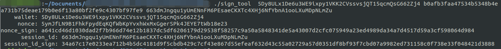

# Http请求格式说明

`请求方式`：POST

`URL格式`：http://<**dbc_client_ip**>:<**dbc_client_port**>/api/v1/**具体请求路径**

`请求body`：
```
{
    "peer_nodes_list": [
        // DBC节点的node_id，目前仅支持填写1个
        "460e56d4cdade97065ddf4d0dfeee7ab7e6e77d0058fad07e43123fadd1d8d2a"
    ],
    "additional": {
        // 每个请求要传递的各种参数

    },
   // 身份认证信息
   ...
}
```
**身份认证信息**一共有3种类型，请求时，填写任意一种即可：

>**第 1 种类型：租用者钱包签名**
>
>***说明***: 需要知道租用者的`钱包地址`和`对应的钱包私钥`，所以，使用此方式的一般是`租用者本人`。
>
>- 签名方法：`./sign_tool [钱包地址] [钱包私钥]`
>
>>输出：
>>
>- 将生成的3个值填写到请求body中，最终的请求body格式：
>    ```
>    {
>       "peer_nodes_list": [
>            "460e56d4cdade97065ddf4d0dfeee7ab7e6e77d0058fad07e43123fadd1d8d2a"
>        ],
>        "additional": {
>
>        },
>        "wallet":"5Dy8ULx1De6u3WE9ixpy1VKK2CVssvsjQT15qcmQsG662Zj4",
>        "nonce":"5q7KRn4d8EmXFFsim8vHBp23N2CpERbD2mWR3WCo1o3teZnGxYEh4N6",
>        "sign":"2460725b2f5e737cd810c773be61b9b27c3b9dbdac4af9cf25c7be9949ad7202a0b7467f71ad843888f482662d3ae2e4fa566d3c1930a3fa90f3dcb97ea4098d"
>    }
>    ```

>**第 2 种类型：多签钱包签名**
>
>***说明***: 需要知道多签账户的所有`钱包地址`，以及`阈值(threshold)`数量个账户的钱包签名。
>- 以3签2为例，各字段的释义：
> 
>    ```
>    "multisig_accounts": {
>        // 多签账户的所有钱包地址
>        "wallets": [
>            "5Dy8ULx1De6u3WE9ixpy1VKK2CVssvsjQT15qcmQsG662Zj4",
>            "5HgVTsXnUBmaL5F2RBjKmXMoAeG9Avuyk9tmgnnVx28u2ZrS",
>            "5DhBmvUkj9YWvdDtJWJwaGrFRpzeqW4Ch5oTyTamXG2LMHVQ"
>        ],
>        // 创建多签钱包时的阈值(threshold)
>        "threshold": "2",
>        // 使用多签账户中的任意2个钱包私钥签名（签名方法与第1种类型中的签名方法相同）
>        "signs": [
>            {
>                "wallet":"5Dy8ULx1De6u3WE9ixpy1VKK2CVssvsjQT15qcmQsG662Zj4",
>                "nonce":"5q7KRn4d8EmXFFsim8vHBp23N2CpERbD2mWR3WCo1o3teZnGxYEh4N6",
>                   "sign":"2460725b2f5e737cd810c773be61b9b27c3b9dbdac4af9cf25c7be9949ad7202a0b7467f71ad843888f482662d3ae2e4fa566d3c1930a3fa90f3dcb97ea4098d"
>            },
>            {
>                "wallet":"5HgVTsXnUBmaL5F2RBjKmXMoAeG9Avuyk9tmgnnVx28u2ZrS",
>                "nonce":"5t1mv263Qpnu5tk5xPDk86oXGUX8yXaYGpAWj2n6gU45HNmsQqLaAU7",
>                "sign":"c494cc517f3c181fd7206d03175b5c0c29d162e53aa88c557887241d104456272dc313501c8ae4e71dbcbae183942a119713974aff87aa1ef3870aa505be6384"
>            }
>        ]
>    }
>- 最终的请求body格式：
>   ```
>   {
>       "peer_nodes_list": [
>            "460e56d4cdade97065ddf4d0dfeee7ab7e6e77d0058fad07e43123fadd1d8d2a"
>        ],
>        "additional": {
>
>        },
>        "multisig_accounts": {
>           "wallets": [
>               "5Dy8ULx1De6u3WE9ixpy1VKK2CVssvsjQT15qcmQsG662Zj4",
>               "5HgVTsXnUBmaL5F2RBjKmXMoAeG9Avuyk9tmgnnVx28u2ZrS",
>               "5DhBmvUkj9YWvdDtJWJwaGrFRpzeqW4Ch5oTyTamXG2LMHVQ"
>           ],
>           "threshold": "2",
>           "signs": [
>               {
>                   "wallet":"5Dy8ULx1De6u3WE9ixpy1VKK2CVssvsjQT15qcmQsG662Zj4",
>                   "nonce":"5q7KRn4d8EmXFFsim8vHBp23N2CpERbD2mWR3WCo1o3teZnGxYEh4N6",
>                   "sign":"2460725b2f5e737cd810c773be61b9b27c3b9dbdac4af9cf25c7be9949ad7202a0b7467f71ad843888f482662d3ae2e4fa566d3c1930a3fa90f3dcb97ea4098d"
>               },
>               {
>                   "wallet":"5HgVTsXnUBmaL5F2RBjKmXMoAeG9Avuyk9tmgnnVx28u2ZrS",
>                   "nonce":"5t1mv263Qpnu5tk5xPDk86oXGUX8yXaYGpAWj2n6gU45HNmsQqLaAU7",
>                   "sign":"c494cc517f3c181fd7206d03175b5c0c29d162e53aa88c557887241d104456272dc313501c8ae4e71dbcbae183942a119713974aff87aa1ef3870aa505be6384"
>               }
>           ]
>       }
>   }
>   ```

>**第 3 种类型：使用机器租用者分发的session_id和session_id_sign**
>
>***说明***: session_id和session_id_sign是`租用者`给其他想要使用该机器的`第三方用户`的`身份凭证`，第三方用户可以使用该session_id访问该机器。
>
>***注意***：session_id只能由`租用者`向机器请求获取和修改（请求方式：参考上述第1种和第2种类型）
>
>- 机器租用者请求机器获取session_id（请求方式：参考上述第1种和第2种类型; 此处以第1种方式为例），返回值为session_id：
>    ```
>    {
>       "peer_nodes_list": [
>            "460e56d4cdade97065ddf4d0dfeee7ab7e6e77d0058fad07e43123fadd1d8d2a"
>        ],
>        "additional": {
>
>        },
>        "wallet":"5Dy8ULx1De6u3WE9ixpy1VKK2CVssvsjQT15qcmQsG662Zj4",
>        "nonce":"5q7KRn4d8EmXFFsim8vHBp23N2CpERbD2mWR3WCo1o3teZnGxYEh4N6",
>        "sign":"2460725b2f5e737cd810c773be61b9b27c3b9dbdac4af9cf25c7be9949ad7202a0b7467f71ad843888f482662d3ae2e4fa566d3c1930a3fa90f3dcb97ea4098d"
>    }
>    ```
>- 机器租用者对session_id进行签名：
> 
> 将生成的session_id和session_id_sign分发给第三方用户即可。
>- `第三方用户`拿到这个session_id和session_id_sign后，请求的body格式为：
>    ```
>    {
>       "peer_nodes_list": [
>            "460e56d4cdade97065ddf4d0dfeee7ab7e6e77d0058fad07e43123fadd1d8d2a"
>        ],
>        "additional": {
>
>        },
>        "session_id":"3QRjS1PsbDReGJKVBBRqxUh9RqXB5jbfHJ8bMgGoJ3C9HHHHm9rCmmh",
>        "session_id_sign":"ca89d0adb44a03c6f22a9205a06e22f682805f8c8ee25dd182e36ceb581899001196ce94c40e2147247f967256d7e010318e4387853939d94ba99c81f16a358f"
>    }
>    ```
