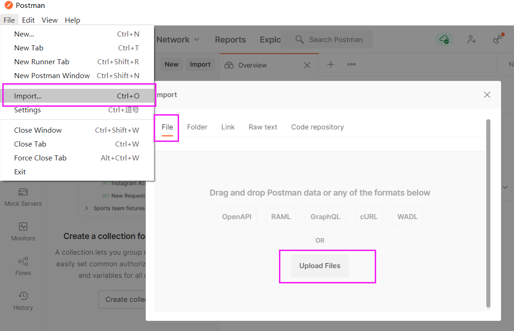

# 准备工作
- 下载安装Http请求工具：https://www.postman.com/downloads/
- 下载json文件：http://121.57.95.175:20027/index.html/deepbrainchain.postman_collection.json

- 导入json文件：
  

- 下载签名工具，稍后会用到：
  https://github.com/DeepBrainChain/DBC-AIComputingNet/releases
  下载其中的sign_tool文件
- 给签名工具sign_tool文件添加可执行权限：`chmod +x ./sign_tool`
