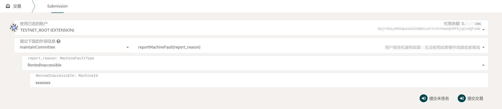
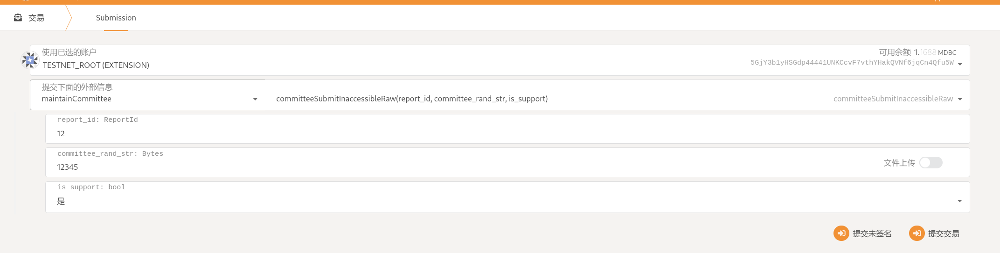
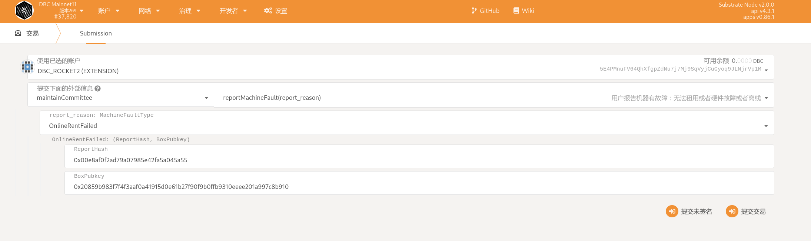
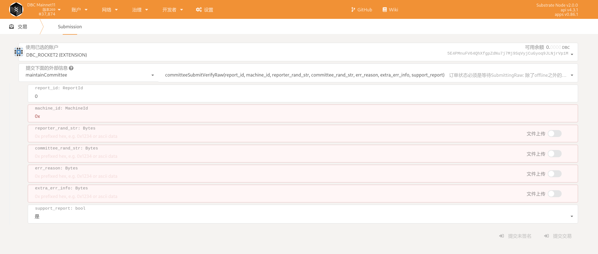
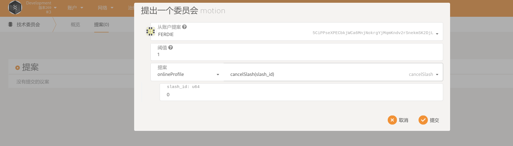

# Machine renter reports machine malfunction

::: warning
Documentation is under development
:::

The four types of machine faults that can be reported are divided into two categories according to how they are handled:

1. After the machine is leased **Inaccessible fault(`RentedInaccessible(MachineId)`)**,

2. Other types of fault, including

   - The machine is rented, but has a **hardware malfunction(`RentedHardwareMalfunction(ReportHash, BoxPubkey)`)**;

   - The machine is rented, but **hardware counterfeit(`RentedHardwareCounterfeit(ReportHash, BoxPubkey)`)**;

   - The machine is online, but **cannot be rented(`OnlineRentFailed(ReportHash, BoxPubkey)`)**

Below is a brief description of the two reporting processes:

::: tip
In this document, the validator is the validating committee, so the descriptions validator/committee may be used interchangeably.

The reporter can cancel the report if and only if someone grabs the order.
:::

## 1. The machine cannot be accessed after being leased

This type is designed so that the verifier can quickly respond to the report, and the verifier can use the program to monitor this report on the chain and automatically grab the order, automatically determine whether the report is valid, and automatically submit the processing results. Therefore, such reports are the fastest in troubleshooting. Reporting information is submitted on-chain in clear text to accommodate this treatment.

### 1.1. [Role: Reporter] Report to the chain

Execute `report_machine_fault`, the reporter needs to select `Fault Type` as `RentedInaccessible`, and provide the machine ID

Payment: 10 DBC (additional fee for this type of report)

Stake 1000 DBC



### 1.2. [Role: Validator] Order grabbing

Execute `committee_book_report`

After the first validator grabs the order, the verification result will be submitted within 5 minutes, and the verification will end in 10 minutes.

The committee can monitor maintainCommittee.bookableReport to see if there is a bookable report

You can query maintainCommittee.reportInfo to query the specific information of the report (error type, reporting time, etc.)

Payout: 10 DBC

Staking: 0 DBC (No committee pledge is required for this type of report)

### 1.3. [Role: (Other) Validator] Order grabbing

- execute `committee_book_report`

- Need to grab the order within 5 minutes (10 blocks) after the first validator grabs the order

- Up to 3 validators to grab orders

- Consume 10 DBC to pledge 1000DBC

### 1.4. [Role: (Order grabbed) Validator] Submit Hash of `confirmation information`:

Execute `committee_submit_verify_hash`


::: tip Hash generation method
hash("report_id" + "committee_rand_str" + "is_support");
Please modify the script when generating hash: `https://github.com/DeepBrainChain/DeepBrainChain-MainChain/scripts/hash_machine_inaccessible.py`
:::

### 1.5. [Role: (Order grabbed) Validator] Submit `confirmation information`

- Validators are allowed to submit original information only if all committees that are vying for the order have submitted the hash or 5 minutes (10 blocks) from the first order rush

Execute `committee_submit_inaccessible_raw`



::: tip
Waiting for all committees that have successfully grabbed the order to submit the original information or 10 minutes after the first validator grabbed the order, the committee's verification results will be counted and processed.
:::

### 1.6. System Judgment Results

TODO

## 2. Other faults

As mentioned, other failures include:

- The machine is rented, but has a **hardware failure(`RentedHardwareMalfunction(ReportHash, BoxPubkey)`)**;

- The machine is rented, but **hardware counterfeit(`RentedHardwareCounterfeit(ReportHash, BoxPubkey)`)**;

- The machine is online, but **cannot rent(`OnlineRentFailed(ReportHash, BoxPubkey)`)**

### 2.1. [Role: Reporter] Report to the chain

To execute `report_machine_fault`, the reporter needs to select `fault type` as one of the above three errors. Here is an example of `cannot rent`:

Generate report Hash: According to the report content, modify the `machine_id` and `rand_str` in the script, and then execute the following command to generate the report Hash

```shell
❯ python hash_machine_fault.py
ReporterHash: 0x00e8af0f2ad79a07985e42fa5a045a55
CommitteeHash: 0xc45a1e9471d6e0e539febe382b009070
```

At the same time, you also need to provide your own BoxPubkey for decryption after the committee receives the encrypted information:

::: tip
If it is a multi-signature account, or if you do not know the private key, you can regenerate an SS58 account and use the SS58 private key to generate BoxPubkey. Subsequent operations can use this key pair.
:::

```
❯ node gen_boxpubkey.js --key 0xeb2a67b0d6d3e457076c3d4f9633e7400921fa49887324131b4a9520e5971c4c
0x20859b983f7f4f3aaf0a41915d0e61b27f90f9b0ffb9310eeee201a997c8b910
```

Then call the report function:



### 2.2. [Role: Validator] Order grabbing

Execute `committee_book_report`

After the first validator grabs the order, the verification result will be submitted within 5 minutes, and the verification will end in 10 minutes.

The committee can monitor maintainCommittee.bookableReport to see if there is a bookable report

You can query maintainCommittee.reportInfo to query the specific information of the report (error type, reporting time, etc.)

Payout: 10 DBC

Staking: 1000 DBC

### 2.3 [Role: Reporter] Submit encrypted information

After the validator grabs the order, the reporter needs to submit the encrypted information to the order grabbing committee within 30 minutes (60 blocks). If the encrypted information is not provided over time, the report will fail (the reporter will be punished for this).

```shell
# Generate encrypted message
node seal_msg.js --sender_privkey 0x0cdc17e4cd84743c66bae7761ad354d423c93ac1e398630575d91371d6f713ce --receiver_box_pubkey 0x20da91ba45f5ed8fddd40d5439f817c9f00750694ed5c70d17e421caf15f437b --msg "abcdefg bcdefa"
```

in which,

`--sender_privkey` is the private key of the whistleblower;
`--receiver_box_pubkey` is the box_pubkey of the committee (receiver), which can be queried in the following ways:
`--msg` is the error message to be encrypted, such as `machine_id has a memory failure`, note: **`--msg` is the `machine_id` to be reported + the random string of the reporter + error message**, such as `8eaf04151687736326c9fea17e25fc5287613693c912909cb226aa4794f26a48[abcdef] Supplementary information, can be left blank`

### 2.4 [Role: Committee] Decrypt after receiving encrypted information

When the reporter provides the encrypted information, the committee needs to decrypt the information to query the information submitted by the reporter

```shell
node open_msg.js --sender_box_pubkey 0xe30cac79ec5fe7c9811ed9f1a18ca3806b22798e24b7d9f9424b1a27bde3e866 --receiver_privkey 0x171baa0f7baa4fa7e2dd94b8f9efc0b95034a4ad5f3aba5b6b923e38130c3f0d --sealed_msg 0x01405deeef2a8b0f4a09380d14431dd10fde1ad62b3c27b3fbea4701311d
```

in,
`--sender_box_pubkey` is the reporter's box_pubkey, which can be queried through the information in `maintainCommittee.reportInfo.machine_fault_type`;

`--receiver_privkey` is the private key corresponding to the committee's own box_pubkey
`--sealed_msg` is the encrypted message received by the committee

After the decryption is completed, the committee needs to judge whether there is a problem with the machine according to the actual situation. and submit it to the chain

Query Committee BoxPubkey:


### 2.5 [Role: Committee] Determine the machine failure information and submit it to the chain



其中，`extra_err_info`为委员会判断的，可能不同于报告人认为的错误原因。该字段也可留空

Among them, `extra_err_info` is judged by the committee and may be different from the reason for the error that the reporter believes. This field can also be left blank

## 3. Result execution and representation

### 3.1 Rewards and penalties after reporting

When the report is completed, penalties and rewards will be given according to the results submitted by the committee. simply put,

- For validators,

  - Committees that do not complete all tasks will be penalized, such as booking a report/submitting a verification hash without final submission confirmation

  - When the verification result is different from the majority of the committees, if 2 committees oppose the report and 1 committee supports the report, the supporting committee will be punished, and the remaining 2 committees will be rewarded

  - Rewarded when successfully completing the verification machine failure task and agreeing with the majority of the rest of the committee (both think the machine is faulty/non-faulty)

- For whistleblowers

  - When the whistleblower reports the type of failure that requires the submission of encrypted information, if the encrypted information is not submitted within half an hour of the committee's order grabbing, the report will fail and will be punished

  - Penalties for whistleblowers when their report is disapproved by a majority of the committee

  - Rewarded when a report is supported by a majority of the committee

- for machine_stash,

  When the report is successful, you will be punished

### 3.2 Claims after Rewards and Punishments Occur

When the report occurs, the punishment will be recorded on the chain and executed \**two days after the punishment occurs (2880*2 blocks), allowing the punished committee/reporter to appeal. Appeals will be handled by the Technical Committee. The penalty will be lifted after the technical committee determines that the appeal is valid.

Among them, when the machine is successfully taken off the shelf due to the report, it needs to be checked and dealt with, and then put on the shelf as soon as possible to reduce the penalty. When the machine is wrongly punished, maybe after it is put on the shelves, make an appeal (there are also 2 days), and request the technical committee to judge.

Committees that have not successfully completed their assignments are not allowed to make representations

Appeals require a certain amount of coins to be pledged. When the appeal fails, the pledged coins will be deducted.

## 4. Technical Committee Cancellation of Penalty

When the punished person pledges a certain amount of DBC and submits an appeal to the technical committee, the technical committee can cancel the punishment before the punishment is executed.

Just call the cancellation penalty (`cancel_slash`) in the corresponding module, where the threshold is set to 1 (1/5), and the `slash_id` is the penalty that needs to be cancelled. Such as,

### 4.1 [Role: Technical Committee] Cancellation of penalty based on appeal

- To cancel the reporter's penalty, you need to call `maintainCommittee--cancelReporterSlash`

- To cancel the penalty of stash (caused by the machine being offline and then online), you need to call `onlineProfile--cancelSlash`

- Cancel the penalty of the online committee (due to no work assigned, or inconsistent with the views of most other committees handling the order), need to call `onlineCommittee-cancelSlash`


