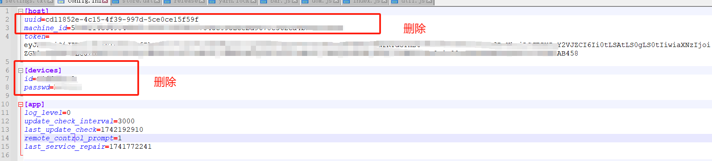

# 网吧参与Deeplink短租挖矿

## 1. 设备要求

+ 参考： https://orion.deeplink.cloud/shortterm

## 2. 安装设置Deeplink软件

### 2.1 方案一

+ 软件下载地址： https://www.deeplink.cloud/software

+ 如果您是无盘系统带动GPU设备，请注意以下操作：

  +  在超级模式当中安装deeplink 并登录您的钱包
  + 打开配置文件 (%appdata%\deeplink\config.ini)
  + 删除掉[host]选项中的 uuid \ machine_id 保留token，删除掉[device]选项的所有内容（token一定要保留，不然这个无盘服务器下的GPU设备无法与您的钱包关联）

  

  + 保存 并关机，然后将此镜像打包为启动镜像
  + GPU设备开机验证，确认您的GPU设备没有使用同样的ID 以及密码

### 2.2 方案二

+ 打开配置文件 (%appdata%\deeplink\config.ini)  并在[devices]模块中加入以下配置并重新启动deeplink服务

```
[devices]
# 忽略上面的设备码选项，总是从服务器获取设备码，推荐在网吧无盘环境中设置为 1 启动此功能，
always_refresh_id=1
```

## 3. 出租您的设备

+ 点击进入云GPU机器
+ 选择出租我的电脑
+ 质押DBC NFT 以及 DLC进行出租
