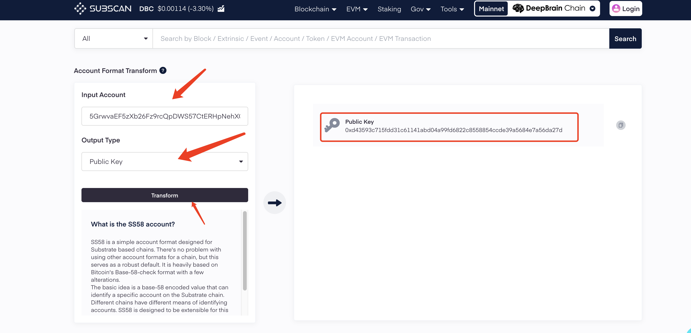
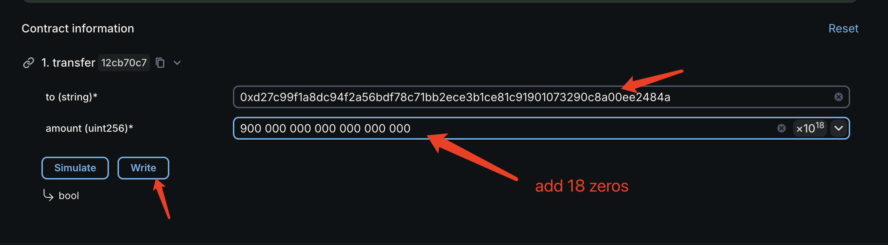

# EVM DBC transfer back to Substrate

## 0x format address DBC transfer back to 5 format address:

### Through the official bridge contract

1. Convert the public key of the address starting with 5, copy the Public Key, and fill in the to address in step 2
   [https://dbc.subscan.io/tools/format_transform
   ](https://dbc.subscan.io/tools/format_transform)

2. Call the official bridge contract to transfer funds through the blockchain browser (it is recommended to transfer 1DBC for testing first)
   [https://www.dbcscan.io/address/0xD6D5252ab5cbDac9dd53468A12fC1f8050A4Ee22?tab=write_contract
   ](https://www.dbcscan.io/address/0xD6D5252ab5cbDac9dd53468A12fC1f8050A4Ee22?tab=write_contract)

### We do not recommend transferring to an exchange address. The loss of tokens caused by this will be borne by you.
