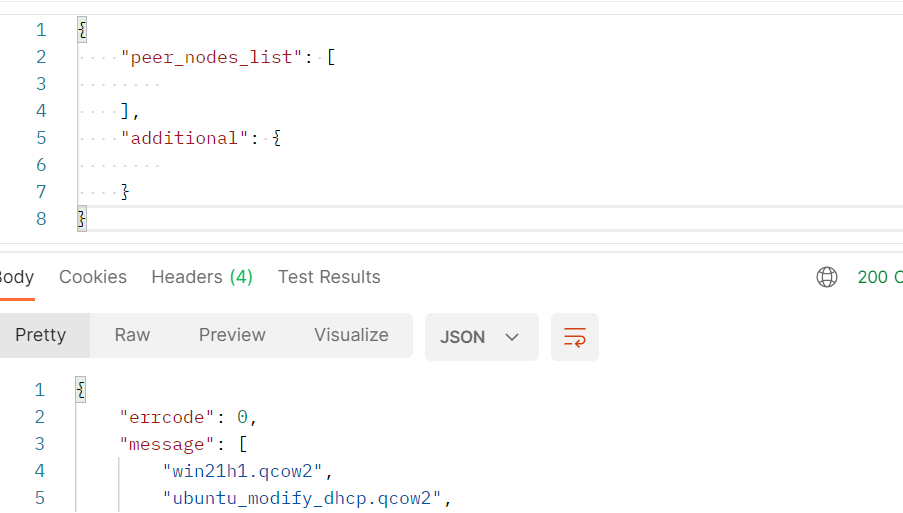

# HTTP고객측 API요청

**다음 HTTP 요청의 dbc_client_ip 및 dbc_client_port는 사용자 자신이 배포한 DBC 고객측 액세스 주소입니다.**

---

## GPU노드 관리

### 1.GPU노드 기기 설정 정보 확인

요청방식: POST

URL요청: http://<dbc_client_ip>:<dbc_client_port>/api/v1/mining_nodes

body요청:

```json
{
  "peer_nodes_list": [
    //GPU노드의node_id
    "58fb618aa482c41114eb3cfdaefd3ba183172da9e25251449d045043fbd37f45"
  ],
  "additional": {}
}
```

예:


<br/>

### 2. 임대자 session_id 확인 및 획득

요청방식： POST

URL요청： http://<dbc_client_ip>:<dbc_client_port>/api/v1/mining_nodes/session_id

body요청 ：

```
{
  "peer_nodes_list": [
  //GPU노드의 node_id
  "58fb618aa482c41114eb3cfdaefd3ba183172da9e25251449d045043fbd37f45"
  ],
  "additional": {
  },
  //신분 인증 정보，임대자 서명 사용 혹은  다명의계정 서명 사용（HTTP여청 형식 설명 참조 바랍니다），둘중하나 선택
  ...
}
```

예 (이부분은 임대자 서명 사용 해도 되고, 다명의계정 서명 사용해도 됩니다 ) :


<br/>

## 가상기기 관리

### 1. 가상기기 생성

요청방식： POST

URL요청： http://<dbc_client_ip>:<dbc_client_port>/api/v1/tasks/start

body요청：

```json
{
  "peer_nodes_list": [
    //GPU노드의node_id
    "58fb618aa482c41114eb3cfdaefd3ba183172da9e25251449d045043fbd37f45"
  ],
  "additional": {
    // linux가상기기 원격등록，ssh포트 번호（linux）
    "ssh_port": "5684",
    // windows가상기기 원격등록，rdp포트 번호（windows）
    "rdp_port": "5685",
    // vnc포트번호 연결
    "vnc_port": "5904",
    // 미러이미지 이름
    "image_name": "ubuntu.qcow2",
    // 가상기기 표시 자체 저의 （예：my-ubuntu-1804）
    "custom_image_name": "my-ubuntu-1804",
    // 운영시스템 유형: ubuntu、win
    "operation_system": "ubuntu",
    // 인도 방식:
    // linux시스템 설정：legacy
    // windows시스템 설정：uefi
    "bios_mode": "legacy",
    // 서로다른 가상기기 간에 전송되는 멀티캐스트 주소,범위 224.0.0.0~239.0.0.0
    // 멀티캐스트 주소를 추가하고 괄호 안에 ","로 계속 구분하거나  입력 안해도 됩니다
    "multicast":["230.0.0.1:5558"]
    // gpu수량（ 0보다 크거나 같음 ）
    "gpu_count": "2",
    // cpu수량（0보다 큰）
    "cpu_cores": "8",
    // 메모리 크기（0보다 큰，단위：G）
    "mem_size": "8",
    // 디스크 크기（0보다 큰，단위：G）
    "disk_size": "10"
  },
  "session_id": "임대자가 배포한 session_id",
  "session_id_sign": "임대자가 배포한 session_id_sign"
}
```

예 :


- 생성 프로세스의 시간은 설정 구성에 따라 5분에서 15분까지 진행됩니다.

- 가상 기기 상세 정보를 요청하여 가상 기기의 로그인 방식과 가상 기기의 현재 상태를 조회할 수 있습니다.(상태값이 "creating"이면, 가상기기가 생성 진행중임을 의마합니다 .)

### 2.가상기기 상세정보 확인

요청 방식： POST

URL요청： http://<dbc_client_ip>:<dbc_client_port>/api/v1/tasks/<확인 할task_id값>

body요청：

```json
{
  "peer_nodes_list": [
    //GPU노드의node_id
    "58fb618aa482c41114eb3cfdaefd3ba183172da9e25251449d045043fbd37f45"
  ],
  "additional": {},
  "session_id": "임대자 배포한 session_id",
  "session_id_sign": "임대자 배포한 session_id_sign"
}
```

예:


### 3.가상기기 목록 확인

방식 요청： POST

URL 요청： http://<dbc_client_ip>:<dbc_client_port>/api/v1/tasks

body 요청：

```json
{
  "peer_nodes_list": [
    //GPU노드의 node_id
    "58fb618aa482c41114eb3cfdaefd3ba183172da9e25251449d045043fbd37f45"
  ],
  "additional": {},
  "session_id": "임대자 배포한session_id",
  "session_id_sign": "임대자 배포한session_id_sign"
}
```

예:


### 4. 가상기기 정지

방식 요청： POST

URL 요청： http://<dbc_client_ip>:<dbc_client_port>/api/v1/tasks/stop/<정지 할task_id값>

body 요청：

```json
{
  "peer_nodes_list": [
    //GPU노드의 node_id
    "58fb618aa482c41114eb3cfdaefd3ba183172da9e25251449d045043fbd37f45"
  ],
  "additional": {},
  "session_id": "임대자 배포한session_id",
  "session_id_sign": "임대자 배포한 session_id_sign"
}
```

예:


### 5.가상기기 작동

이 인터페이스는 휴면 상태의 가상 머신을 깨우는 데에도 사용됩니다.

방식 요청： POST

URL 요청： http://<dbc_client_ip>:<dbc_client_port>/api/v1/tasks/start/<작동할 task_id값>

body 요청

```json
{
  "peer_nodes_list": [
    //GPU노드의 node_id
    "58fb618aa482c41114eb3cfdaefd3ba183172da9e25251449d045043fbd37f45"
  ],
  "additional": {},
  "session_id": "임대자 배포한session_id",
  "session_id_sign": "임대자 배포한 session_id_sign"
}
```

예:


6.가상기기 삭제

방식 요청： POST

URL 요청： http://<dbc_client_ip>:<dbc_client_port>/api/v1/tasks/delete/<삭제 할task_id값>

body 요청：

```json
{
  "peer_nodes_list": [
    //GPU노드의 node_id
    "58fb618aa482c41114eb3cfdaefd3ba183172da9e25251449d045043fbd37f45"
  ],
  "additional": {},
  "session_id": "임대자 배포한session_id",
  "session_id_sign": "임대자 배포한 session_id_sign"
}
```

예:


7.가상기기 다시시작

방식 요청： POST

URL 요청： http://<dbc_client_ip>:<dbc_client_port>/api/v1/tasks/restart/<다시 시작할task_id값>

body요청：

```json
{
  "peer_nodes_list": [
    //GPU노드의 node_id
    "58fb618aa482c41114eb3cfdaefd3ba183172da9e25251449d045043fbd37f45"
  ],
  "additional": {},
  "session_id": "임대자 배포한 session_id",
  "session_id_sign": "임대자 배포한 session_id_sign"
}
```

::: warning
**경 보:**
다시 시작 요청을 보낸 후 관리프로그램은 최선이라고 생각하는 종료 방법을 선택합니다. 가상 기기에서 요청을 무시할 수 있습니다. 가상기기를 강제로 다시 시작하려면 url에 force_reboot 파라미터를 추가하십시오. 파라미터가 true 또는 1이면 강제로 다시 시작됩니다. false 또는 0이거나 파라미터가 없으면 상기 전통 방식으로 다시 시작합니다 계. 가상 기기 강제로 다시 시작하기 위한 요청 URL은 다음과 같습니다:

http://<dbc_client_ip>:<dbc_client_port>/api/v1/tasks/restart/<다시 시작할 task_id값>?force_reboot=true
:::

### 8.가상기기 일지 확인

방식 요청： POST

URL 요청： http://<dbc_client_ip>:<dbc_client_port>/api/v1/tasks/logs/<확인할task_id값>?flag=tail&line_num=10

body 요청：

```json
{
  "peer_nodes_list": [
    //GPU노드의 node_id
    "58fb618aa482c41114eb3cfdaefd3ba183172da9e25251449d045043fbd37f45"
  ],
  "additional": {},
  "session_id": "임대자 배포한session_id",
  "session_id_sign": "임대자 배포한session_id_sign"
}
```

:::tip
가상기기 일지 확인을위한 url요청은 2개의 파라미터를 가지고 있으며, 플래그는 일지의 방향을 나타내며, 파라미터가 tail일 경우 일지파일의 끝부분부터 확인 시작하며, head일 경우 일지파일의 시작단계 부터 확인합니다 . line_num은일지 라인의 수를 나타내며 파일의 실제 라인 수를 초과하는 경우 파일의 실제 라인 수로 우선 진행합니다. 마지막으로 이 요청은 최대 1024바이트를 반환하고 범위를 벗어난 일지는 잘립니다.
:::

### 9.가상 머신 구성 수정

:::tip
먼저 가상 머신을 종료해야 합니다.
:::

> `请求方式`：POST
>
> `请求URL`：http://<**dbc_client_ip**>:<**dbc_client_port**>/api/v1/tasks/modify/<task_id>
>
> `请求body`：
>
> ```json
> {
>   "peer_nodes_list": [
>     //GPU节点的node_id
>     "58fb618aa482c41114eb3cfdaefd3ba183172da9e25251449d045043fbd37f45"
>   ],
>   "additional": {
>     "new_ssh_port": "5586",
>     "new_vnc_port": "5986",
>     "new_rdp_port": "5786",
>     "new_custom_port": [
>       "tcp,123", // host的123转发到guest的123
>       "udp,111:222", // host的111转发到guest的222
>       "tcp,333-444", // host的333-444转发到guest的444
>       "udp,555-666:777-888" // host的[555-666]转发到guest的[777-888]
>     ],
>     "new_gpu_count": "2", // >= 0
>     "new_cpu_cores": "8", // > 0, 单位G
>     "new_mem_size": "8", // > 0, 单位G
>     "increase_disk_size": "10" // > 0, 单位G
>   },
>
>   "session_id": "租用者分发的session_id",
>   "session_id_sign": "租用者分发的session_id_sign"
> }
> ```

## 스냅샷/ 이미지 관리

### 1.스냅샷 생성

가상기기 꺼짐 상태를 확보하기위해 스냅샷 생성 진행합니다

요청 방식: POST

URL 요청:

1.http://{{dbc_client_ip}}:{{dbc_client_port}}/api/v1/snapshot/<task_id>/create

body 요청:

```json
{
  "peer_nodes_list": [
    //GPU노드의node_id
    "80720ffadecb07087b3a5b6f88b91b58f7c738b15405c93914ee04f607a14965"
  ],
  "additional": {
    "snapshot_name": "snap2", //이미지 명칭 자체 정의
    "description": "finish hello world", // 자체정의한 이미지 묘사 (입력 안해도 됩니다)
    "disks": [
      //디스크생성 선택（입력안해도 됩니다，만약"disks"없으면，기본적으로 모든 디스크에 대해 외부 증량스냅샷 진행, 스냅샷 파일은  libvirt 으로 자동 생성됩니다）
      {
        "disk_name": "vda", //디스크 이름
        "snapshot_type": "external" //external외부 스냅샷 생성
      },
      {
        "disk_name": "vdb", //디스크 이름
        "snapshot_type": "no" //no스냅샷 생성 안함 (입력 안하며 기본적으로 사용external)
      }
    ]
  },
  "session_id": "임대자 배포한 session_id",
  "session_id_sign": "임대자 배포한 session_id_sign"
}
```

예:


### 2. 스냅샷 목록 확인

방식요청: POST

URL요청:

1. http://{{dbc_client_ip}}:{{dbc_client_port}}/api/v1/snapshot/<task_id>

Body요청:

```json
{
  "peer_nodes_list": [
    //GPU노드의 node_id
    "80720ffadecb07087b3a5b6f88b91b58f7c738b15405c93914ee04f607a14965"
  ],
  "additional": {},
  "session_id": "임대자 배포한 session_id",
  "session_id_sign": "임대자 배포한 session_id_sign"
}
```

예:


### 3.스냅샷 상세정보 확인

방식 요청: POST

URL요청:

1.http://{{dbc_client_ip}}:{{dbc_client_port}}/api/v1/snapshot/<task_id>/<snap_name>

body요청:

```json
{
  "peer_nodes_list": [
    //GPU노드의node_id
    "80720ffadecb07087b3a5b6f88b91b58f7c738b15405c93914ee04f607a14965"
  ],
  "additional": {},
  "session_id": "임대자 배포한session_id",
  "session_id_sign": "임대자 배포한session_id_sign"
}
```

예:


## Image Manage

### 1. .미러이미지 목록 확인

​

방식 요청: POST

URL요청: http://{{dbc_client_ip}}:{{dbc_client_port}}/api/v1/images`

Body 요청:

이미지 센터의 이미지 목록 확인

```json
{
  "peer_nodes_list": [],
  "additional": {}
}
```

### 2.GPU노드의 이미지 목록 확인 ​

```json
{
  "peer_nodes_list": [
    //GPU노드의 node_id
    "80720ffadecb07087b3a5b6f88b91b58f7c738b15405c93914ee04f607a14965"
  ],
  "additional": {}
}
```

### 3.GPU노드에서 사용자의 이미지 목록 확인

```json
{
  "peer_nodes_list": [
    //GPU노드의node_id
    "80720ffadecb07087b3a5b6f88b91b58f7c738b15405c93914ee04f607a14965"
  ],
  "additional": {},
  "session_id": "임대자 배포한session_id",
  "session_id_sign": "임대자 배포한session_id_sign"
}
```

예:


### 5.이미지 전송

방식 요청: POST

URL요청:

1.http://{{dbc_client_ip}}:{{dbc_client_port}}/api/v1/images/upload

Body 요청:

1.GPU노드의 어느 이미지를 이미지 센터에 전송

```json
{
  "peer_nodes_list": [
    //GPU노드의 node_id
    "80720ffadecb07087b3a5b6f88b91b58f7c738b15405c93914ee04f607a14965"
  ],
  "additional": {
    "image_filename": "ubuntu.qcow2"
  },
  "session_id": "임대자 배포한 session_id",
  "session_id_sign": "임대자 배포한 session_id_sign"
}
```

2.고객측 노드의 어느 이미지를 이미지 센터에 전송

```json
{
  "peer_nodes_list": [],
  "additional": {
    "image_filename": "ubuntu.qcow2"
  }
}
```

예:


### 6.이미지 다운로드

방식 요청: POST

URL 요청:

1.http://{{dbc_client_ip}}:{{dbc_client_port}}/api/v1/images/download

Body 요청:

이미지 센터에서 GPU노드의 이미지 다운로드

```json
{
  "peer_nodes_list": [
    //GPU노드의 node_id
    "80720ffadecb07087b3a5b6f88b91b58f7c738b15405c93914ee04f607a14965"
  ],
  "additional": {
    "image_filename": "ubuntu.qcow2"
  },
  "session_id": "임대자 배포한 session_id",
  "session_id_sign": "임대자 배포한 session_id_sign"
}
```

예:

