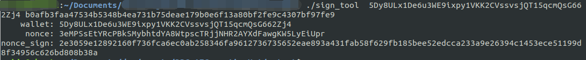

# HTTP요청 형식 설명

요청 방식 : POST

URL형식: http://<dbc_client_ip>:<dbc_client_port>/api/v1/구체 요청 경로

body요청:

```json
{
    "peer_nodes_list": [
        // DBC노드의node_id，현재는 1개 입력만 지원합니다
        "460e5 6d4cdade97065ddf4d0dfeee7ab7e6e77d0058fad07e43123fadd1d8d2a"
    ],
    "additional": {
        // 요청마다 전송하는 각종 파라미터
     },
    // 신분인증정보
      ...
 }
```

신분 인증 정보 총 3가지 유형 있습니다 ,요청할 때 이중 한가지 입력하십시오:

첫번째 유형: 임대자 지갑 서명

설명: 임대자 지갑주소 및 이 지갑 비밀번호 알아야합니다 , 즉 , 이방법 사용하는 사람은 임대자 본인입니다

- 서명방법: ./sign_tool [지갑주소] [지갑비번]

출력:



- 생성된 3개 값을 body요청에 입력하세요, 최종 요청한 body 형식:

```json
{
  "peer_nodes_list": [
    "460e56d4cdade97065ddf4d0dfeee7ab7e6e77d0058fad07e43123fadd1d8d2a"
  ],
  "additional": {},
  "wallet": "5Dy8ULx1De6u3WE9ixpy1VKK2CVssvsjQT15qcmQsG662Zj4",
  "nonce": "5q7KRn4d8EmXFFsim8vHBp23N2CpERbD2mWR3WCo1o3teZnGxYEh4N6",
  "sign": "2460725b2f5e737cd810c773be61b9b27c3b9dbdac4af9cf25c7be9949ad7202a0b7467f71ad843888f482662d3ae2e4fa566d3c1930a3fa90f3dcb97ea4098d"
}
```

**두번째 유형:여러 지갑 서명**

설명:여러 서명 계정의 모든 지갑 주소를 알아야합니다, 및 threshold 수의 계정에 대한 지갑 서명 필요합니다

3서명 2를 예로 들어 각 문장의 해석:

```json
"multisig_accounts": {
    // 다중 서명 계정의 모든 지갑주소
    "wallets": [
        "5Dy8ULx1De6u3WE9ixpy1VKK2CVssvsjQT15qcmQsG662Zj4",
        "5HgVTsXnUBmaL5F2RBjKmXMoAeG9Avuyk9tmgnnVx28u2ZrS",
        "5DhBmvUkj9YWvdDtJWJwaGrFRpzeqW4Ch5oTyTamXG2LMHVQ"
    ],
    // 다중 서명 지갑 생성 시 임계값(threshold)
    "threshold": "2",
    // 다중서명 계정에서 2개의지갑 개인키로 서명(서명방법은 첫번째 유형과 동일)
    "signs": [
        {
            "wallet":"5Dy8ULx1De6u3WE9ixpy1VKK2CVssvsjQT15qcmQsG662Zj4",
            "nonce":"5q7KRn4d8EmXFFsim8vHBp23N2CpERbD2mWR3WCo1o3teZnGxYEh4N6",
            "sign":"2460725b2f5e737cd810c773be61b9b27c3b9dbdac4af9cf25c7be9949ad7202a0b7467f71ad843888f482662d3ae2e4fa566d3c1930a3fa90f3dcb97ea4098d"
        },
        {
            "wallet":"5HgVTsXnUBmaL5F2RBjKmXMoAeG9Avuyk9tmgnnVx28u2ZrS",
            "nonce":"5t1mv263Qpnu5tk5xPDk86oXGUX8yXaYGpAWj2n6gU45HNmsQqLaAU7",
            "sign":"c494cc517f3c181fd7206d03175b5c0c29d162e53aa88c557887241d104456272dc313501c8ae4e71dbcbae183942a119713974aff87aa1ef3870aa505be6384"
        }
    ]
}
```

- 최종 body형식 요청:

```json
{
  "peer_nodes_list": [
    "460e56d4cdade97065ddf4d0dfeee7ab7e6e77d0058fad07e43123fadd1d8d2a"
  ],
  "additional": {},
  "multisig_accounts": {
    "wallets": [
      "5Dy8ULx1De6u3WE9ixpy1VKK2CVssvsjQT15qcmQsG662Zj4",
      "5HgVTsXnUBmaL5F2RBjKmXMoAeG9Avuyk9tmgnnVx28u2ZrS",
      "5DhBmvUkj9YWvdDtJWJwaGrFRpzeqW4Ch5oTyTamXG2LMHVQ"
    ],
    "threshold": "2",
    "signs": [
      {
        "wallet": "5Dy8ULx1De6u3WE9ixpy1VKK2CVssvsjQT15qcmQsG662Zj4",
        "nonce": "5q7KRn4d8EmXFFsim8vHBp23N2CpERbD2mWR3WCo1o3teZnGxYEh4N6",
        "sign": "2460725b2f5e737cd810c773be61b9b27c3b9dbdac4af9cf25c7be9949ad7202a0b7467f71ad843888f482662d3ae2e4fa566d3c1930a3fa90f3dcb97ea4098d"
      },
      {
        "wallet": "5HgVTsXnUBmaL5F2RBjKmXMoAeG9Avuyk9tmgnnVx28u2ZrS",
        "nonce": "5t1mv263Qpnu5tk5xPDk86oXGUX8yXaYGpAWj2n6gU45HNmsQqLaAU7",
        "sign": "c494cc517f3c181fd7206d03175b5c0c29d162e53aa88c557887241d104456272dc313501c8ae4e71dbcbae183942a119713974aff87aa1ef3870aa505be6384"
      }
    ]
  }
}
```

3번째 유형 : 기기 임대자가 배포한 session_id 및 session_id_sign 사용 합니다

설명: session_id 및 session_id_sign는 임대자가 기타 본기기를 사용하고싶은 제3자유저의 신분 증명입다 . 제3자 유저는 본 session_id로 기기 방문 가능합니다 。

주의:session_id는 오직 임대자가 기기에 얻기 및 수정으로 요청할수있습니다 (요청방식:상기첫번째 두번째유형 참고)

- 기기임대자는 기기에 session_id 요청합니다 .(요청 방법: 상기 첫 번째 및 두 번째 유형 참조, 여기는 첫 번째 방법을 예로 설명합니다 ), 반환 값은 session_id입니다:

```json
{
  "peer_nodes_list": [
    "460e56d4cdade97065ddf4d0dfeee7ab7e6e77d0058fad07e43123fadd1d8d2a"
  ],
  "additional": {},
  "wallet": "5Dy8ULx1De6u3WE9ixpy1VKK2CVssvsjQT15qcmQsG662Zj4",
  "nonce": "5q7KRn4d8EmXFFsim8vHBp23N2CpERbD2mWR3WCo1o3teZnGxYEh4N6",
  "sign": "2460725b2f5e737cd810c773be61b9b27c3b9dbdac4af9cf25c7be9949ad7202a0b7467f71ad843888f482662d3ae2e4fa566d3c1930a3fa90f3dcb97ea4098d"
}
```

- 기기 임대자는 session_id에 서명합니다 :


생성된 session_id 및 session_id_sign를 제3자에 배포하면 됩니다

- 제3자 유저 , session_id 및 session_id_sign받은 후 ,body형식 요청합니다 :

```json
{
  "peer_nodes_list": [
    "460e56d4cdade97065ddf4d0dfeee7ab7e6e77d0058fad07e43123fadd1d8d2a"
  ],
  "additional": {},
  "session_id": "3QRjS1PsbDReGJKVBBRqxUh9RqXB5jbfHJ8bMgGoJ3C9HHHHm9rCmmh",
  "session_id_sign": "ca89d0adb44a03c6f22a9205a06e22f682805f8c8ee25dd182e36ceb581899001196ce94c40e2147247f967256d7e010318e4387853939d94ba99c81f16a358f"
}
```
