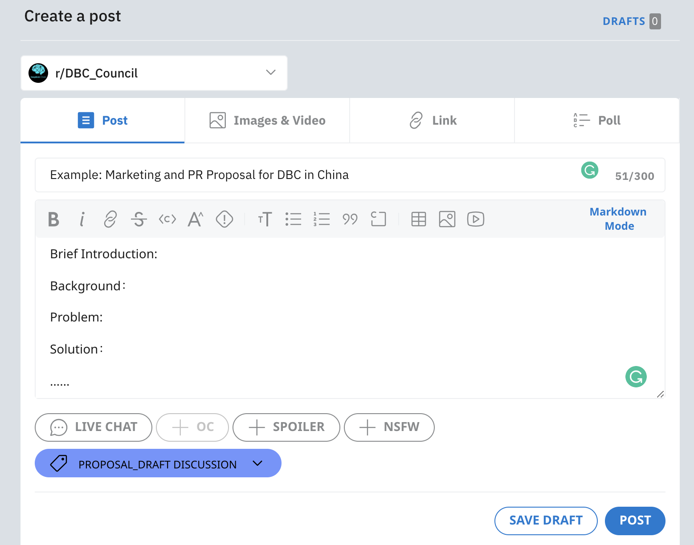

# DBC Treasury 자금 신청 프로세스

## 1.초안 준비

제안서 템플릿 참고하여 초안 준비

제안서 템플릿 참고 문서 링크

영문 :https://shimo.im/docs/R6P99TpPWW8wC3yP

중문: https://shimo.im/docs/lfwA369loYQhDprN/

[**[출처\]** ](https://shimo.im/docs/lfwA369loYQhDprN/)[DBC Treasury 자금 신청 프로세스](https://blog.naver.com/dbc_korea/222642257067)|**작성자** [DBC KOREA](https://blog.naver.com/dbc_korea)

## 2.제안 오프체인 토론

제안서 제출 전 , 제안자는 위쳇 ,텔레그램,커뮤니티 등 체인 외부 어떤 경우에서든 이사회 및 커뮤니티 구성원과 제안을 논의하여 의견 통합 후 제안서를 지속적으로 개선할수 있습니다 .

현재 DBC는 reddit에 subreddit 커뮤니티 DBC_Council을 설립했으며(https://www.reddit.com/r/DBC_Council/), 커뮤니티는 제안 토론 섹션[proposal_draft 토론]도 만들었습니다. 제안자는 커뮤니티에 초안을 제출하고 토론을 위해 flair [proposal_draft 토론]을 추가할 수 있습니다.

## 3.온체인 제출

DBC메인넷-governance-treasury페이지 ([https://www.dbcwallet.io/#/treasury](https://www.reddit.com/r/DBC_Council/))에서 온체인 제출합니다, 그리고 DBC의 일부(최소 신청금액의 5% 이상) 을 보증금으로 합니다 .

::: warning

**주의!** 제안 통과되면 보증금 반환; 제안 거절되면 보증금 반환되지 안습니다

:::

따라서 제안서 작성에 주의를 기울여 보다 완전하고 실현가능한 제안서를 제출하시기 바랍니다 .

온체인 제출 동시에 제안자는 제안내용을 필수로 subreddit 커뮤니티 DBC_Council에 제출합니다

(https://www.reddit.com/r/DBC_Council/),flair[proposal_submitted onchain]추가합니다.

온체인 제출후 온체인 제안번호와 블록높이 받습니다, 제안번호를 제안서에 추가해주세요 , 온체인 - 오프체인 대응 편리 위합니다 .

## 4.이사회 온체인 투표 진행

## 5.투표 완성

투표 결과 나온 후 DBC subreddit의 커뮤니티 관리자는 승인된 제안을 flair[proposal_approved]로 분류하고 , 승인되지 않은 제안은 flair[proposal_rejected]로 분류합니다 .

## 6.자금 발행

자금은 분할 지급되며, 신청 성공한 제안자는 지속적으로 자체 성과를 업데이트 해야합니다. 제안서에 단계별 필요한 자금을 기입해주세요 . 제안 완성 상황은 커뮤니티 구성원 (비 이사회 구성원) 이 감독하고 투표합니다 .

**특별주의: 자금 수령 주소는 거래소 주소가 될수 없으며, 개인키를 컨트롤할수있는 주소여야 하며, 가능한 DBC메인넷 주소가 제일 좋습니다, 그렇지 않으면 통과 후 발행된 자금을 받을 수 없습니다 .**
